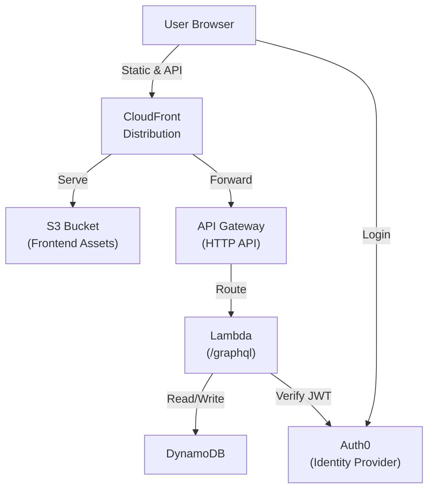
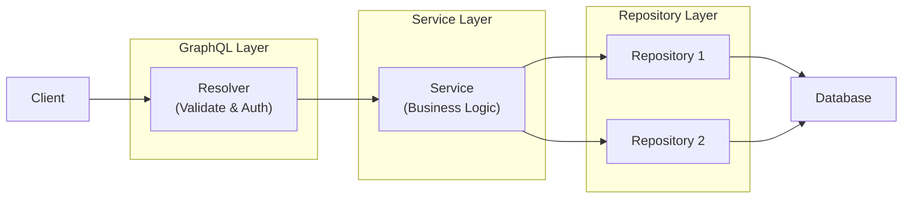

<!-- SYNC IMPACT REPORT
Version Change: 0.14.0 → 0.15.0
Changes:
  - MINOR (0.15.0): Added Backend Service Architecture principle
Added Sections:
  - Backend Service Architecture: Define domain entity services vs single-purpose services with selection criteria
Modified Sections:
  - Core Principles: Added Backend Service Architecture principle after Backend Layer Structure and before Database Record Hydration
Templates Requiring Updates:
  ✅ plan-template.md: Generic template, no updates needed
  ✅ spec-template.md: Generic template, no updates needed
  ✅ tasks-template.md: Generic template, no updates needed
  ✅ checklist-template.md: Generic template, no updates needed
  ✅ agent-file-template.md: Generic template, no updates needed
  ⚠ docs/tech-spec.md: Requires alignment with constitutional service architecture patterns
Follow-up TODOs:
  - Update docs/tech-spec.md to align with constitutional service architecture patterns
  - Ratification date remains TODO (inherited from previous versions)
-->

# Personal Finance Tracker Constitution

## Repository Structure

The project comprises four independent npm packages distributed across the repository:

- **backend/** – GraphQL server exposing the API for the frontend, includes database integration
- **frontend/** – User-facing single-page application
- **backend-cdk/** – Deployable backend infrastructure
- **frontend-cdk/** – Deployable frontend infrastructure

Each package maintains its own `package.json`, dependencies, and build configuration. They are versioned and deployed independently while remaining architecturally coupled through shared GraphQL schema and deployment order requirements.

## General Requirements

- Deploy with free or minimal cost (use free-tier cloud services, no mandatory paid subscriptions)
- Enable mobile installation via PWA without app store publishing
- Minimize vendor lock-in (see [Vendor Independence](#vendor-independence) for details)

## Backend

An npm package providing Apollo GraphQL server and API implementation.

### Technologies
- **Language**: TypeScript
- **Framework**: Apollo Server, Node.js
- **Testing**: Jest
- **Quality**: ESLint, Prettier, TypeScript strict mode

### Responsibilities
- **Business Logic**: Implement application domain logic and service layer operations
- **GraphQL API**: Expose data and operations through GraphQL resolvers
- **Database Access**: Handle all data persistence and retrieval operations
- **Authentication**: Verify JWT tokens and establish user identity
- **Authorization**: Enforce user data scoping and prevent cross-user data access

## Frontend

An npm package providing the user-facing single-page application.

### Technologies
- **Language**: TypeScript
- **Framework**: Vue 3, Vite, Vuetify, Apollo Client
- **Testing**: Jest
- **Quality**: ESLint, Prettier, TypeScript strict mode, Vue type-checking

### Responsibilities
- **User Interface**: User interface and interactions
- **Client Routing**: Single-page navigation and routing
- **Authentication**: User sign-in and JWT token management
- **GraphQL Client**: GraphQL API client communication

## Backend CDK

An npm package providing infrastructure-as-code for backend deployment to AWS.

### Technologies
- **Language**: TypeScript
- **Framework**: AWS CDK
- **Testing**: Jest
- **Quality**: ESLint, Prettier, TypeScript strict mode

## Frontend CDK

An npm package providing infrastructure-as-code for frontend deployment to AWS.

### Technologies
- **Language**: TypeScript
- **Framework**: AWS CDK
- **Testing**: Jest
- **Quality**: ESLint, Prettier, TypeScript strict mode

## AWS Production Architecture

## Core Principles

### Vendor Independence

**Non-negotiable rule**: Minimize vendor lock-in through technology choices and architectural decisions that preserve deployment flexibility.

- **Frontend**: Must be deployable to any static hosting provider without code changes
  (S3, GitHub Pages, nginx, Cloudflare Pages, Vercel, or equivalent)
- **Backend**: Must be deployable to any Node.js runtime without code changes
  (AWS Lambda, Docker containers, VPS, bare metal, or equivalent)
- **Data Layer**: Database access must be abstracted to enable migration to another database
  - **Repository Pattern**: Use repository pattern for all database access to support
    database portability and maintainability
  - **Portable Query Patterns**: Use only database operations and query patterns that
    can be reproduced in popular SQL and NoSQL databases (PostgreSQL, MongoDB, MySQL, etc.).
  - Avoid vendor-specific features and optimizations
- **Infrastructure Code**: CDK is AWS-specific but frontend and backend remain portable

### Schema-Driven Development

**Non-negotiable rule**: GraphQL schema is the single source of truth for API contracts. All API changes begin with schema modification.

**Development Process**:
- Backend GraphQL schema defined at `backend/src/schema.graphql` (canonical source)
- Before making any change, read the schema
- Start all API changes with schema updates
- Backend generates TypeScript types via `npm run codegen` after schema changes
- Frontend syncs schema from backend using `npm run codegen:sync-schema` in `frontend/src/schema.graphql`
- Frontend generates typed composables via `npm run codegen` for all GraphQL operations
- Code generation provides full TypeScript type checking across frontend and backend
- Both frontend and backend consume generated types for compile-time type safety

**Rationale**: Ensures unambiguous API contracts, prevents type mismatches, enables safe refactoring.

### Backend Layer Structure

**Non-negotiable rule**: Backend MUST implement a clean three-layer architecture that separates concerns and maintains clear dependencies: **GraphQL Resolvers → Services → Repositories**.

**Repository Layer**:
- Provide database access interface
- Perform pure data access operations (CRUD)
- Handle errors for database operations
- Avoid business logic
- Organize one repository per entity (recommended)

**Service Layer**:
- Implement business logic and domain rules
- Provide business-specific error messages
- Orchestrate multi-repository operations (operations across multiple repositories)
- Inject repository dependencies in service constructor
- Implement complex validation logic (currency matching, category type validation)
- Orchestrate transactions (atomic operations ensuring data consistency)
- Group related CRUD operations for one entity in one service
- Expose public methods for direct calling by GraphQL resolvers

**GraphQL Layer**:
- Validate user input using Zod schemas
- Enforce authentication and authorization
- Define API schema and documentation
- Transform requests and responses
- Call appropriate service methods
- Avoid direct database access

**Request Flow:**

**Rationale**: Enables independent testing, maintainable code, and portable architecture.

### Backend Service Layer

**Non-negotiable rule**: Service classes follow one of two patterns based on complexity and purpose.

**Domain Entity Services (Default)**:
- Represent a single domain entity
- Expose multiple public methods such as CRUD operations
- Centralize validation, business rules, and helper methods within domain
- Depend primarily on one repository for related entity
- May depend on other repositories if needed

**Single-Purpose Services**:
- Expose one public method (typically named `call`)
- Contain complex, unique business logic
- Handle non-CRUD operations requiring specialized orchestration
- May orchestrate multiple repositories

**Selection Criteria**:
- Default to domain entity services for standard entity operations
- Use single-purpose services when complexity is high and implementation is unique
- Prefer single-purpose services when orchestrating multiple repositories

**Rationale**: Balances maintainability with flexibility for complex operations.

### Database Record Hydration

**Non-negotiable rule**: All data read from the database MUST be validated at the repository boundary before being returned to service or resolver layers.

**Implementation**:
- Use schema validation (Zod or equivalent) to validate every database record at read time
- Validate against TypeScript interfaces to ensure compile-time type safety
- Apply validation consistently across all repositories for uniform error handling

**Rationale**: Catches data corruption at source, prevents downstream errors.

### Soft-Deletion

**Non-negotiable rule**: All entities use soft-deletion by default unless explicitly excepted.

**Implementation**:
- All entities MUST support soft-deletion via an `isArchived` flag or equivalent
- Soft-deleted records MUST NOT appear in user-facing queries by default
- All queries scoped to non-archived records unless intentionally accessing archived data
- Exceptions: Document the business reason in entity comments

**Rationale**: Enables recovery, maintains audit trail.

### Test Strategy

**Backend** (primary focus):

- Test repositories
  - In repository tests, use real database connection to validate data access layer
- Test services
  - In service tests, use mocked repositories to isolate business logic from database dependencies
- Test resolvers only on request (optional)
- Test utility functions
- Prefer unit tests over integration tests
- Keep test suite small and effective

**Frontend**:
- Test manually (visual verification in dev)
- Write UI component tests only for complex/critical components; not required

**Test File Location**:
- Co-location strategy: tests live next to the code they test
- Naming: `[source-file].test.ts` in same directory as source `[source-file].ts`

### Input Validation

**Non-negotiable rule**: Validate input at two distinct layers - GraphQL layer for format/structure, service layer for business rules.

**Implementation**:
- **GraphQL Layer**: Use Zod schemas to validate input structure, format, and constraints
  - Validate required fields, data types, formats (UUID, date, email)
  - Enforce range constraints (positive numbers, string lengths)
  - Validate enums and predefined values
  - Reject malformed input immediately at API boundary
- **Service Layer**: Enforce business validation
  - Enforce business rules and domain constraints
  - Enforce data integrity rules
  - Validate entity existence
  - Validate entity relationships

**Rationale**: Fails fast on malformed input, enables API-agnostic service reuse.

### UI Guidelines

- Use snackbars for all user feedback notifications (errors and success messages)
- Optimize design and behavior for mobile devices first, ensure responsive across all screen sizes

### Frontend Code Discipline

**Non-negotiable rule**: Prefer framework components and styles over custom implementations.

- Use framework design system before creating custom solutions
- Minimize custom CSS

**Rationale**: Reduces maintenance, ensures consistency.

### TypeScript Code Generation

**Non-negotiable rule**: All generated or manually written TypeScript code MUST adhere to strict type safety and code quality standards.

**Implementation**:
- Avoid non-null assertions (`!`) unless absolutely necessary
  - Document the reason when used
- Avoid type assertions (`as any`) unless absolutely necessary
  - Document the reason when used
- After generating or changing code, MUST run `npm run format` and fix all ESLint issues

**Rationale**: Maintains type safety, prevents runtime errors, ensures code quality.

## Governance

This constitution supersedes all other development guidelines. Amendments require documentation in the sync impact report and ratification by the team.

**Amendment Process**:
1. Update `.specify/memory/constitution.md` with changes
2. Increment version per semantic versioning (MAJOR/MINOR/PATCH)
3. Document changes in sync impact report (top of file as HTML comment)
4. Commit with message: `docs: amend constitution to vX.Y.Z ([change summary])`
5. Update dependent artifacts (templates, guidance docs) as flagged

**Version**: 0.15.0 | **Ratified**: TODO(RATIFICATION_DATE) | **Last Amended**: 2025-11-20
