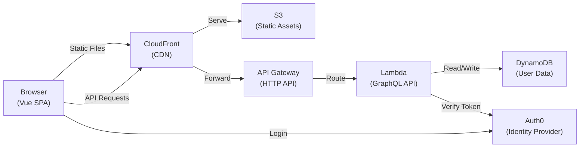

<!-- SYNC IMPACT REPORT
Version Change: 0.6.3 → 0.6.4 (PATCH: Converted AWS Production Architecture diagram from ASCII to Mermaid format)
Modified Sections: AWS Production Architecture (ASCII art replaced with Mermaid graph)
Added Sections: None
Removed Sections: None
Templates Requiring Updates:
  - plan-template.md: Contains "Constitution Check" section - no changes required (already generic)
  - spec-template.md: No principle-specific dependencies - no changes required
  - tasks-template.md: No principle-specific dependencies - no changes required
  - commands/*.md: No command files found in .specify/templates/commands/ - no updates possible
Follow-up TODOs: Ratification date remains TODO (inherited from previous versions)
-->

# Personal Finance Tracker Constitution

## Repository Structure

The project comprises four independent npm packages distributed across the repository:

- **backend/** – GraphQL server exposing the API for the frontend, includes database integration
- **frontend/** – User-facing single-page application
- **backend-cdk/** – Deployable backend infrastructure
- **frontend-cdk/** – Deployable frontend infrastructure

Each package maintains its own `package.json`, dependencies, and build configuration. They are versioned and deployed independently while remaining architecturally coupled through shared GraphQL schema and deployment order requirements.

## Backend

An npm package providing Apollo GraphQL server and API implementation.

### Technologies
- **Language**: TypeScript
- **Framework**: Apollo Server, Node.js
- **Testing**: Jest
- **Quality**: ESLint, Prettier, TypeScript strict mode

### Responsibilities
- **Business Logic**: Implement application domain logic and service layer operations
- **GraphQL API**: Expose data and operations through GraphQL resolvers
- **Database Access**: Handle all data persistence and retrieval operations
- **Authentication**: Verify JWT tokens and establish user identity
- **Authorization**: Enforce user data scoping and prevent cross-user data access

## Frontend

An npm package providing the user-facing single-page application.

### Technologies
- **Language**: TypeScript
- **Framework**: Vue 3, Vite, Vuetify, Apollo Client
- **Testing**: Jest
- **Quality**: ESLint, Prettier, TypeScript strict mode, Vue type-checking

## Backend CDK

An npm package providing infrastructure-as-code for backend deployment to AWS.

### Technologies
- **Language**: TypeScript
- **Framework**: AWS CDK
- **Testing**: Jest
- **Quality**: ESLint, Prettier, TypeScript strict mode

## Frontend CDK

An npm package providing infrastructure-as-code for frontend deployment to AWS.

### Technologies
- **Language**: TypeScript
- **Framework**: AWS CDK
- **Testing**: Jest
- **Quality**: ESLint, Prettier, TypeScript strict mode

## AWS Production Architecture

## Core Principles

### Test Strategy

**Backend** (primary focus):
- Test repositories and services
- Test utility/batch functions (e.g., DataLoader batch handlers) with core path unit tests (happy path + error cases)
- Keep test suite small and effective

**Frontend**:
- Test manually (visual verification in dev)
- Write UI component tests only for complex/critical components; not required

### Vendor Independence

**Non-negotiable rule**: Minimize vendor lock-in through technology choices and architectural decisions that preserve deployment flexibility.

- **Frontend**: Must be deployable to any static hosting provider without code changes
  (S3, GitHub Pages, nginx, Cloudflare Pages, Vercel, or equivalent)
- **Backend**: Must be deployable to any Node.js runtime without code changes
  (AWS Lambda, Docker containers, VPS, bare metal, or equivalent)
- **Data Layer**: Database access must be abstracted to enable migration to another database
  - **Repository Pattern**: Use repository pattern for all database access to support
    database portability and maintainability
  - **Portable Query Patterns**: Use only database operations and query patterns that
    can be reproduced in popular SQL and NoSQL databases (PostgreSQL, MongoDB, MySQL, etc.).
  - Avoid vendor-specific features and optimizations
- **Infrastructure Code**: CDK is AWS-specific but frontend and backend remain portable

## Governance

This constitution supersedes all other development guidelines. Amendments require documentation in the sync impact report and ratification by the team.

**Amendment Process**:
1. Update `.specify/memory/constitution.md` with changes
2. Increment version per semantic versioning (MAJOR/MINOR/PATCH)
3. Document changes in sync impact report (top of file as HTML comment)
4. Commit with message: `docs: amend constitution to vX.Y.Z ([change summary])`
5. Update dependent artifacts (templates, guidance docs) as flagged

**Version**: 0.6.4 | **Ratified**: TODO(RATIFICATION_DATE) | **Last Amended**: 2025-10-29
