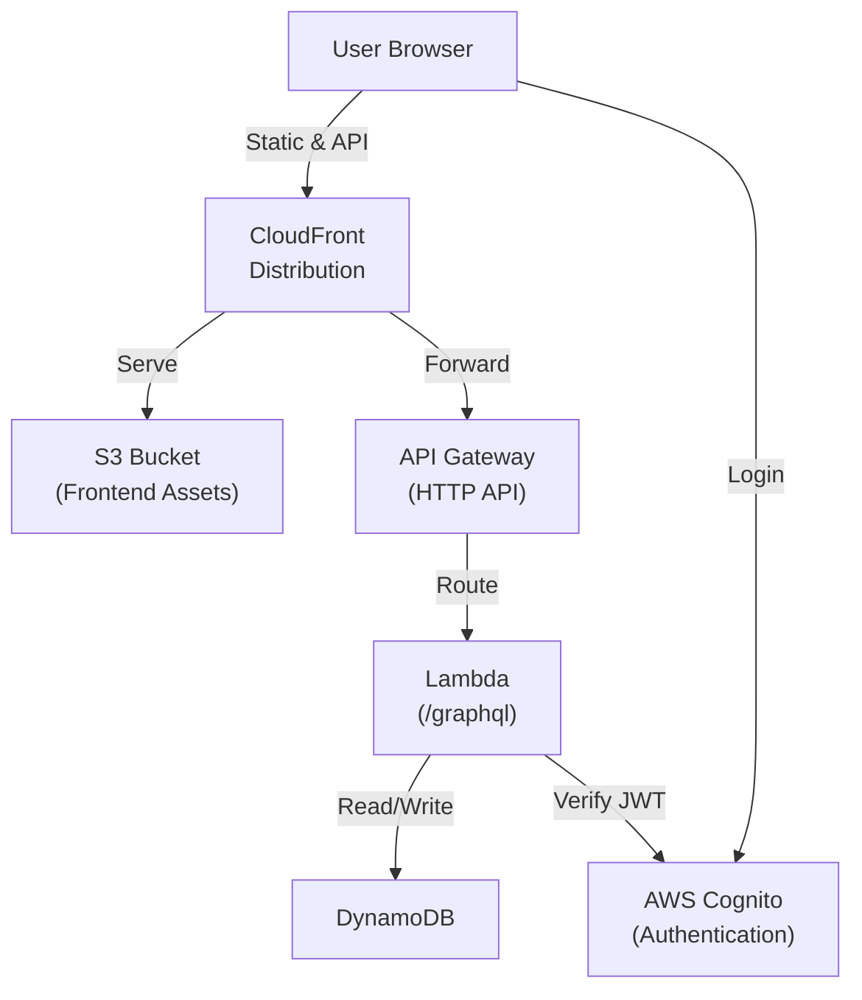
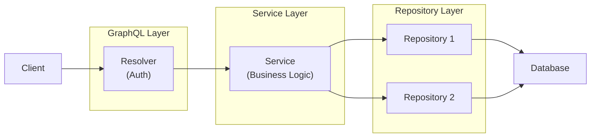

<!-- SYNC IMPACT REPORT
Version Change: 0.23.0 → 0.24.0
Changes:
  - MINOR (0.24.0): Revised Input Validation principle to clarify service-heavy validation approach
Modified Sections:
  - Backend Layer Structure - GraphQL Layer: Clarified thin validation role
    - Removed: "Validate user input using Zod schemas"
    - Added: "Rely on GraphQL schema validation (structure, field types, required fields, enums)"
    - Added: "Can add minimal validation/parsing if needed to properly call service methods"
  - Backend Layer Structure - Mermaid Diagram: Updated labels to reflect validation distribution
    - GraphQL: "Validate & Auth" → "Auth & Delegate"
    - Service: "Business Logic" → "Business Logic & Validation"
  - Input Validation: Completely rewritten to clarify service-heavy validation approach
    - Old approach: Two-layer validation (GraphQL for format/structure via Zod, Service for business rules)
    - New approach: Service-heavy validation with clear responsibility distribution
    - GraphQL Layer: Thin validation - relies on schema (structure, types, required, enums), minimal additions
    - Service Layer: Self-validating entry point - MUST validate, CAN repeat GraphQL validations defensively, validates business rules + format/range IF business-important
    - Repository Layer: Operational validation only (parameter presence, operand validity)
    - Clarified: Not all format validation is mandatory - only what has business importance
    - Rationale expanded: Multiple entry points (GraphQL, REST, CLI, batch), defensive programming, validation with business consequences belongs in services
Added Sections:
  - None
Removed Sections:
  - None
Templates Requiring Updates:
  ✅ plan-template.md: Generic template, no specific validation guidance to update
  ✅ spec-template.md: Generic template, no specific validation guidance to update
  ✅ tasks-template.md: Generic template, no specific validation guidance to update
Dependent Documentation Updates:
  - No template changes required (principle clarifies existing practice)
Follow-up TODOs:
  - Ratification date remains TODO (inherited from previous versions)

Previous Version History:
  - 0.22.3 → 0.23.0: Added new rule to TypeScript Code Generation principle requiring typecheck execution
  - 0.22.2 → 0.22.3: Corrected user identification flow in Authentication & Authorization principle
  - 0.22.1 → 0.22.2: Corrected authentication provider from Auth0 to AWS Cognito
  - 0.22.0 → 0.22.1: Enhanced TypeScript naming standards
-->

# Personal Finance Tracker Constitution

## Repository Structure

### Overview

The project comprises three independent npm packages distributed across the repository:

- **backend/** – GraphQL server exposing the API for the frontend, includes database integration
- **frontend/** – User-facing single-page application
- **infra-cdk/** – Deployable infrastructure for both backend and frontend

Each package maintains its own `package.json`, dependencies, and build configuration. They are versioned and deployed independently while remaining architecturally coupled through shared GraphQL schema and deployment order requirements.

### Backend

An npm package providing Apollo GraphQL server and API implementation.

**Technologies**:
- **Language**: TypeScript
- **Framework**: Apollo Server, Node.js
- **Testing**: Jest
- **Quality**: ESLint, Prettier, TypeScript strict mode

**Responsibilities**:
- **Business Logic**: Implement application domain logic and service layer operations
- **GraphQL API**: Expose data and operations through GraphQL resolvers
- **Database Access**: Handle all data persistence and retrieval operations
- **Authentication**: Verify JWT tokens and establish user identity
- **Authorization**: Enforce user data scoping and prevent cross-user data access

### Frontend

An npm package providing the user-facing single-page application.

**Technologies**:
- **Language**: TypeScript
- **Framework**: Vue 3, Vite, Vuetify, Apollo Client
- **Testing**: Jest
- **Quality**: ESLint, Prettier, TypeScript strict mode, Vue type-checking

**Responsibilities**:
- **User Interface**: User interface and interactions
- **Client Routing**: Single-page navigation and routing
- **Authentication**: User sign-in and JWT token management
- **GraphQL Client**: GraphQL API client communication

### Infra CDK

An npm package providing unified infrastructure-as-code for both backend and frontend deployment to AWS.

**Technologies**:
- **Language**: TypeScript
- **Framework**: AWS CDK
- **Testing**: Jest
- **Quality**: ESLint, Prettier, TypeScript strict mode

**Responsibilities**:
- **Backend Infrastructure**: DynamoDB tables, Lambda functions, API Gateway for GraphQL endpoint
- **Frontend Infrastructure**: S3 bucket for static assets, CloudFront distribution for content delivery
- **Deployment Orchestration**: Single CDK app managing both BackendCdkStack and FrontendCdkStack

## General Requirements

- Deploy with free or minimal cost (use free-tier cloud services, no mandatory paid subscriptions)
- Enable mobile installation via PWA without app store publishing
- Minimize vendor lock-in (see [Vendor Independence](#vendor-independence) for details)

## Infrastructure and Environments

### Production

**AWS Services**:
- **CloudFront**: Entry point, CDN, HTTPS enforcement
- **S3**: Vue.js bundle storage
- **API Gateway**: Routes GraphQL requests from CloudFront to Lambda
- **Lambda**: Apollo Server runtime
- **DynamoDB**: User data storage (on-demand scaling)
- **Cognito**: User authentication and JWT token generation

**Deployment**:
- Manual deployment via `deploy.sh` script

### Development

**Local Stack**:
- **Vite** dev server replaces S3 + CloudFront
- **Apollo Server** replaces Lambda + API Gateway
- **DynamoDB Local** (Docker) replaces AWS DynamoDB

### External Dependencies

- **AWS Cognito**: Authentication service for both production and development

## Core Principles

### Vendor Independence

**Non-negotiable rule**: Minimize vendor lock-in through technology choices and architectural decisions that preserve deployment flexibility.

- **Frontend**: Must be deployable to any static hosting provider without code changes
  (S3, GitHub Pages, nginx, Cloudflare Pages, Vercel, or equivalent)
- **Backend**: Must be deployable to any Node.js runtime without code changes
  (AWS Lambda, Docker containers, VPS, bare metal, or equivalent)
- **Data Layer**: Database access must be abstracted to enable migration to another database
  - **Repository Pattern**: Use repository pattern for all database access to support
    database portability and maintainability
  - **Portable Query Patterns**: Use only database operations and query patterns that
    can be reproduced in popular SQL and NoSQL databases (PostgreSQL, MongoDB, MySQL, etc.).
  - Avoid vendor-specific features and optimizations
- **Infrastructure Code**: CDK is AWS-specific but frontend and backend remain portable

### Schema-Driven Development

**Non-negotiable rule**: GraphQL schema is the single source of truth for API contracts. All API changes begin with schema modification.

**Development Process**:
- Backend GraphQL schema defined at `backend/src/schema.graphql` (canonical source)
- Before making any change, read the schema
- Start all API changes with schema updates
- Backend generates TypeScript types via `npm run codegen` after schema changes
- Frontend syncs schema from backend using `npm run codegen:sync-schema` in `frontend/src/schema.graphql`
- Frontend generates typed composables via `npm run codegen` for all GraphQL operations
- Code generation provides full TypeScript type checking across frontend and backend
- Both frontend and backend consume generated types for compile-time type safety

**Rationale**: Ensures unambiguous API contracts, prevents type mismatches, enables safe refactoring.

### Backend Layer Structure

**Non-negotiable rule**: Backend MUST implement a clean three-layer architecture that separates concerns and maintains clear dependencies: **GraphQL Resolvers → Services → Repositories**.

**Repository Layer**:
- Provide database access interface
- Perform pure data access operations (CRUD)
- Handle errors for database operations
- Avoid business logic
- Organize one repository per entity (recommended)

**Service Layer**:
- Implement business logic and domain rules
- Provide business-specific error messages
- Orchestrate multi-repository operations (operations across multiple repositories)
- Inject repository dependencies in service constructor
- Implement complex validation logic (currency matching, category type validation)
- Orchestrate transactions (atomic operations ensuring data consistency)
- Group related CRUD operations for one entity in one service
- Expose public methods for direct calling by GraphQL resolvers

**GraphQL Layer**:
- Enforce authentication and authorization
- Define API schema and documentation
- Transform requests and responses between GraphQL schema and service layer
- Call appropriate service methods
- Avoid direct database access
- Rely on GraphQL schema validation
- Can add minimal validation/parsing if needed to properly call service methods

**Request Flow:**

**Rationale**: Enables independent testing, maintainable code, and portable architecture.

### Backend GraphQL Layer

**Non-negotiable rule**: GraphQL schema reflects user-facing functionality, not database implementation details. The schema serves as a Backend-For-Frontend (BFF) contract optimized for the frontend client.

**Implementation**:
- Expose only business-relevant fields with meaningful names
- Never expose internal fields such as internal statuses or database timestamps
- Current user ID handled automatically through authentication context, never passed as query/mutation parameters
- Pagination follows Relay Connection specification for standardized cursor-based navigation
- Field naming prioritizes clarity and domain language over technical implementation details

**Rationale**: Maintains clean API boundaries, enables backend refactoring without breaking clients, enforces proper authentication patterns.

### GraphQL Pagination Strategy

**Non-negotiable rule**: Apply pagination strategy based on expected list size.

**For Potentially Large Lists**:
- MUST use Relay-Compatible Cursor pagination
- Frontend MUST use "Load More" button instead of page numbers

**For Short Lists** (typically < 100 items):
- MAY return plain arrays without pagination wrapper

**Rationale**: Balances performance with simplicity. Load-more pattern provides better mobile UX and stable navigation.

### Backend Service Layer

**Non-negotiable rule**: Service classes follow one of two patterns based on complexity and purpose.

**Domain Entity Services (Default)**:
- Represent a single domain entity
- Expose multiple public methods such as CRUD operations
- Centralize validation, business rules, and helper methods within domain
- Depend primarily on one repository for related entity
- May depend on other repositories if needed

**Single-Purpose Services**:
- Expose one public method (typically named `call`)
- Contain complex, unique business logic
- Handle non-CRUD operations requiring specialized orchestration
- May orchestrate multiple repositories

**Selection Criteria**:
- Default to domain entity services for standard entity operations
- Use single-purpose services when complexity is high and implementation is unique
- Prefer single-purpose services when orchestrating multiple repositories

**Rationale**: Balances maintainability with flexibility for complex operations.

### Database Record Hydration

**Non-negotiable rule**: All data read from the database MUST be validated at the repository boundary before being returned to service or resolver layers.

**Implementation**:
- Use schema validation (Zod or equivalent) to validate every database record at read time
- Validate against TypeScript interfaces to ensure compile-time type safety
- Apply validation consistently across all repositories for uniform error handling

**Rationale**: Catches data corruption at source, prevents downstream errors.

### Soft-Deletion

**Non-negotiable rule**: All entities use soft-deletion by default unless explicitly excepted.

**Implementation**:
- All entities MUST support soft-deletion via an `isArchived` flag or equivalent
- Soft-deleted records MUST NOT appear in user-facing queries by default
- All queries scoped to non-archived records unless intentionally accessing archived data
- Exceptions: Document the business reason in entity comments

**Rationale**: Enables recovery, maintains audit trail.

### Data Migrations

**Non-negotiable rule**: All data modifications MUST be performed through versioned migration files that execute automatically during deployments and can be safely run multiple times.

**Implementation**:
- Store migration files in `backend/src/migrations/` directory
- Modify data only; handle schema changes via CDK infrastructure definitions
- Export an `up` function from each migration receiving DynamoDB client as sole dependency
- Name migration files with timestamp prefix (YYYYMMDDHHMMSS-description.ts)
- Run locally via npm script; run in production via Lambda during deployment

**Rationale**: Ensures data stays synchronized with code across environments, enables safe rollouts, prevents manual production changes.

### Authentication & Authorization

**Non-negotiable rule**: All user authentication flows through AWS Cognito as the authentication service. User data is strictly isolated at the database level, ensuring zero cross-user data leakage.

**Frontend**:
- Force user authentication via AWS Cognito before allowing access to protected routes
- Include JWT token in Authorization header for every GraphQL request to backend

**Backend GraphQL Layer**:
- Verify JWT token against AWS Cognito public keys before any resolver runs
- Reject requests with missing or invalid JWT tokens
- Extract email from JWT token and store in context
- Look up internal database user ID using email from context
- Never trust user IDs from mutation/query input - always use authenticated user from context
- Propagate internal database user ID to service layer

**Backend Service Layer**:
- Accept internal database user ID as parameter in all service methods
- Pass internal database user ID down to repository layer

**Backend Repository Layer**:
- Design repository methods to require internal database user ID parameter and filter all queries by it

**Rationale**: Reduces security risks, ensures industry-standard token management, prevents unauthorized data access.

### Test Strategy

**Non-negotiable rule**: Backend MUST be tested with repository and service layer tests. Test files MUST be co-located next to source files, never in separate test directories.

**Backend** (primary focus):

- Test repositories
  - In repository tests, use real database connection to validate data access layer
- Test services
  - In service tests, use mocked repositories to isolate business logic from database dependencies
- Test resolvers only on request (optional)
- Test utility functions
- Prefer unit tests over integration tests
- Keep test suite small and effective

**Frontend**:
- Test manually (visual verification in dev)
- Write UI component tests only for complex/critical components; not required

**Test File Location**:
- Co-location strategy: tests MUST live next to the code they test
- NEVER use separate test directories like `src/__tests__/` or `src/tests/`
- Naming: `[source-file].test.ts` in same directory as source `[source-file].ts`
- Example: `backend/src/dir/file.ts` → `backend/src/dir/file.test.ts`

**Rationale**: Backend-focused testing ensures data layer correctness and business logic integrity.

### Input Validation

**Non-negotiable rule**: Services are the entry point to business logic and MUST self-validate all input. GraphQL provides thin validation through its schema. Repositories validate only operational requirements.

**GraphQL Layer**:
- Generally minimal - delegate to service layer
- Authenticate users
- Rely on GraphQL schema for automatic validation:
  - Validate structure (object shapes)
  - Validate field types (string, int, etc.)
  - Validate field requiredness
  - Validate enums
- Can add minimal validation/parsing if needed to properly call service methods

**Service Layer**:
- Services MUST self-validate because they are entry points to business logic
- Can repeat GraphQL validations for defensive programming
- MUST validate:
  - Business rules (duplicates, domain constraints)
  - Entity existence
  - Entity relationships (valid combinations, referential integrity)
- Can validate format/range constraints IF they have business importance:
  - Example: email format validation matters IF email notifications are business-critical
  - Example: date format validation matters IF date queries are business operations
  - Not all format validation is mandatory - only what impacts business operations
- Throw only business errors, propagate lower-level errors without wrapping

**Repository Layer**:
- Validate only what is necessary to execute database operations correctly
- Parameter presence checks
- Operand validity checks
- Throw repository-specific errors for database operation failures

**Rationale**: Services can be called from multiple entry points (GraphQL, REST API, CLI, batch jobs). Defensive programming requires services to self-validate regardless of caller. Validation with business consequences belongs with business logic in the service layer.

### UI Guidelines

- Use snackbars for all user feedback notifications (errors and success messages)
- Optimize design and behavior for mobile devices first, ensure responsive across all screen sizes

### Frontend Code Discipline

**Non-negotiable rule**: Prefer framework components and styles over custom implementations.

- Use framework design system before creating custom solutions
- Minimize custom CSS

**Rationale**: Reduces maintenance, ensures consistency.

### TypeScript Code Generation

**Non-negotiable rule**: All generated or manually written TypeScript code MUST adhere to strict type safety and code quality standards.

**Implementation**:
- Avoid non-null assertions (`!`) unless absolutely necessary
  - Document the reason when used
- Avoid type assertions (`as any`) unless absolutely necessary
  - Document the reason when used
- Avoid unnecessary type checks (`typeof`, non-null checks, non-undefined checks) when the provided type is explicit and doesn't require such checks
- Use descriptive names for all variables, methods, parameters, and types
  - Avoid single-character names (except standard loop indices: `i`, `j`, `k`)
  - Avoid abbreviated forms that obscure meaning
  - Avoid shortened versions (e.g., use `user` instead of `usr`, `transaction` instead of `tx`)
  - Keep names concise while prioritizing clarity over brevity
- Place public methods before private methods in classes to ensure the public API is visible at the top
- Run `npm run format` and fix all ESLint issues after generating or changing code
- Run `npm run typecheck` to catch and fix compilation issues after generating or changing code

**Rationale**: Maintains type safety, prevents runtime errors, ensures code quality, improves code readability and API discoverability.

## Governance

This constitution supersedes all other development guidelines. Amendments require documentation in the sync impact report and ratification by the team.

**Amendment Process**:
1. Update `.specify/memory/constitution.md` with changes
2. Increment version per semantic versioning (MAJOR/MINOR/PATCH)
3. Document changes in sync impact report (top of file as HTML comment)
4. Commit with message: `docs: amend constitution to vX.Y.Z ([change summary])`
5. Update dependent artifacts (templates, guidance docs) as flagged

**Version**: 0.24.0 | **Ratified**: TODO(RATIFICATION_DATE) | **Last Amended**: 2026-02-14
