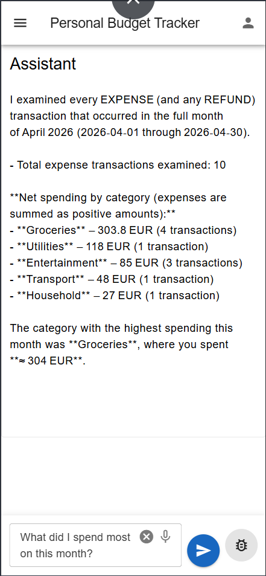

# Personal Finance Tracker

[](https://github.com/alexei-lexx/budget/actions/workflows/ci.yml)

A self-hosted personal finance tracker you deploy to your own AWS account. Track income, expenses, and transfers across multiple accounts and currencies, get an AI Assistant, and keep full control of your cash flow.

## Benefits

- **Complete financial privacy** — self-hosted on your own AWS account; your data never leaves it and no third party can access it
- **Low or zero cost** — no subscription fees; runs on AWS with pay-as-you-go pricing, so most personal use costs nothing
- **Browser and mobile ready** — runs in any browser; install it on your phone or tablet like a native app, no app store needed (Progressive Web App)
- **Source-available** — read the code to verify how your data is handled; fork and customize it to fit your needs

## Core Features

- **Multiple Accounts** - Track all your finances in one place: bank accounts, cash, credit cards, and more
- **Income and Expense Tracking** - Record every transaction including income, expense, and refunds with dates, amounts, categories, and notes
- **Money Transfers** - Move money between your accounts while maintaining accurate balances
- **Custom Categories** - Organize your finances your way with personalized income and expense categories
- **Multi-Currency** - Manage accounts in different currencies (USD, EUR, etc.) without forced conversions
- **Monthly Reports** - See where your money goes each month with detailed category breakdowns
- **Smart Suggestions** - Save time with intelligent account and category recommendations based on your habits
- **Transaction Search** - Find any transaction by filtering on account, category, date, etc.
- **Quick Transaction Entry** - Type something like “coffee 4.50,” and let AI create the transaction autonomously, filling in missing details from your past entries
- **Ask About Your Money** – Use the built-in Assistant to ask questions about cash flow, spending habits, or trends in any language, and let AI analyze your transaction history to provide insightful answers
- **Telegram Integration** - Chat with the app directly from Telegram
- **Custom Domain Support** - Use your own domain name instead of the default AWS URL

[→ See screenshots](#screenshots)

## Technologies

- [Node.js](https://nodejs.org/) backend with GraphQL API
- [Vue.js](https://vuejs.org/) frontend SPA
- Infrastructure as Code with [AWS CDK](https://aws.amazon.com/cdk/)
- Deployed on [AWS](https://aws.amazon.com/)
- Serverless, free-tier friendly
- [TypeScript](https://www.typescriptlang.org/) throughout
- [Spec-driven development](https://github.com/Fission-AI/OpenSpec)

## Repository Structure

- [Backend](backend/README.md) - GraphQL API server setup and development
- [Frontend](frontend/README.md) - Vue.js SPA setup and development
- [Infrastructure](infra-cdk/README.md) - AWS CDK infrastructure
- [Specs](openspec/) - Feature specifications, implementation plans, and design artifacts

## Deployment

Deploy the application to AWS.

### Prerequisites

- AWS CLI installed and configured
- Node.js installed
- `jq` command-line JSON processor installed

### Deployment order

The deployment script handles the following steps automatically:

1. Build backend
2. Deploy auth infrastructure
3. Deploy backend infrastructure
4. Deploy frontend infrastructure
5. Set auth callback/logout URLs with the actual frontend URL
6. Run database migrations
7. Build and upload frontend assets

### Deployment Script

```bash
./deploy.sh
```

### Multi-Environment Deployment

The deployment script supports multi-environment deployments using the ENV environment variable. By default, it deploys to the `production` environment. To deploy to a different environment (e.g., `staging`), set the ENV variable when running the script:

```bash
ENV=staging ./deploy.sh
```

### Override Configuration (Optional)

All parameters have sensible defaults. To override any default, create parameters in AWS Systems Manager Parameter Store.

Parameters fall into two groups:

- **Deployment-time** — read by `deploy.sh` and CDK during stack deployment. Changes take effect on the next `./deploy.sh`.
- **Runtime** — read by the backend Lambda on cold start. Changes take effect on the next cold start without redeploy.

#### Deployment-time

```bash
# Allow/disallow user self-registration
# By default, self-registration is enabled
aws ssm put-parameter --overwrite --type String \
    --name "/manual/budget/production/auth/allow-user-registration" \
    --value "true"

# Auth claim namespace (custom namespace for JWT claims)
aws ssm put-parameter --overwrite --type String \
    --name "/manual/budget/production/auth/claim-namespace" \
    --value "https://personal-budget-tracker"

# Auth domain prefix (must be globally unique across all AWS accounts)
aws ssm put-parameter --overwrite --type String \
    --name "/manual/budget/production/auth/domain-prefix" \
    --value "production-budget-auth"

# Custom domain (optional, see Custom Domain Setup)
aws ssm put-parameter --overwrite --type String \
    --name "/manual/budget/production/frontend/custom-domain" \
    --value "app.example.com"

# Lambda memory size (in MB)
aws ssm put-parameter --overwrite --type String \
    --name "/manual/budget/production/lambda/memory-size" \
    --value "512"

# Lambda timeout (in seconds)
aws ssm put-parameter --overwrite --type String \
    --name "/manual/budget/production/lambda/timeout-seconds" \
    --value "30"
```

#### Runtime

```bash
# AI connection timeout (in milliseconds)
aws ssm put-parameter --overwrite --type String \
    --name "/manual/budget/production/bedrock/connection-timeout" \
    --value "5000"

# AI max response tokens
aws ssm put-parameter --overwrite --type String \
    --name "/manual/budget/production/bedrock/max-tokens" \
    --value "2000"

# AI model ID (e.g., openai.gpt-oss-120b-1:0)
aws ssm put-parameter --overwrite --type String \
    --name "/manual/budget/production/bedrock/model-id" \
    --value "openai.gpt-oss-120b-1:0"

# AI request timeout (in milliseconds)
aws ssm put-parameter --overwrite --type String \
    --name "/manual/budget/production/bedrock/request-timeout" \
    --value "30000"

# AI sampling temperature
aws ssm put-parameter --overwrite --type String \
    --name "/manual/budget/production/bedrock/temperature" \
    --value "0.2"

# Chat history max messages
aws ssm put-parameter --overwrite --type String \
    --name "/manual/budget/production/app/chat-history-max-messages" \
    --value "20"

# Chat message TTL (in seconds)
aws ssm put-parameter --overwrite --type String \
    --name "/manual/budget/production/app/chat-message-ttl-seconds" \
    --value "86400"

# LangSmith tracing enabled
aws ssm put-parameter --overwrite --type String \
    --name "/manual/budget/production/langsmith/tracing" \
    --value "true"

# LangSmith API key
aws ssm put-parameter --overwrite --type SecureString \
    --name "/manual/budget/production/langsmith/api-key" \
    --value "<your-langsmith-api-key>"

# LangSmith project name
aws ssm put-parameter --overwrite --type String \
    --name "/manual/budget/production/langsmith/project" \
    --value "<your-langsmith-project>"
```

To override configuration for a specific environment, replace `production` in the parameter names with your target environment (e.g., `/manual/budget/staging/auth/domain-prefix`).

## Custom Domain Setup

You can optionally use your own domain name to access the app.

**Prerequisites** (one-time setup):

1. Bootstrap CDK in `us-east-1` — CloudFront requires ACM certificates to be in that region, so a separate CDK bootstrap is needed there. Run with `--app ""` to skip loading the app (which would require all env vars):
   ```bash
   cd infra-cdk && npx cdk bootstrap aws://YOUR_ACCOUNT_ID/us-east-1 --app ""
   ```
2. Create a Route 53 hosted zone for your domain in your AWS account (via the AWS Console or CLI)
3. Copy the NS records from the hosted zone and add them to wherever you currently manage DNS for that domain
4. Wait for NS propagation — this can take a few minutes to a few hours. Verify with:
   ```bash
   nslookup -type=NS app.example.com
   ```

**Setup:**

1. Set the SSM parameter to the **exact name of your Route 53 hosted zone** (not a subdomain under it — the value must match the hosted zone domain name used in the lookup):
   ```bash
   aws ssm put-parameter --overwrite --type String \
       --name "/manual/budget/production/frontend/custom-domain" \
       --value "app.example.com"
   ```
2. Run `./deploy.sh`

**To change the domain:** update the SSM parameter, remove the stale `ssm:` and `hosted-zone:` entries for your domain from `infra-cdk/cdk.context.json`, then redeploy:

```bash
./deploy.sh
```

**To remove the custom domain:** delete the SSM parameter, remove the `ssm:` and `hosted-zone:` entries for your domain from `infra-cdk/cdk.context.json`, then redeploy:

```bash
aws ssm delete-parameter --name "/manual/budget/production/frontend/custom-domain"
./deploy.sh
```

Then explicitly destroy the cert stack (it is conditionally created, so `./deploy.sh` alone will not remove it):

```bash
cd infra-cdk && npx cdk destroy ${NODE_ENV}-BudgetFrontend-Cert --region us-east-1
```

## Screenshots

<p align="center">
    
    
</p>

<p align="center">
    
    
</p>

<p align="center">
    
    
</p>

<p align="center">
    
</p>
