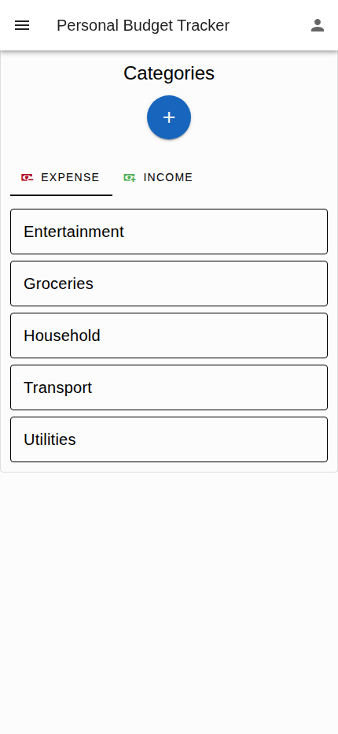
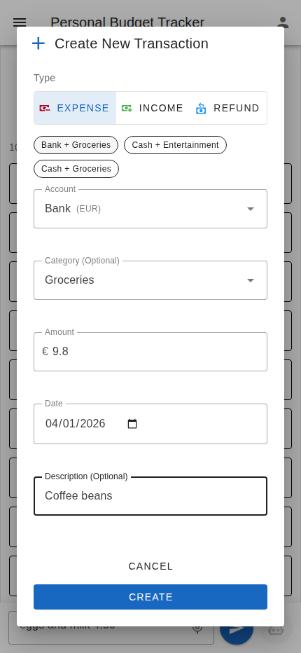
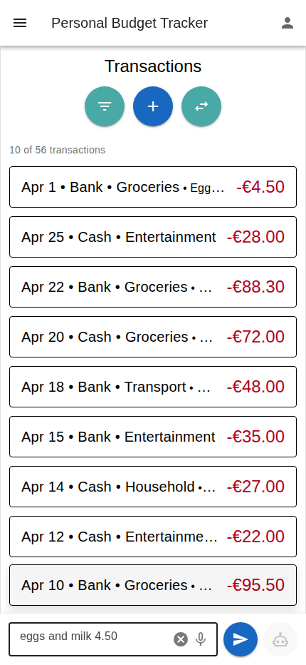
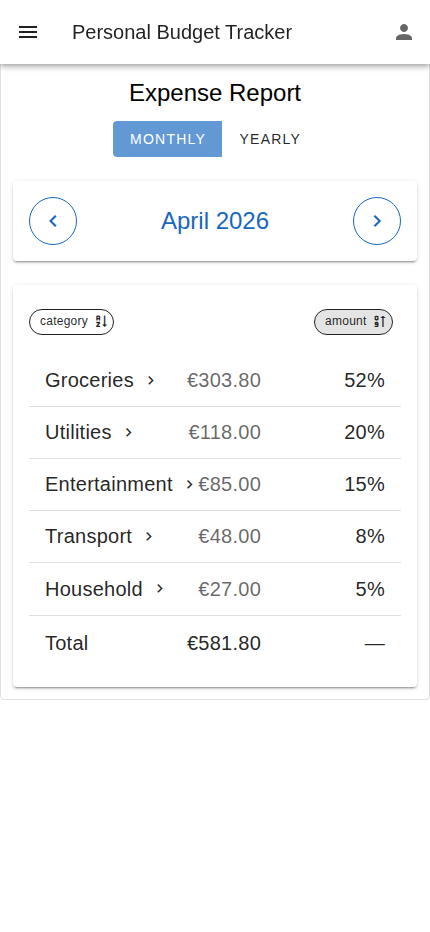
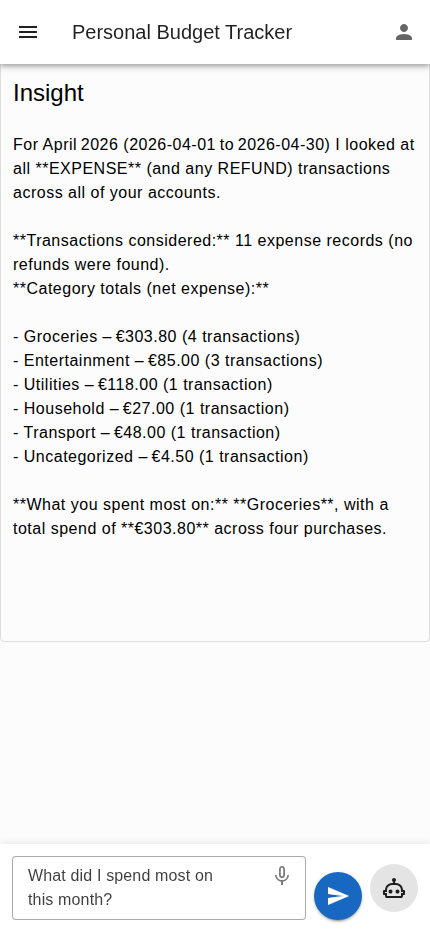
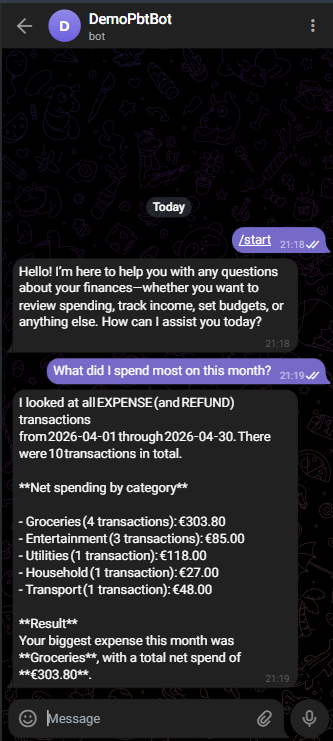

# Personal Finance Tracker

[](https://github.com/alexei-lexx/budget/actions/workflows/ci.yml)

Web application for personal financial management.

## Benefits

- **Self-hosted on your own AWS account** — your financial data never leaves it, no third-party app has access to it
- **No subscription fees** — pay only for what you use on AWS, typically low or zero for personal use
- **Source-available** — read and customize the code (PolyForm Noncommercial License)

## Core Features

- **Multiple Accounts** - Track all your finances in one place: bank accounts, cash, credit cards, and more
- **Income and Expense Tracking** - Record every transaction including income, expense, and refunds with dates, amounts, categories, and notes
- **Money Transfers** - Move money between your accounts while maintaining accurate balances
- **Custom Categories** - Organize your finances your way with personalized income and expense categories
- **Multi-Currency** - Manage accounts in different currencies (USD, EUR, etc.) without forced conversions
- **Monthly Reports** - See where your money goes each month with detailed category breakdowns
- **Smart Suggestions** - Save time with intelligent account and category recommendations based on your habits
- **Transaction Search** - Find any transaction by filtering on account, category, date, etc.
- **Quick Transaction Entry** - Type something like “coffee 4.50,” and let AI create the transaction autonomously, filling in missing details from your past entries
- **Ask About Your Money** – Ask questions about cash flow, spending habits, or trends in any language, and let AI analyze your transaction history to provide insightful answers
- **Telegram Integration** - Chat with the app directly from Telegram

[→ See screenshots](#screenshots)

## Technologies

- [Node.js](https://nodejs.org/) backend with GraphQL API
- [Vue.js](https://vuejs.org/) frontend SPA
- Infrastructure as Code with [AWS CDK](https://aws.amazon.com/cdk/)
- Deployed on [AWS](https://aws.amazon.com/)
- Serverless, free-tier friendly
- [TypeScript](https://www.typescriptlang.org/) throughout
- [Spec-driven development](https://github.com/Fission-AI/OpenSpec)

## Repository Structure

- [Backend](backend/README.md) - GraphQL API server setup and development
- [Frontend](frontend/README.md) - Vue.js SPA setup and development
- [Infrastructure](infra-cdk/README.md) - AWS CDK infrastructure
- [Specs](openspec/) - Feature specifications, implementation plans, and design artifacts

## Deployment

Deploy the application to AWS.

### Prerequisites

- AWS CLI installed and configured
- Node.js installed
- `jq` command-line JSON processor installed

### Deployment order

The deployment script handles the following steps automatically:

1. Build backend
2. Deploy auth infrastructure
3. Deploy backend infrastructure
4. Deploy frontend infrastructure
5. Set auth callback/logout URLs with the actual frontend URL
6. Run database migrations
7. Build and upload frontend assets

### Deployment Script

```bash
./deploy.sh
```

### Multi-Environment Deployment

The deployment script supports multi-environment deployments using the ENV environment variable. By default, it deploys to the `production` environment. To deploy to a different environment (e.g., `staging`), set the ENV variable when running the script:

```bash
ENV=staging ./deploy.sh
```

### Override Configuration (Optional)

All parameters have sensible defaults. To override any default, create parameters in AWS Systems Manager Parameter Store:

```bash
# Allow/disallow user self-registration
# By default, self-registration is enabled
aws ssm put-parameter --overwrite --type String \
    --name "/manual/budget/production/auth/allow-user-registration" \
    --value "true"

# Auth claim namespace (custom namespace for JWT claims)
aws ssm put-parameter --overwrite --type String \
    --name "/manual/budget/production/auth/claim-namespace" \
    --value "https://personal-budget-tracker"

# Auth domain prefix (must be globally unique across all AWS accounts)
aws ssm put-parameter --overwrite --type String \
    --name "/manual/budget/production/auth/domain-prefix" \
    --value "production-budget-auth"

# Auth scopes
aws ssm put-parameter --overwrite --type String \
    --name "/manual/budget/production/auth/scope" \
    --value "openid profile email"

# AI max response tokens
aws ssm put-parameter --overwrite --type String \
    --name "/manual/budget/production/bedrock/max-tokens" \
    --value "2000"

# AI model ID (e.g., openai.gpt-oss-120b-1:0)
aws ssm put-parameter --overwrite --type String \
    --name "/manual/budget/production/bedrock/model-id" \
    --value "openai.gpt-oss-120b-1:0"

# AI sampling temperature
aws ssm put-parameter --overwrite --type String \
    --name "/manual/budget/production/bedrock/temperature" \
    --value "0.2"

# Lambda memory size (in MB)
aws ssm put-parameter --overwrite --type String \
    --name "/manual/budget/production/lambda/memory-size" \
    --value "512"

# Lambda timeout (in seconds)
aws ssm put-parameter --overwrite --type String \
    --name "/manual/budget/production/lambda/timeout-seconds" \
    --value "30"
```

To override configuration for a specific environment, replace `production` in the parameter names with your target environment (e.g., `/manual/budget/staging/auth/domain-prefix`).

## Screenshots

<p align="center">
    
    
</p>

<p align="center">
    
    
</p>

<p align="center">
    
    
</p>

<p align="center">
    
</p>
