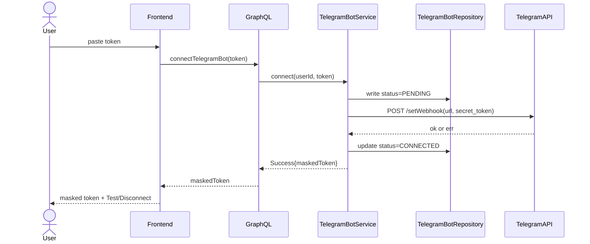
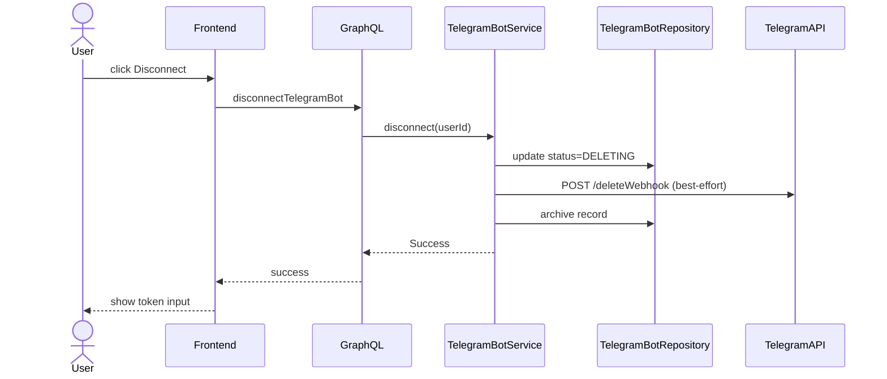
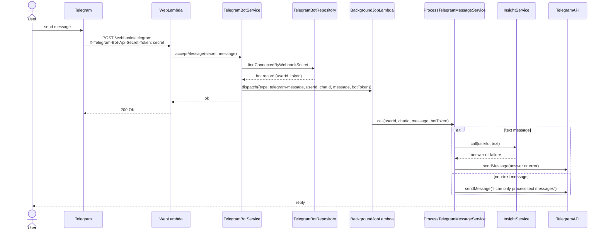

# Technical Design: Telegram Bot Integration

## Vision

Users connect a personal Telegram bot to their account via Settings. Once connected, text messages sent to the bot are routed through the existing Insight AI service and answered in Telegram — extending finance queries to a conversational, mobile-native channel. Each user controls their own bot (created via BotFather); the app acts as the message handler for all connected bots through a single webhook endpoint.

## User Perspective

**User stories:**

- As a user, I can paste my Telegram bot token in Settings and click Connect
- As a user, I see a masked indicator (`••••1234`) when a bot is connected
- As a user, I can click Disconnect to remove the integration
- As a user, I can click Test to verify the bot is still registered
- As a user, I can only have one bot connected at a time — to connect a new one I have to disconnect the existing one first
- As a user, I can ask a finance question via Telegram and receive an answer
- As a user, if I send a non-text message, the bot replies "I can only process text messages"
- As a user, if Insight fails, the bot sends an error message

**Settings UI:**

```
Not connected:
  [Telegram Bot]
  ┌─────────────────────────────┐
  │ Bot token                   │  [Connect]
  └─────────────────────────────┘

Connected:
  [Telegram Bot]  ✓ Connected
  ••••1234           [Test]  [Disconnect]
```

Connect failure: snackbar error, field retains token for retry.
Test: snackbar success/failure, no state change.

## Architecture Overview

**Web Lambda (/graphql)** (entry point)

- **Owns**: `connectTelegramBot` mutation, `disconnectTelegramBot` mutation, `testTelegramBot` query, `telegramBot` query; authentication and userId resolution
- **Relations**: TelegramBotService

**Web Lambda (/webhooks/telegram)** (entry point for inbound Telegram messages)

- **Owns**: Webhook request validation via `X-Telegram-Bot-Api-Secret-Token` header; immediate 200 OK response to Telegram
- **Relations**: TelegramBotService

**TelegramBotService** (domain entity service)

- **Owns**: Bot lifecycle — connect, disconnect, test, findOneConnectedByUserId, acceptMessage (lookup by webhookSecret, dispatch)
- **Relations**: TelegramBotRepository, TelegramApiClient (port), BackgroundJobDispatcher (port)

**Background Job Lambda** (entry point for async jobs)

- **Owns**: Job type routing; dispatching to the appropriate handler
- **Relations**: ProcessTelegramMessageService

**ProcessTelegramMessageService** (single-purpose service)

- **Owns**: AI-reply orchestration for a single inbound Telegram message
- **Relations**: InsightService, TelegramApiClient (port)

**TelegramBotRepository**

- **Owns**: Persistence of Telegram bots records
- **Relations**: TelegramBotsTable

**TelegramBotsTable** (new DynamoDB table)

- **Owns**: Bot state per user — id, userId, bot token, webhookSecret, status, isArchived

**Telegram API** (external)

- **Owns**: Bot registration and message delivery

## Sequence Diagrams

**Connect bot:**



**Disconnect:**



**Webhook receive + async processing:**



## Key Design Decisions

**1. Separate `TelegramBots` DynamoDB table**

- **Decision**: Store Telegram bots in a dedicated DynamoDB table with a status field (`PENDING` = webhook registered but not yet confirmed in DB; `CONNECTED` = fully active; `DELETING` = disconnect in progress)
- **Rationale**: setWebhook and DB write are not atomic; status tracking makes partial failures recoverable — a `PENDING` record signals an incomplete connect, a `DELETING` record signals an incomplete disconnect. Keeps User table focused on user settings.
- **Alternative considered**: Fields on User record — simpler but no clean status tracking, harder to reason about partial failures during token replacement

**2. Single fixed webhook URL + `X-Telegram-Bot-Api-Secret-Token` header for identity and auth**

- **Decision**: All connected bots share a single webhook URL `/webhooks/telegram` — Telegram calls it for every inbound message; each bot is registered with a unique `secret_token` (the `webhookSecret` UUID); Telegram echoes it as `X-Telegram-Bot-Api-Secret-Token` header; handler looks up user by header value
- **Rationale**: `setWebhook` is scoped per bot token — same URL can be registered by many bots independently (confirmed via official Telegram API docs). Secret never appears in URL or logs.
- **Alternative considered**: Secret in URL path — rejected; credentials in URLs appear in access logs

**3. Extend existing web Lambda to handle both `/graphql` and `/webhooks/telegram`**

- **Decision**: Dispatch based on `event.rawPath` in the Lambda handler; `/webhooks/telegram` goes to the webhook handler, everything else to Apollo Server
- **Rationale**: Less infrastructure, fewer cold starts in local dev, consistent with existing pattern of one backend process
- **Alternative considered**: Separate webhook Lambda — more isolation but unnecessary complexity

**4. Async processing: respond to Telegram immediately, process in a separate Lambda**

- **Decision**: `TelegramBotService.acceptMessage` dispatches to a Background Job Lambda asynchronously (fire-and-forget) and returns immediately; the web Lambda then replies 200 to Telegram; async dispatch is abstracted behind a `BackgroundJobDispatcher` port so application code stays runtime-agnostic
- **Rationale**: AI processing regularly exceeds Telegram's 5-second webhook timeout. Lambda async invocation is built-in at no extra cost.
- **Alternative considered**: SQS — better retry semantics but adds cost and complexity disproportionate to personal-scale usage

**5. Background Job Lambda as general-purpose async job dispatcher**

- **Decision**: Reads `type` field from payload, dispatches to appropriate handler; `telegram-message` is the first type
- **Rationale**: Avoids proliferating Lambdas for each future async use case; single deployment unit for background work

**6. `TelegramBotService` (domain entity) + `ProcessTelegramMessageService` (single-purpose)**

- **Decision**: `TelegramBotService` owns the bot lifecycle (`connect`, `disconnect`, `test`, `acceptMessage`); `ProcessTelegramMessageService` orchestrates AI processing and the Telegram reply
- **Rationale**: Matches constitution's two service patterns — CRUD operations in domain entity service, complex orchestration in single-purpose service.

**7. Primary key (`userId` PK + `id` SK) + GSI on `webhookSecret` on `TelegramBotsTable`**

- **Decision**: Each TelegramBot record has an `id` field as SK (consistent with other tables); a Global Secondary Index (GSI) on `webhookSecret` (partition key only) supports the `findConnectedByWebhookSecret` lookup inside `acceptMessage`, which knows only the secret from the `X-Telegram-Bot-Api-Secret-Token` header.
- **Rationale**: The GSI is a secondary index on a single field — portable to SQL and MongoDB per the vendor-independence principle.
- **Alternative considered**: `userId` as sole PK — would work given one bot per user, but inconsistent with the rest of the project's table design

**8. Port interfaces for all external dependencies**

- **Decision**: Telegram API calls (`TelegramApiClient`) and async job dispatch (`BackgroundJobDispatcher`) are accessed through port interfaces defined in `services/ports/`; concrete implementations are injected at the Lambda entry point
- **Rationale**: Constitution requires the backend to be deployable to any Node.js runtime without code changes; embedding AWS SDK calls or direct `fetch` calls in application code would violate that
- **Alternative considered**: Call dependencies directly in application code — fewer files but ties business logic to Lambda runtime and specific HTTP client

## Observability

Log errors at each failure point:

- **TelegramBotService.acceptMessage**: webhookSecret not found in DB; async dispatch failed
- **TelegramBotService.connect**: `setWebhook` error; DB write error
- **TelegramBotService.disconnect**: `deleteWebhook` error (best-effort — log and continue)
- **ProcessTelegramMessageService**: InsightService error; sendMessage error
