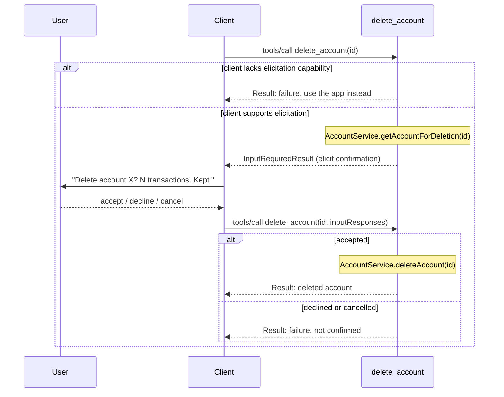

## Context

See proposal.md - Why.

A tool's handler is the callback passed to `server.registerTool(name, config, cb)`. The SDK calls it whenever a `tools/call` request names that tool, and its return value becomes the response. Every existing tool in this codebase (`create_account`, `update_account`, etc.) returns its result in one call: the handler runs once, does the work, returns a `Result<T>` mapped through `toToolResult`.

`delete_account` needs a real confirmation step first. The installed `@modelcontextprotocol/server` SDK (v2.0.0) offers two mechanisms for a handler to get input mid-call, and they are not interchangeable:

- `ctx.mcpReq.elicitInput(params)`: the handler calls this and awaits it inline. The SDK sends a nested `elicitation/create` request to the client over the same still-open connection, and the handler stays paused until the client answers it, before finishing the original request. This is marked `@deprecated` in the SDK's own type declarations and **throws on a 2026-07-28-era request** — the protocol revision this server and its clients speak. It is not a slower or worse-fitting option here; it does not run at all.
- `inputRequired(...)`: the handler returns an `InputRequiredResult` immediately, ending that request. The client shows the prompt on its own, then sends a **second, independent** `tools/call` with the original arguments plus the answer attached. The same handler runs again from the top, sees the answer this time, and returns the real result.

This design uses `inputRequired`, because it is the only mechanism the installed SDK actually runs for this protocol revision.

On the retry, the client resends the original tool arguments unchanged. The account `id` is therefore already present on the second call. No `requestState` is needed to carry it across.

The proposal's Impact section originally expected a change to `to-tool-result.ts`. That is not needed: `InputRequiredResult` is returned directly from the handler and never passes through `toToolResult`, which keeps converting only the final `Result<T>` outcome.

## Goals / Non-Goals

**Goals:**

- Elicit real user confirmation before archiving an account, using MCP elicitation.
- Fail closed, with a clear message, when the client cannot elicit.
- Reuse existing services. Add no new business rules.

**Non-Goals:**

- Changing `AccountService`, the `Account` model, or GraphQL. Deletion semantics (archive, transactions kept) are unchanged.
- A general elicitation helper for other tools. This design covers `delete_account` only. A shared helper can follow once a second tool needs one.

## Decisions

**Elicitation schema: a boolean `confirm` field, matching the SDK's own documented pattern.**
The `requestedSchema` is `{ type: 'object', properties: { confirm: { type: 'boolean' } }, required: ['confirm'] }`, the same shape the SDK's own confirmation example uses. Alternative considered: an empty schema, with the decision carried only by the response `action`. Rejected: it isn't the SDK's documented pattern, and there's no confirmation a client renders an empty form sensibly. The response is read with `acceptedContent<{ confirm: boolean }>(...)`, checking `.confirm === true`. A missing response, a declined/cancelled one, and an accepted one with `confirm: false` are all treated the same: not confirmed. This matches the spec, where decline and cancel produce the same failure.

**Add `AccountService.getAccountForDeletion(id, userId)`, instead of the tool calling the service and the repository separately.**
The tool needs one thing before eliciting: the account's name and its current transaction count. Getting that from `accountService.getAccountsByUser(...)` plus `transactionRepository.findManyByAccountId(...)` in the tool itself would put cross-repository orchestration in the MCP layer, which the constitution assigns to services. `AccountService` already takes `transactionRepository` in its constructor, used today by `updateAccount`'s currency-change guard. `getAccountForDeletion` adds one method using that existing dependency: it looks up the account by `id` and `userId`, throws `BusinessError` if not found (matching `deleteAccount`'s existing behavior), and returns `{ account, transactionCount }`. The tool calls this one method and only handles formatting the elicitation message from it.

**Add `TransactionRepository.countByAccountId({ accountId, userId })`, instead of fetching all transactions to count them.**
`TransactionRepository` already has `hasTransactionsForAccount`, added for exactly this reason: checking for any transaction shouldn't require fetching and hydrating every one. `countByAccountId` follows the same selector shape and the same reasoning, for a count instead of a boolean. `COUNT` is a portable operation across SQL and NoSQL stores, consistent with the constitution's query-portability rule.

**Check client capability before eliciting, don't rely on a caught protocol error.**
The SDK exposes a `-32021 MissingRequiredClientCapability` protocol error for capability gaps, but it is not confirmed whether it fires before or after a handler returns an `InputRequiredResult`. If it fires after, the handler never gets a chance to substitute the app's own message ("delete the account from the app instead"). To guarantee that message, the handler reads the client's declared capabilities from `ctx.mcpReq.envelope` up front. If elicitation isn't declared, it returns the app's own failure directly, without attempting to elicit. The exact field path on `ctx.mcpReq.envelope` needs confirming against the installed SDK during implementation; the decision to check up front, rather than after the fact, does not depend on that detail.

**No re-check between the elicit call and the archive call.**
`AccountService.deleteAccount` already re-validates existence and ownership when it runs. If the account changed between the two calls, that call fails on its own terms. No extra check is needed before it.

## Risks / Trade-offs

- [Account re-fetched on both calls] `getAccountForDeletion` looks up the account on the first call, then `deleteAccount` looks it up again on the second. → Accepted: `deleteAccount`'s own existence/ownership check can't be skipped without duplicating its logic, and both are single-record reads.
- [SDK capability-detection field unconfirmed] The Decisions section above depends on a specific field on `ctx.mcpReq.envelope` whose exact shape wasn't confirmed from the SDK's type declarations alone. → Mitigation: confirm the field against the installed SDK's types first, before writing the fail-closed branch; the surrounding approach does not change either way.
- [Elicitation message accuracy] A wrong or stale transaction count would undermine the confirmation's purpose. → Mitigation: the count comes from `countByAccountId`, called immediately before eliciting, in the same request.

## Constitution Compliance

- **Backend Layer Structure**: The tool calls `AccountService` only, never `TransactionRepository` directly. `AccountService.getAccountForDeletion` is the one place that orchestrates across `AccountRepository` and `TransactionRepository`, matching the constitution's assignment of multi-repository orchestration to the service layer.
- **Backend Domain Entities / Port Interfaces**: `getAccountForDeletion` and `countByAccountId` are additive. Neither changes an existing method's signature or the `Account` entity's invariants.
- **Result Pattern**: The service call's outcome is still `Result<T>` through `toToolResult`. The elicitation round trip is a protocol-level detour above that, not a new return convention for the service layer.
- **Input Validation**: The tool re-validates ownership on both calls (via `getAccountForDeletion` on the first, via `deleteAccount` on the second). Neither call trusts the retried request's arguments as already-checked.
- **Test Strategy**: `getAccountForDeletion` and `countByAccountId` each get service/repository-level tests, matching how `hasTransactionsForAccount` and `updateAccount`'s currency guard are already tested.
