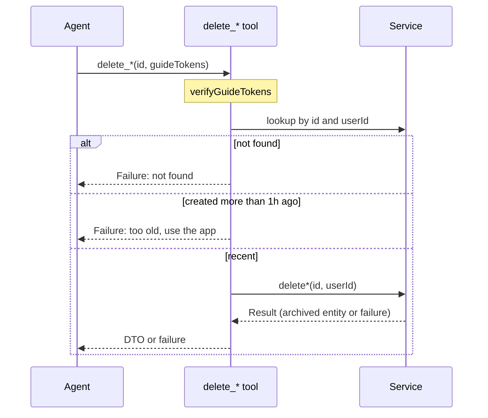

## Context

See proposal.md - Why. Requirements are in `specs/mcp-server/spec.md`.

Current state that shapes the approach:

- Each MCP tool is a `Tool` object (`mcp/tools/tool.ts`) with `name`, `description`, `inputSchema`, and `run`. `mcp/server.ts` registers every tool in one loop. It passes only `description` and `inputSchema` to `server.registerTool`. Tools return `Result<T>`. The loop converts it with `toToolResult`.
- Every tool verifies guide tokens first, then calls a service.
- `Account`, `Category`, and `Transaction` each have an immutable `createdAt`, set by the server on creation.
- The services already delete (archive) all three entities:
  - `AccountService.deleteAccount` and `CategoryService.deleteCategory` archive the record. Transactions are kept.
  - `TransactionService.deleteTransaction` archives the transaction and updates the account balance atomically. It rejects transfer legs.
- Service lookups available to the tools:
  - `TransactionService.getTransactionById(id, userId)`.
  - `AccountService.getAccountsByUser(userId, scope)` and `CategoryService.getCategoriesByUser(userId, { scope })`. There is no get-by-id for accounts or categories.
- The installed MCP SDK exports `ToolAnnotations`. `registerTool` accepts an `annotations` field.

## Goals / Non-Goals

**Goals:**

- Keep the age limit in the MCP layer. The app and GraphQL keep deleting records of any age.
- Reuse existing service methods. Add no service, repository, or model code.
- Share one age check across the three tools.

**Non-Goals:**

- Annotating existing tools (for example `readOnlyHint` on `get_*` tools).
- Tracking whether a record was created by an agent or in the app.
- Making the age limit configurable.

## Decisions

### 1. The age limit lives in the MCP tools, not in services

The limit restricts what one caller may do. A user in the app may delete a three-year-old record. An agent may not. The record and the domain rule are the same. Only the caller differs. That makes it an authorization rule. The constitution assigns authorization to the entry-point layer. The MCP layer already enforces another agent-only rule there: guide tokens.

Alternative considered: an optional `{ createdAfter }` parameter on the three service `delete*` methods. It saves one read. Rejected: it adds a parameter that only one caller ever passes, and it moves a channel policy into the domain layer.

### 2. Each tool runs: guide tokens → lookup → age check → delete

- The lookup is user-scoped. Ownership is proven before the age is revealed. This follows the constitution's validation order.
- Lookups per tool:
  - `delete_transaction`: `transactionService.getTransactionById`.
  - `delete_account`: `accountService.getAccountsByUser(userId, "ACTIVE")`, then find by `id`.
  - `delete_category`: `categoryService.getCategoriesByUser(userId, { scope: "ACTIVE" })`, then find by `id`.
- Accounts and categories are short per-user lists. Filtering a list is cheap. It avoids new service methods.
- An archived account or category is not in the `ACTIVE` list. The tool reports it as not found. This matches the agent's view: `get_accounts` and `get_categories` hide archived records by default.
- The service's own failure passes through unchanged. Examples: a transfer leg, or a race where the record was deleted between lookup and delete.
- The success result is mapped with the existing DTO mappers: `toAccountDto`, `toCategoryDto`, `toTransactionDto`.

Alternative considered: add `getAccountById` and `getCategoryById` to the services. Rejected: the existing list methods are enough. No new service surface is needed.

### 3. Shared age check in `mcp/tools/recently-created.ts`

One small exported function decides whether a `createdAt` is within the limit. It holds the one-hour constant. All three tools use it. Each tool builds its own failure message, with its own entity name:

> Only accounts created within the last hour can be deleted by an agent. Delete older accounts in the app.

The boundary is inclusive. A record exactly one hour old can still be deleted. The specs only fix "less than" and "more than" one hour.

The check reads the current time with `Date.now()`, like `guides.ts`. Tests control time with fake timers.

Alternative considered: duplicate the comparison in each tool. Rejected: three copies of the same constant and comparison can drift apart.

### 4. Destructive annotation through the `Tool` interface

- Add an optional `annotations?: ToolAnnotations` field to `Tool`.
- The registration loop in `server.ts` passes `annotations: tool.annotations` to `registerTool`.
- The three delete tools set `{ destructiveHint: true }`.

The MCP spec already treats a non-read-only tool as destructive by default. Setting the hint explicitly makes the intent clear. It does not depend on client defaults.

Alternative considered: register the delete tools outside the loop. Rejected: it duplicates the loop's error handling.

### 5. Transfers rely on the service rule

`TransactionService.deleteTransaction` already rejects transfer legs. The tool adds no transfer check. The tool description tells the agent that transfers cannot be deleted through this tool.

## Risks / Trade-offs

- [Two reads per delete] The tool looks up the record, then the service looks it up again. → Accepted. Both are single-user reads. `createdAt` cannot change, so the age check cannot go stale between the two reads.
- [Window includes app-created records] An agent can delete a record the user created in the app minutes ago. → Accepted for simplicity. The client's tool permission is the second safeguard.
- [Clients may ignore the destructive hint] → Accepted. The age limit is enforced by the server regardless of the client.
- [Clock skew] `createdAt` and the age check both use the server clock. → No skew between client and server applies.

## Constitution Compliance

- **Backend Layer Structure**: The MCP tools act as an entry point, like resolvers. They call services only. No repository access. Compliant.
- **Authentication & Authorization**: The age limit is an authorization rule for the agent caller. It lives in the entry-point layer. The user ID comes from the authenticated MCP context. Compliant.
- **Input Validation (ordering)**: Guide tokens are checked first, with no I/O. The user-scoped lookup proves ownership before the age is revealed. Compliant.
- **Backend Service Layer**: No service changes. Domain rules stay in the existing `delete*` methods. Compliant.
- **Result Pattern**: Tools return `Result<T>`. Service failures pass through. Compliant.
- **Soft-Deletion**: Existing service methods archive records. Compliant.
- **Test Strategy**: Co-located tool tests with mocked services. A unit test for the shared age check. Compliant.
