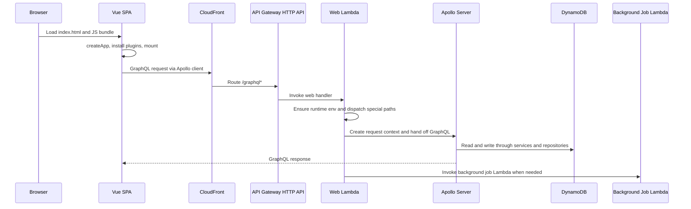

# Architecture

This repository is a self-hosted personal finance tracker built as a Vue single-page application on top of a GraphQL backend, with AWS CDK defining the deployed runtime. The code is organized so that the backend owns business behavior and data access, the frontend owns routing and presentation, and infrastructure wires the services together for AWS.

## System boundaries

- **Backend**: Apollo GraphQL server, domain services, repositories, auth, AI orchestration, Telegram integration, and background-job dispatch.
- **Frontend**: Vue app bootstrapped from `frontend/src/main.ts`, with route-level auth guards in `frontend/src/router/index.ts`.
- **Infrastructure**: CDK stacks in `infra-cdk/lib/` provision DynamoDB tables, Lambda functions, CloudFront, S3, API Gateway, and optional custom-domain resources.

The backend and frontend are both shipped as build artifacts and are joined at runtime by CloudFront routing `/graphql*` and `/mcp*` requests to API Gateway while serving the SPA from S3.

## Runtime topology

This topology shows the main request path for the SPA and the Lambda split used by the backend.

## Backend entrypoints and composition

`backend/src/server.ts` is the GraphQL server composition root. It reads the schema from `backend/src/graphql/schema.graphql`, creates an `ApolloServer`, enables introspection only in development, and logs GraphQL errors before returning them.

`createContext()` is the per-request composition point. It:

- extracts the `Authorization` header,
- resolves JWT auth through `resolveJwtAuthService()`,
- assembles repositories and service instances,
- lazily resolves the authenticated internal user ID,
- creates fresh request-scoped DataLoaders for accounts and categories.

That context object is what resolvers consume, so request authorization and loader scoping happen before any domain logic runs.

## Dependency injection and owned singletons

`backend/src/dependencies.ts` is the backend’s dependency graph. It centralizes singleton creation for the shared runtime objects and is the main place where the service layer is wired together.

Important responsibilities include:

- creating the shared `DynamoDBDocumentClient`,
- building repository singletons for users, accounts, categories, transactions, chat messages, trend presets, and Telegram bots,
- building CRUD and report services from those repositories,
- creating the background-job dispatcher provider,
- initializing the LangChain model from runtime environment variables,
- composing the assistant and natural-language transaction agents,
- wrapping those agents in services used by GraphQL resolvers.

The file uses singleton helpers so expensive objects are reused across warm Lambda invocations, while request-specific objects such as DataLoaders are still created inside `createContext()`.

## Lambda dispatch and request routing

`backend/src/lambdas/web.ts` is the Lambda entrypoint for the HTTP API. It is responsible for all web traffic that reaches the backend runtime and performs a small amount of path-based dispatch before delegating to Apollo.

Dispatch behavior:

- `/webhooks/telegram` goes to `telegramWebhookHandler`
- `/mcp` goes to `mcpHandler`
- `/.well-known/*` returns a 404 so MCP/OAuth discovery probes do not fall through to Apollo’s CSRF guard
- all other requests are handed to the Apollo request handler

Before any of that, the handler ensures runtime environment values are loaded once per warm execution via `injectRuntimeEnv(process.env)`.

## Frontend bootstrapping and client routing

`frontend/src/main.ts` creates the Vue application, provides the Apollo client to the component tree, installs auth, i18n, Vuetify, and router plugins, and mounts the app into `#app`.

`frontend/src/router/index.ts` defines the application routes and the primary navigation guard:

- `/` shows the sign-in page,
- the finance and assistant views require authentication,
- the guard waits for auth state to finish loading before redirecting,
- unauthenticated users are sent back to `SignIn`.

This means the frontend does not duplicate backend authorization, but it does avoid rendering protected views until the client-side auth state is ready.

## Infrastructure and deployment shape

`infra-cdk/lib/backend-cdk-stack.ts` provisions the backend runtime:

- DynamoDB tables for users, accounts, categories, transactions, migrations, chat messages, Telegram bots, and trend presets
- Lambda functions for the web endpoint and background jobs
- CloudWatch log groups and IAM roles
- Bedrock invocation permissions for AI-driven features
- environment variables that bind the Lambdas to the correct tables, auth issuer, and job function

The web Lambda gets the background-job function name injected so it can dispatch asynchronous work.

`infra-cdk/lib/frontend-cdk-stack.ts` provisions the delivery path for the SPA:

- an S3 bucket for static website hosting
- a CloudFront distribution in front of the bucket
- API Gateway origin routing for `/graphql*` and `/mcp*`
- optional custom-domain support using Route 53 and ACM, including a separate us-east-1 certificate stack when configured
- outputs used by deployment tooling, including bucket name and CloudFront identifiers

## End-to-end request path

A typical authenticated GraphQL request moves through the system like this:

1. The browser loads the SPA from CloudFront and S3.
2. The Vue app boots in `main.ts`, installs the Apollo client, and routes the user to the appropriate view.
3. A view or composable issues a GraphQL operation.
4. CloudFront forwards `/graphql*` to API Gateway.
5. API Gateway invokes the web Lambda.
6. The Lambda loads runtime config, dispatches path-specific handlers, and calls Apollo for GraphQL traffic.
7. `createContext()` resolves auth, services, repositories, and request-scoped loaders.
8. Resolvers call services, which in turn use repositories and shared helpers.
9. DynamoDB stores and retrieves the durable application state.
10. The response returns through Apollo, Lambda, API Gateway, and CloudFront back to the browser.

## Invariants and operational notes

- Shared backend dependencies are intentionally long-lived singletons; per-request auth and loader state are created fresh for each GraphQL request.
- Environment variables are the contract between CDK and the Lambda runtime, so missing table names or auth settings fail early during startup.
- The web Lambda is the single HTTP entrypoint for GraphQL, Telegram webhooks, MCP, and discovery probes, so path routing there is part of the public contract.
- Frontend route protection is a UI guard, not a security boundary; the backend still authenticates every request through JWT context creation.
- Optional custom-domain resources are created only when the SSM lookup resolves to a real hosted-zone name.

## Where to change things

- GraphQL schema, resolvers, and request context: `backend/src/server.ts` and `backend/src/graphql/`
- Backend wiring, repositories, services, and AI model setup: `backend/src/dependencies.ts`
- Lambda HTTP dispatch and non-GraphQL entrypoints: `backend/src/lambdas/web.ts`
- SPA startup and navigation rules: `frontend/src/main.ts` and `frontend/src/router/index.ts`
- AWS resources, permissions, and delivery topology: `infra-cdk/lib/backend-cdk-stack.ts` and `infra-cdk/lib/frontend-cdk-stack.ts`
