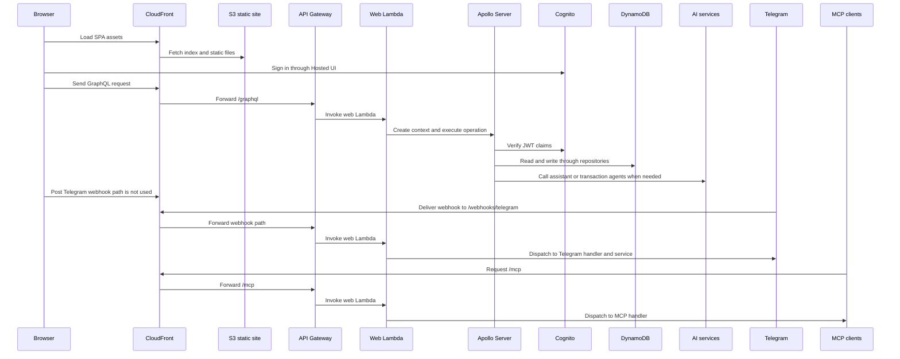
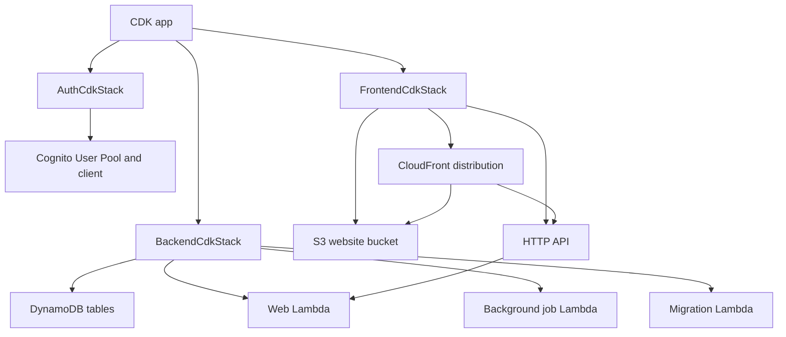

# System architecture

This repository is split into three major layers:

- a Vue single-page application in `frontend/`
- a GraphQL API and supporting Lambdas in `backend/`
- AWS CDK infrastructure in `infra-cdk/`

The architectural boundary that matters most is that application behavior lives in the backend and frontend code, while AWS resources, permissions, routing, and hosting are defined in CDK. The GraphQL schema and generated client/resolver types sit between those layers: they are generated artifacts that encode the contract, but the actual behavior still comes from resolver, service, and composable code.

## Runtime responsibilities

### Frontend SPA

`frontend/src/main.ts` mounts the Vue app, installs auth, i18n, Vuetify, and routing plugins, and provides the Apollo client to the component tree. That file is the entrypoint for browser runtime only; it does not own persistence or authorization rules.

The frontend’s main job is to collect user input, call generated GraphQL operations, and render returned state. For example, the create-transaction-from-text composable sends the mutation, passes an abort signal, preserves failed input, and only clears the text after a successful transaction is returned.

### GraphQL backend

`backend/src/server.ts` constructs the Apollo Server and loads `backend/src/graphql/schema.graphql`. It also builds a fresh GraphQL context per request. That context is where request-scoped auth, repositories, services, and DataLoaders are wired together.

The resolver index in `backend/src/graphql/resolvers/index.ts` composes domain-specific resolver modules. It also defines union resolution for `AgentTraceMessage` by mapping the service-layer discriminated union into GraphQL concrete types.

The Lambda entrypoint in `backend/src/lambdas/web.ts` multiplexes three kinds of runtime traffic:

- GraphQL requests are handled by Apollo
- Telegram webhook calls are routed directly to the Telegram handler
- MCP traffic is routed directly to the MCP handler

It also forces `/.well-known/*` discovery paths to return 404 instead of falling through to Apollo, which avoids confusing MCP/OAuth clients with CSRF errors.

### Persistence and domain services

DynamoDB is the primary persistence layer. The backend context injects repositories and services, but request handlers do not talk to tables directly. They go through service and repository boundaries, which keeps persistence access constrained and makes it easier to preserve per-user isolation.

The CDK backend stack defines separate tables for users, accounts, categories, transactions, chat messages, migrations, Telegram bots, and trend presets, plus the secondary indexes needed for lookup patterns such as user email, MCP token, transaction date ordering, and Telegram webhook secret lookup.

### Authentication

Cognito is the authentication boundary for the browser-facing app. The auth stack creates a user pool, a public SPA client, a hosted UI domain, and a pre-token-generation Lambda that injects namespaced email claims into access tokens.

The important invariant is that email is required and immutable in Cognito because the app uses it as the user identifier for persisted data. Changing it would orphan DynamoDB records. The SPA uses an authorization-code flow, and the backend verifies JWTs against the configured issuer and client ID.

### Outbound integrations

The backend can call out to three main integration paths:

- AI services for assistant chat and natural-language transaction creation
- Telegram bot services for incoming webhook traffic and bot replies
- MCP tools and token-authenticated MCP requests for external AI clients

These integrations are all behind backend services or Lambda handlers rather than being invoked directly from the browser.

## End-to-end request boundaries

This diagram shows the runtime split between browser delivery, GraphQL execution, and outbound integration paths.

## Deployment wiring

CloudFront is the public edge entrypoint for both the SPA and API traffic. The frontend stack provisions an S3 website origin for static assets and forwards `/graphql*` and `/mcp*` to API Gateway through an HTTP origin. It also supports an optional custom domain via Route 53 and an ACM certificate in `us-east-1`.

This wiring keeps deployment concerns in infrastructure code and runtime behavior in application code.

## Safe-change invariants

### Auth and request scoping

`backend/src/server.ts` creates a new GraphQL context for every request, and the account/category loaders are recreated per request with a lazy user-id lookup. That prevents cross-request cache leakage and keeps loader results scoped to the authenticated user.

For safe changes, preserve these rules:

- do not reuse GraphQL context objects across requests
- keep loader instances request-scoped
- keep user identity resolution tied to the authenticated request context
- do not let frontend code bypass the backend for protected data access

### Persistence boundaries

Backend code should continue to access DynamoDB through repositories and services, not directly from resolvers or UI code. That separation is what keeps user scoping, validation, and business rules centralized.

The DynamoDB table keys and indexes are part of the data contract. Changing them affects lookup paths for accounts, categories, transactions, chat messages, Telegram bots, and migrations.

### Integration boundaries

Telegram webhooks and MCP traffic are intentionally separated from the normal GraphQL request path inside the Lambda handler. If you add a new externally reachable path, decide whether it belongs in Apollo, a dedicated Lambda branch, or separate infrastructure entirely.

AI features are also mediated through service layers and Lambda runtime configuration. They are not a frontend-only concern, because the backend owns tool access, persistence, and validation.

## Extension points

The codebase has a few stable change surfaces:

- GraphQL behavior: resolver modules under `backend/src/graphql/resolvers/`
- backend orchestration and request scoping: `backend/src/server.ts`
- Lambda path multiplexing: `backend/src/lambdas/web.ts`
- browser bootstrap and client wiring: `frontend/src/main.ts`
- auth and token policy: `infra-cdk/lib/auth-cdk-stack.ts`
- table definitions, Lambda permissions, and runtime env wiring: `infra-cdk/lib/backend-cdk-stack.ts`
- CloudFront, S3, API routing, and optional custom domain setup: `infra-cdk/lib/frontend-cdk-stack.ts`

## Test signals that matter

The most relevant tests are the ones that protect architectural boundaries rather than just symbol existence:

- frontend composable tests that confirm transaction submission preserves abort behavior and input state on failure
- backend resolver and service tests that verify business rules and error translation remain inside the backend
- MCP and Telegram handler tests that confirm non-GraphQL paths are isolated from the Apollo request path
- infrastructure tests, if present, that verify the CDK wiring for auth, API routing, and table/index definitions

Those tests are important because they guard the system’s main invariants: authenticated request scoping, persistence isolation by user, and clear separation between browser traffic, GraphQL traffic, and outbound integrations.
