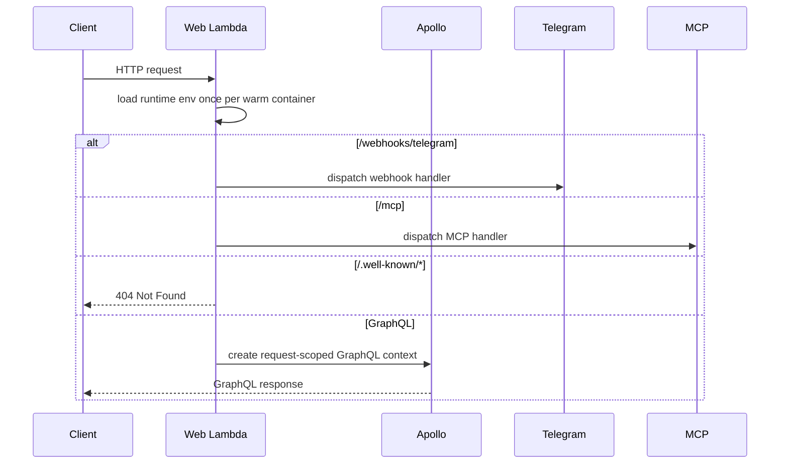

# Backend Architecture

The backend is the application runtime for GraphQL, background jobs, Telegram webhook handling, and MCP requests. Its main architectural job is to assemble request-scoped services from singleton providers, keep persistence behind repositories, and turn internal failures into the right user-facing or internal responses depending on the surface.

## Bootstrap and runtime entrypoints

The primary runtime entrypoint is `backend/src/lambdas/web.ts`. On each invocation it first ensures runtime environment variables are loaded, then routes the request by path:

- `/webhooks/telegram` goes to the Telegram webhook handler
- `/mcp` goes to the MCP handler
- `/.well-known/*` returns a 404 so discovery probes do not fall through to Apollo
- everything else goes through Apollo Server

That routing keeps the GraphQL path isolated from non-GraphQL traffic and prevents MCP discovery requests from being misclassified as GraphQL/CSRF failures.

This diagram shows the first routing decision in the backend request path.

`backend/src/lambdas/background-job.ts` is the asynchronous job entrypoint. It validates the event shape with Zod before dispatching, logs malformed job payloads, and fails fast on unexpected input. For recognized jobs it resolves the relevant service and surfaces job failures as thrown errors so the job runtime can observe them.

`backend/src/lambdas/mcp-handler.ts` is the HTTP bridge for MCP. It authenticates the request token before building the server, returns `401 Unauthorized` when no valid token is present, and otherwise adapts API Gateway requests and responses to the MCP transport.

## Dependency assembly and lifecycle

`backend/src/dependencies.ts` is the composition root. It wires repositories, services, providers, and agents together and exposes resolver functions that the rest of the backend uses.

The dependency graph has a few important properties:

- repositories are built on singleton DynamoDB document clients
- higher-level services depend on repositories, not on SDK clients
- AI services and agents are built asynchronously because they need model initialization
- background-job and Telegram adapters are optional runtime integrations rather than direct business-logic dependencies
- the same service objects can be reused across GraphQL, MCP, and background-job paths

`backend/src/utils/dependency-injection.ts` implements the singleton helpers used throughout the composition root. `createSingleton` memoizes a synchronous factory result, and `createAsyncSingleton` memoizes a promise while resetting it if initialization rejects. That means a failed async initialization can be retried instead of being permanently cached as a broken promise.

`backend/src/dependencies.ts` also includes a development-only fallback for background-job dispatch: when `BACKGROUND_JOB_FUNCTION_NAME` is absent, the dispatcher becomes a logger that skips the Lambda invoke. That keeps local development from requiring every production integration.

## GraphQL server construction and request context

`backend/src/server.ts` constructs the Apollo Server and loads the schema from `backend/src/graphql/schema.graphql`. The server is configured with a custom `formatError` policy that splits failure handling into three categories:

- intentional `GraphQLError` values are passed through unchanged
- user-facing domain and validation failures return safe client messages with `BAD_USER_INPUT` or `BAD_REQUEST`
- unexpected failures are logged with the GraphQL path and rewritten to a generic `Internal server error` with `INTERNAL_SERVER_ERROR`

That boundary matters because GraphQL callers should see actionable validation and business-rule feedback, but not implementation details from uncaught exceptions.

The request context is built per request in `createContext`. It normalizes the `Authorization` header, resolves JWT auth, and then assembles repositories and services into a fresh `GraphQLContext`. The context is not shared between requests.

Request-scoped DataLoaders are created after a lazy `getUserId` helper is defined. The helper returns an empty string for unauthenticated requests and also falls back to an empty string if authenticated-user lookup fails. This keeps the loaders scoped to the authenticated user while avoiding cross-request cache leakage.

## Persistence adapters and repository boundaries

The backend talks to DynamoDB through repositories and writers rather than through raw SDK calls in resolvers or handlers.

`backend/src/repositories/dyn-base-repository.ts` provides the common repository behavior:

- it requires a table name at construction time
- it owns a shared `DynamoDBDocumentClient`
- it hydrates query results through Zod schema parsing
- it paginates recursively until either the requested page size is satisfied or the table has no more results

That gives each repository a consistent failure mode: malformed persisted data fails at hydration time instead of leaking loosely typed records upward.

The repositories are then composed into account, category, transaction, chat message, telegram bot, trend preset, and user repositories. Services sit on top of those repositories and implement business rules, cross-entity workflows, and agent-driven orchestration.

## MCP handling and user-scoped tools

`backend/src/mcp/server.ts` creates the MCP server only after `authenticateMcpToken` resolves a user from the token and user repository. If authentication fails, the handler returns no server and the HTTP layer responds with `401 Unauthorized`.

After authentication, the server registers a fixed set of tools bound to that user id. The tool set is user-scoped, not global, and includes account, category, transaction, aggregate, and guide-loading operations.

Tool execution has deliberate error translation:

- user-facing errors become tool failures with the original message
- unexpected errors are logged server-side and collapsed to a generic `Failed to run <tool>` message

That preserves diagnostic value for normal business errors while keeping internal stack details out of MCP responses.

## Representative execution path

The GraphQL request path is the clearest example of backend control flow because it combines environment setup, auth, service assembly, repository access, and user-facing error translation.

1. API Gateway invokes the web Lambda.
2. The web Lambda loads runtime environment values once per warm container.
3. The Apollo branch creates a fresh request context.
4. `createContext` normalizes the auth header and resolves JWT auth.
5. The context wires repositories, services, and request-scoped loaders.
6. Apollo executes the resolver.
7. Resolver and service errors are formatted according to the error policy.

## Safe-change invariants

A few invariants are central to safe backend changes:

- keep GraphQL contexts request-scoped
- keep loaders tied to the authenticated request, not to the process
- keep business logic in services and repositories, not in Lambda handlers
- preserve MCP token authentication before tool registration
- keep background jobs validated and fail-fast on malformed payloads
- keep internal faults hidden from GraphQL and MCP clients unless the error is intentionally user-facing
- preserve repository hydration and validation so persisted data stays schema-checked at the boundary

## Extension points

The backend has a small number of stable seams that are safe to extend:

- `backend/src/server.ts` for GraphQL context, error policy, and request scoping
- `backend/src/dependencies.ts` for new services, repositories, or adapters
- `backend/src/lambdas/web.ts` for new externally reachable HTTP paths
- `backend/src/lambdas/background-job.ts` for new async job kinds
- `backend/src/mcp/server.ts` for new MCP tools and their authorization rules
- repository subclasses for new DynamoDB-backed entities

## Focused tests that matter

The tests that best protect this architecture are the ones that exercise boundaries:

- GraphQL tests that verify auth, validation, and error formatting
- context or service tests that prove request-scoped loaders do not leak user data
- MCP server tests that confirm token authentication and tool registration behavior
- background-job tests that validate payload parsing and failure propagation
- repository tests that confirm schema hydration and pagination behavior

Those tests matter more than symbol-level coverage because they protect the backend’s core safety properties: per-request scoping, user isolation, predictable failure translation, and strict persistence validation.
