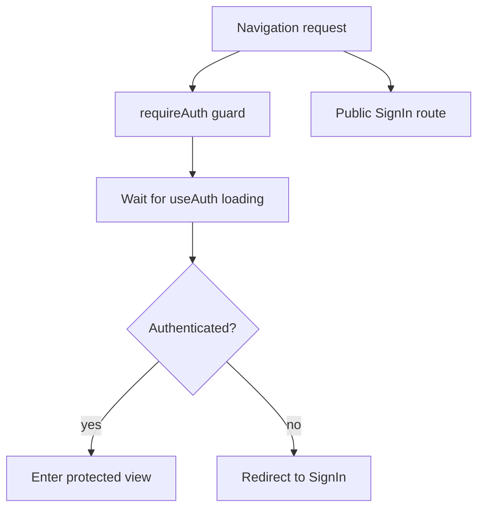
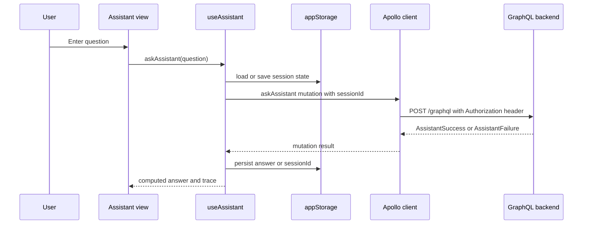

# Frontend Architecture

The frontend is a Vue single-page application that owns browser-side UI state, route transitions, and the orchestration of GraphQL requests. It does not implement business rules locally; instead it composes generated GraphQL operations, auth/session plugins, and a small set of stateful composables to deliver the user experience safely.

## Application shape

`frontend/src/main.ts` is the browser entrypoint. It creates the Vue app, provides the shared Apollo client to the component tree, and installs the auth, i18n, Vuetify, and router plugins before mounting the app.

That means the main application concerns are split along a few stable boundaries:

- `main.ts` bootstraps the runtime
- `plugins/auth.ts` handles OIDC login state and callback processing
- `apollo.ts` centralizes GraphQL transport, auth headers, and network error handling
- `router/index.ts` decides which views are publicly accessible and which require authentication
- composables such as `useAssistant()` and `useCreateTransactionFromText()` own multi-step UI interactions and local persistence

The UI is therefore a stateful client that depends on the backend for authoritative data, while preserving transient input, cached assistant output, and navigation state in the browser.

## Generated GraphQL client contract

The frontend talks to the backend only through GraphQL operations. Query and mutation documents live in `frontend/src/graphql/queries.ts` and `frontend/src/graphql/mutations.ts`, while the generated type-safe operation hooks and result types live in `frontend/src/__generated__/vue-apollo.ts`.

The generated module is the contract between the Vue code and the schema: composables import hooks such as `useAskAssistantMutation()` and `useCreateTransactionFromTextMutation()` rather than assembling network requests by hand. This keeps component code aligned with the schema and makes backend changes visible at build time when operation signatures or union shapes change.

Representative operations that matter to the UI include:

- `ASK_ASSISTANT`, which returns either `AssistantSuccess` or `AssistantFailure` with a `sessionId` and `agentTrace`
- `CREATE_TRANSACTION_FROM_TEXT`, which returns either a success payload with a `transaction` or a failure payload with a user-facing message and trace
- the normal CRUD and report queries for accounts, categories, transactions, trends, settings, and Telegram bot state

The frontend relies on fragment-driven documents so list and detail views stay consistent with the schema shape without duplicating field selection.

## Auth and session handling

`frontend/src/plugins/auth.ts` creates the OIDC client with runtime configuration from Vite environment variables. It requires issuer, client ID, and scope values, uses the authorization-code flow, and persists the OIDC user state in `localStorage` through `WebStorageStateStore`.

The important architectural behavior is that the plugin also handles the OAuth callback directly in the browser. When the URL contains `code` and `state`, it completes the redirect flow, stores the tokens, and cleans the URL so the callback parameters do not linger in history.

`frontend/src/apollo.ts` then reads the token through a setter-installed callback and injects it as the `Authorization` header on each GraphQL request. This keeps authentication concerns centralized instead of being reimplemented in individual views.

The app uses a separate namespaced storage wrapper in `frontend/src/lib/appStorage.ts` for user-scoped UI data. That wrapper prefixes keys with `budget:` so the app can clear persisted assistant state without wiping unrelated browser storage used by the OIDC library. This prevents one user’s assistant data from leaking into the next session on a shared browser while preserving sign-out behavior.

## Router boundaries

`frontend/src/router/index.ts` defines the route map and the authentication boundary around the app. The sign-in view is public, while accounts, categories, transactions, reports, trends, assistant, and settings are protected by a reusable `requireAuth` guard.

The guard waits for `useAuth()` to finish loading before deciding whether to allow navigation. If authentication is ready and the user is signed in, the route proceeds; otherwise the router redirects to the sign-in page.

This router boundary is one of the main safety mechanisms in the UI: protected views assume a valid session and should not have to duplicate redirect logic.

## Stateful composables that drive the UI

The most important frontend behavior lives in composables, not in page components. They encapsulate request lifecycle, abort handling, storage, and presentation-state retention.

### `useAssistant()`

`useAssistant()` coordinates the assistant chat flow. It submits the `ASK_ASSISTANT` mutation with an optional session ID, handles abort signals, and distinguishes between success and failure responses.

It also persists two pieces of state in app storage:

- the last assistant answer and trace, so the UI can restore the previous result after a reload
- the assistant session ID, so follow-up questions continue the same backend session

On success it stores the returned answer and trace, and on failure it preserves the session ID while clearing the displayed answer. On network or transport failure it resolves a user-facing message through `resolveErrorMessage()` and leaves aborts silent.

### `useCreateTransactionFromText()`

`useCreateTransactionFromText()` powers the natural-language transaction flow. It trims input, aborts in-flight requests when requested, and submits `CREATE_TRANSACTION_FROM_TEXT` with an `isVoiceInput` flag when the input came from speech.

Its key UI contract is that it does not clear the text field on failure. Only a successful response that includes a transaction clears the input. That preserves the user’s draft text so they can correct and resubmit without retyping.

The composable also captures the returned `agentTrace`, which lets the UI render the assistant reasoning path or troubleshooting details alongside the created transaction.

### Shared storage and error handling

`frontend/src/apollo.ts` maintains a global connection error ref for transport failures, while composables handle GraphQL-domain errors locally. This separation matters because the app can show generic connection feedback globally without collapsing the specialized error states used by assistant or transaction flows.

`appStorage` is used by stateful composables, not by view code directly, so storage policy stays centralized. That makes it easier to change persistence behavior later without rewriting screens.

## Data-flow sequence

The assistant flow is the clearest example of how the frontend coordinates local state, storage, and the backend contract.

This sequence shows the main front-to-back contract: the composable owns request lifecycle and cached UI state, while the backend owns the assistant response and session semantics.

## Safe-change invariants

When changing UI behavior, preserve these boundaries:

- keep browser bootstrap in `main.ts` and avoid scattering global providers across views
- keep OIDC callback handling in the auth plugin so login state stays consistent
- keep GraphQL authentication header injection in `apollo.ts`
- keep protected route decisions in the router guard rather than per-view ad hoc checks
- keep session and draft persistence inside composables or storage helpers, not in individual components
- preserve the rule that failed transaction-from-text submissions keep the user’s input intact
- preserve assistant session continuity by storing and reusing the returned session ID

These invariants make it safe to evolve views without breaking authentication, storage, or retry behavior.

## Extension points

The safest frontend change surfaces are:

- `frontend/src/graphql/queries.ts` and `frontend/src/graphql/mutations.ts` when the UI needs new backend operations
- `frontend/src/__generated__/vue-apollo.ts` through its generated workflow, not by manual editing
- `frontend/src/composables/*` for new request orchestration or cached UI state
- `frontend/src/router/index.ts` for new views and access rules
- `frontend/src/plugins/auth.ts` for login flow or token policy changes
- `frontend/src/lib/appStorage.ts` when adding more namespaced browser-persisted UI state

Changes that affect behavior should usually start in a composable or route boundary, then move outward into the view layer.

## Focused tests that matter

The frontend tests that best protect the architecture are the ones that verify user-visible behavior at the composable and router boundary:

- `frontend/src/composables/useAssistant.test.ts` for session persistence, abort behavior, and error handling
- `frontend/src/composables/useCreateTransactionFromText.test.ts` for input retention, abort handling, and successful submission behavior
- route-level tests, if added, for protected navigation and sign-in redirection
- storage tests such as `frontend/src/lib/appStorage.test.ts` for namespaced cleanup behavior

Those tests matter because they protect the contracts that would otherwise be easy to break while refactoring components: authenticated access, session continuity, and safe retry behavior.
