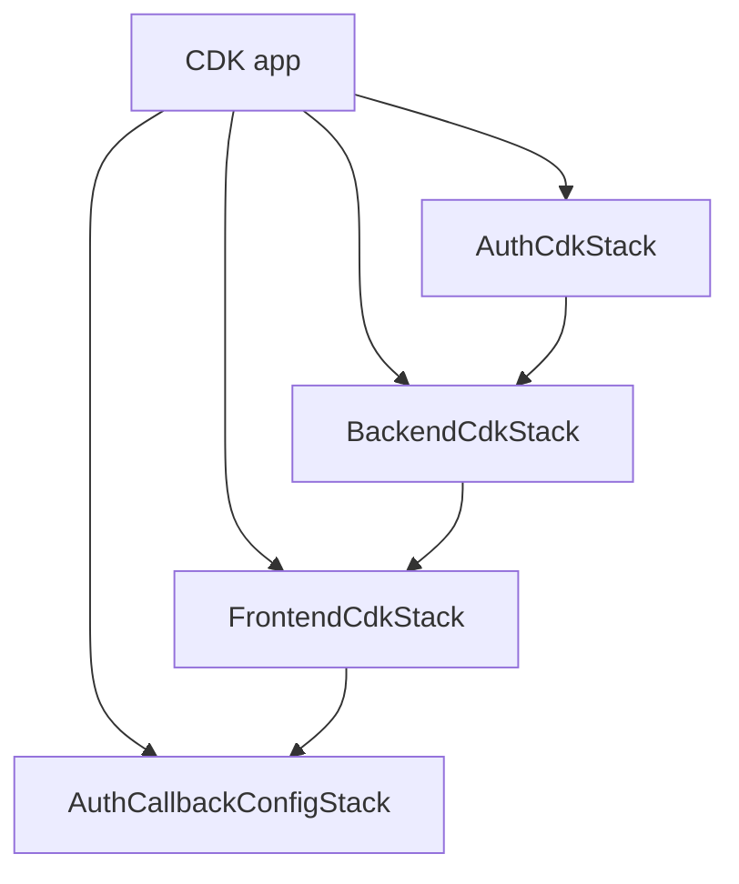
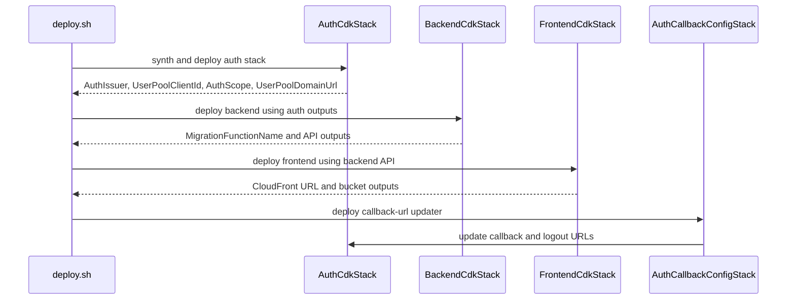

# Infrastructure Architecture

This page describes the AWS CDK layer that provisions and wires the app runtime. The important boundary is that application behavior lives in the backend and frontend code, while infrastructure code owns hosting, routing, permissions, identity plumbing, and deployment-time configuration flow.

## Stack layout and responsibilities

The CDK app in `infra-cdk/bin/app.ts` creates four stacks:

- `AuthCdkStack` provisions Cognito user authentication, the user pool client, the hosted UI domain, and the pre-token-generation Lambda that injects the namespaced email claim into access tokens.
- `BackendCdkStack` provisions the DynamoDB tables, Lambda functions, API Gateway HTTP API, backup vault and plan, and the environment variables that connect runtime code to AWS resources.
- `FrontendCdkStack` provisions the S3 website bucket and CloudFront distribution that serves the SPA and proxies `/graphql*` and `/mcp*` traffic to the backend API.
- `AuthCallbackConfigStack` runs after the frontend exists and updates the Cognito client callback and logout URLs so authentication works with the deployed CloudFront domain.

The app tags every stack with the current `NODE_ENV`, and the backend stack also tags DynamoDB tables with a `backup` tag so the backup plan can select them automatically.

The deployment graph shows the main ordering constraint: backend resources need Cognito outputs, frontend resources need the backend API, and callback URLs can only be finalized after CloudFront exists.

## Deployment order and cross-stack references

The CDK entrypoint passes the auth stack's user pool and client into the backend stack, then passes the backend HTTP API into the frontend stack. The frontend stack exposes the distribution and optional custom-domain URL, which are then consumed by the callback-configuration stack.

Although CloudFormation can deploy independent stacks separately, this repository intentionally couples them in one CDK app so cross-stack references stay consistent and the deploy script can read the resulting outputs in a single run. `FrontendCdkStack` enables `crossRegionReferences` because custom-domain certificates are created in `us-east-1` while the main frontend stack may target another region.

The custom-domain certificate is created in a sibling stack under `us-east-1` only when the custom domain lookup succeeds. That sibling stack exists because CloudFront requires ACM certificates in `us-east-1`, and the Route 53 hosted zone is looked up by exact domain name before certificate validation and alias creation.

## Configuration sources and when they apply

There are two distinct configuration lifecycles:

- **Deployment-time configuration** is read by `deploy.sh` and CDK while stacks are synthesized and deployed. Changing it takes effect on the next deployment.
- **Runtime configuration** is read by the backend Lambda at cold start from SSM Parameter Store, so a redeploy is not required for those values to change.

The root README documents the same split and the example parameters that live under `/manual/budget/<env>/...`. In practice, this means infrastructure and app code consume configuration at different times:

- `deploy.sh` reads deployment-time SSM values such as auth registration policy, auth claim namespace, auth domain prefix, optional frontend custom domain, and Lambda memory and timeout settings.
- The backend runtime reads SSM-backed values on cold start for chat and LangChain behavior, so those knobs are operational rather than structural.
- CDK context is used for optional custom-domain and hosted-zone lookups, and the first synth can produce a dummy lookup placeholder until the context cache is populated.

The deployment script then extracts the auth outputs from the synthesized stacks and exports them into the frontend build as `VITE_*` environment variables, which makes the browser bundle point at the deployed Cognito and API endpoints instead of hardcoded local defaults.

## Runtime wiring from stacks to application code

The backend stack is where infrastructure meets application code most directly. Its Lambda environment contains the table names, `AUTH_CLIENT_ID`, `AUTH_ISSUER`, `AUTH_CLAIM_NAMESPACE`, and `NODE_ENV` values that the backend services use to authenticate requests and reach DynamoDB.

The backend stack also provisions the resource shape that the code relies on:

- DynamoDB tables use pay-per-request billing, point-in-time recovery, retention on deletion, and deletion protection.
- The users table has email and MCP token secondary indexes.
- The transactions table has secondary indexes for sortable created-at reads and date-ordered reads.
- The chat messages table uses a TTL attribute for expiring session data.
- The Telegram bots table has a webhook-secret index.
- The backup vault and daily backup plan protect all tagged tables automatically.

The Lambda defaults are centralized in `default-lambda-options.ts`, so memory size and timeout can be set once and reused across the auth, backend, and callback-updater functions. Tracing is always enabled there, which makes stack-level observability a default rather than an opt-in.

## Frontend hosting and request routing

`FrontendCdkStack` serves the SPA from an S3 static website origin behind CloudFront. The distribution uses the bucket as the default origin for the app shell, while `/graphql*` and `/mcp*` are forwarded to API Gateway through an HTTP origin.

This matters for application changes because the frontend build assumes the CDN owns routing behavior:

- `index.html` is returned for the root path and for 404s so SPA routes can refresh safely.
- Security headers are attached to both static and API responses.
- API requests are not cached, while static assets use optimized caching.
- The frontend build and deployment script depend on the bucket name and distribution ID outputs from the stack.

When a custom domain is configured, the frontend stack also creates the Route 53 alias record and exposes the final `https://...` URL. That URL becomes an input to auth callback configuration.

## Auth callback wiring without circular dependencies

The Cognito stack can be deployed before CloudFront exists, but the Cognito app client needs the final redirect URLs. The repository resolves this with a separate callback-configuration stack that runs after the frontend stack and calls `UpdateUserPoolClient` through a custom resource.

The callback stack preserves the rest of the Cognito client configuration by updating only the callback and logout URLs. If a custom domain is configured, both the CloudFront URL and the custom domain are written into the allowed URL set so auth works from either entrypoint.

## Deployment script integration

`deploy.sh` is the operational glue between CDK and the application build:

1. It loads deployment-time SSM values into environment variables.
2. It builds the backend before running `npm run deploy` in `infra-cdk`.
3. It reads stack outputs from the generated CDK outputs file.
4. It runs backend migrations through the migration Lambda.
5. It exports auth values into the frontend build as `VITE_AUTH_CLIENT_ID`, `VITE_AUTH_ISSUER`, `VITE_AUTH_SCOPE`, and `VITE_AUTH_UI_URL`, and sets the GraphQL and MCP endpoints.
6. It uploads the frontend assets to the S3 bucket and invalidates the CloudFront cache when a distribution ID is available.

That flow is the main reason the infrastructure page matters for application work: changing the shape or naming of outputs, environment variables, URL routing, or stack ordering can break deployment even if the runtime code itself still compiles.

## Practical change boundaries

Safe application changes usually stay within the contracts established by these stacks:

- Backend code can assume the table names and auth-related Lambda environment variables are present because CDK injects them.
- Frontend code can assume it is served from CloudFront and should use `/graphql` and `/mcp` relative paths.
- Auth flows can assume Cognito redirect URLs are managed by CDK, not by manual console edits.
- New tables or Lambdas should follow the existing backup, tracing, logging, and retention conventions so they fit the same operational model.

If a change affects any of those contracts, update the CDK stack and the deployment script together so the runtime, deploy-time config, and outputs remain aligned.
