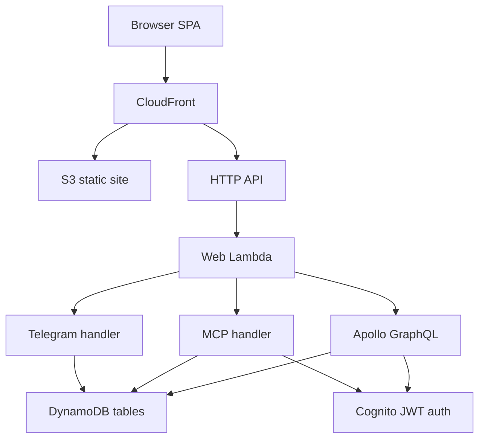
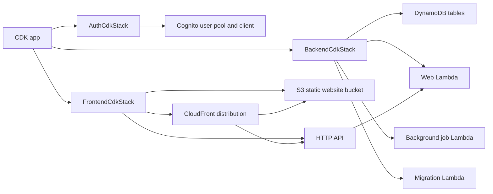
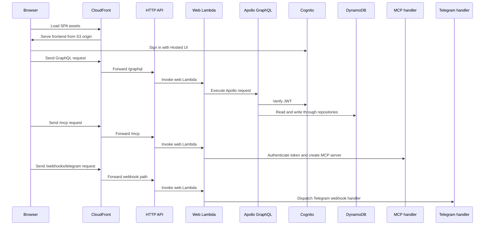

# Architecture Overview

This repository is organized around three ownership boundaries:

- the Vue single-page application in `frontend/`
- the application runtime in `backend/`
- AWS infrastructure and deployment wiring in `infra-cdk/`

The important architectural rule is that browser behavior, GraphQL execution, MCP tooling, and Telegram handling are all implemented in backend code, while CDK defines the AWS resources, routing, permissions, and environment wiring that make those runtimes reachable.

## Runtime shape

The app is served as a CloudFront-backed SPA with API traffic routed through the same edge entrypoint. The frontend only owns browser bootstrap and client-side request initiation; it does not own data access or authorization policy.

The backend is a Lambda-based application server. It exposes GraphQL through Apollo, and it also multiplexes non-GraphQL requests for Telegram webhooks and MCP requests. That makes the backend the central runtime boundary where authentication, request scoping, and integration dispatch converge.

CDK provisions the AWS services that surround those runtimes: Cognito for browser authentication, DynamoDB for persistence, API Gateway for HTTP routing, CloudFront and S3 for the frontend, and optional Route 53 and ACM resources for a custom domain.

This diagram shows the main runtime split: CloudFront serves the browser application, API Gateway forwards dynamic requests to the web Lambda, and that Lambda dispatches into GraphQL, Telegram, or MCP processing.

## Request surfaces

### Browser and GraphQL

`backend/src/server.ts` constructs the Apollo Server and loads the GraphQL schema. It also creates a fresh request context for every request, which is where authenticated identity, repositories, services, and request-scoped DataLoaders are wired together.

`backend/src/lambdas/web.ts` is the main HTTP entrypoint. It routes requests by path:

- `/webhooks/telegram` goes to the Telegram webhook handler
- `/mcp` goes to the MCP handler
- `/.well-known/*` returns `404` so discovery probes do not fall through to Apollo
- everything else is handled by Apollo GraphQL

That path-based dispatch means GraphQL is not the only public surface, but it is the default surface for normal application traffic.

### MCP

MCP requests are authenticated separately from browser requests. `backend/src/lambdas/mcp-handler.ts` extracts a token from the query string, calls `createAuthenticatedMcpServer`, and returns `401 Unauthorized` when token authentication fails.

`backend/src/mcp/server.ts` binds the authenticated user to an `McpServer` instance and registers tool handlers that reuse backend services and repositories. The tools are user-scoped, so the MCP surface is not a generic database proxy; it is an authenticated extension point over the same backend domain model.

### Telegram

Telegram webhook traffic is isolated from GraphQL inside the web Lambda. The Lambda router sends `/webhooks/telegram` straight to the Telegram webhook handler, which keeps webhook processing separate from Apollo request parsing and GraphQL error handling.

## Ownership boundaries

### Frontend owns presentation and client workflow

The frontend mounts the Vue application and provides client-side infrastructure such as routing, auth integration, and Apollo client wiring. The browser code is responsible for collecting user input and issuing GraphQL operations, not for direct persistence or business-rule enforcement.

### Backend owns domain execution and integration policy

The backend owns the application’s runtime policy:

- GraphQL request context and error translation
- service and repository orchestration
- request-scoped identity resolution
- MCP tool registration and token authentication
- Telegram webhook dispatch
- AI-assisted features that need backend access to data and tools

The browser does not bypass the backend for protected data or integration access.

### CDK owns AWS resources and wiring

The infrastructure layer defines the deployable shape of the system rather than business logic.

- `infra-cdk/lib/auth-cdk-stack.ts` creates the Cognito user pool, SPA client, hosted UI domain, and pre-token-generation Lambda.
- `infra-cdk/lib/backend-cdk-stack.ts` creates DynamoDB tables, Lambdas, IAM permissions, runtime environment variables, backup configuration, and the HTTP API used by the web Lambda.
- `infra-cdk/lib/frontend-cdk-stack.ts` creates the CloudFront distribution, S3 origin, API routing behaviors, and optional custom domain resources.

This diagram shows the deployment-level ownership split. Application code runs in Lambda and the browser, while AWS resources and connections are declared in CDK.

## AWS intersections that matter

### GraphQL and Cognito

Cognito is the authentication boundary for the browser-facing app. The auth stack uses email as the sign-in alias, makes email required and immutable, and creates a hosted UI client that uses the authorization-code flow. The backend then verifies JWTs against the configured issuer and client ID.

That design matters because email is also the persistent user identifier in the application data model. The architecture depends on identity staying stable so user-owned DynamoDB records are not orphaned.

### GraphQL and DynamoDB

The backend context injects repositories and services rather than letting resolvers talk to tables directly. The backend stack provisions separate tables for users, accounts, categories, transactions, migrations, chat messages, Telegram bots, and trend presets, plus indexes for email, MCP token, transaction ordering, and webhook-secret lookup.

The separation between resolver logic and storage access is an explicit boundary: GraphQL controls request-level behavior, but persistence access stays behind repositories and services.

### MCP and the backend stack

The backend stack’s HTTP API forwards `/mcp` to the web Lambda, and the web Lambda dispatches that path to the MCP handler. The MCP server then authenticates the token and exposes tool-based access to backend services.

This is the main place where GraphQL, MCP, and AWS routing intersect: they share the same public edge and Lambda runtime, but they remain separate request paths with different authentication and execution semantics.

### Telegram and the backend stack

Telegram webhooks are also routed through the web Lambda, but they are not treated as GraphQL operations. This keeps the webhook integration isolated from GraphQL concerns while still letting the Lambda share backend configuration and access to persistence or service layers.

## Control flow summary

This flow captures the main runtime relationships without mirroring the source tree: browser traffic, GraphQL execution, MCP tooling, and Telegram webhooks all meet in the same API/Lambda edge, but each follows its own internal path.

## Operational and change boundaries

The most important safe-change rule is to preserve the request boundaries:

- keep GraphQL context request-scoped
- keep MCP authentication separate from browser auth
- keep Telegram webhook dispatch out of the Apollo path
- keep storage access behind backend services and repositories
- keep AWS resource definition in CDK rather than application code

Relevant extension points are therefore architectural, not just file-based:

- GraphQL behavior and error handling in `backend/src/server.ts`
- Lambda path routing in `backend/src/lambdas/web.ts`
- MCP tool registration in `backend/src/mcp/server.ts`
- Cognito and token policy in `infra-cdk/lib/auth-cdk-stack.ts`
- table definitions, permissions, and runtime env wiring in `infra-cdk/lib/backend-cdk-stack.ts`
- CloudFront, S3, API routing, and custom-domain setup in `infra-cdk/lib/frontend-cdk-stack.ts`

The focused tests that matter most are the ones that protect those boundaries: GraphQL request-scoping behavior, MCP token handling, Telegram webhook routing, and CDK wiring for auth, routing, and tables.
