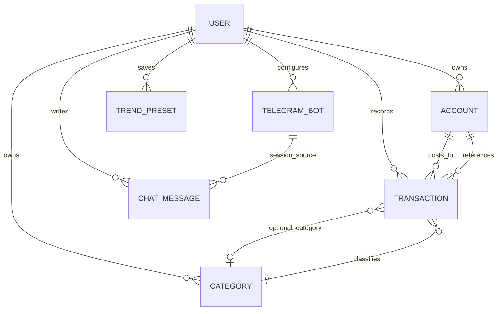
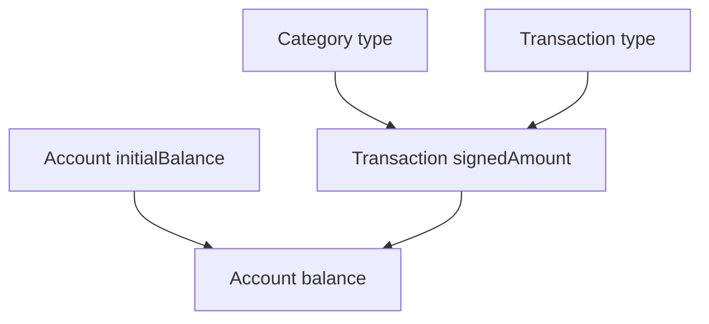

# Domain Model

The backend models are organized around user-owned finance entities plus the chat and Telegram records that support conversational workflows. The important design constraint is that each entity carries its own invariants and ownership rules, so service and repository changes must preserve those rules rather than treating the models as passive data bags.

## Core ownership and scoping rules

Almost every finance entity is scoped to a `userId`. Accounts, categories, transactions, Telegram bots, chat messages, and trend presets all include a user owner, and the model layer checks that relationships stay within the same user when entities are connected together. This means cross-user references are invalid even if the identifiers are otherwise well-formed.

Transactions are the clearest example: a transaction must point at an account owned by the same user, and when a category is attached it must also belong to that same user. The transaction model rejects any combination that crosses ownership boundaries.

## Entity relationships

This diagram shows the primary ownership and reference edges. The most important non-obvious relationship is that transactions do not own their account or category data; they only reference those entities and validate the reference at creation or update time.

## Account

An account stores `name`, `currency`, `initialBalance`, and a separate `transactionBalance` accumulator. The effective `balance` is derived as `initialBalance + transactionBalance`, so transaction-driven balance changes are tracked independently from the starting amount.

Account names are trimmed and must remain between 1 and 100 characters after trimming. Currency must be supported by the currency type system. Accounts start with `transactionBalance = 0`, `isArchived = false`, and `version = 0`.

Archiving is a terminal state for mutation: archived accounts cannot be updated or archived again. Version bumps are modeled separately from business updates so persistence can advance optimistic concurrency without changing business fields.

## Category

A category belongs to a user, has a trimmed `name`, and must be one of `INCOME` or `EXPENSE`. It also carries `excludeFromReports`, which allows reporting to ignore that category while keeping it available for transaction classification.

Categories are soft-deletable via `isArchived`, and archived categories cannot be updated or archived again. Like accounts, they start with `version = 0` and use explicit version bumps for persistence coordination.

## Transaction

Transactions are the most constrained entity in the model. Each transaction references exactly one account, may reference one category, and stores an `amount`, `currency`, `date`, optional `description`, optional `transferId`, and optional `compoundTransaction` metadata.

Key invariants:

- `amount` must be positive.
- The transaction currency is copied from the referenced account at creation, so the account determines the transaction currency.
- Transfers are modeled with `TRANSFER_IN` and `TRANSFER_OUT` and must include `transferId`.
- Non-transfer transactions cannot carry `transferId`.
- Transfer transactions cannot have a category.
- Transfer transactions cannot be part of a compound transaction.
- Categories used by transactions must be in the same user scope and must not be archived.
- Category type must match the transaction type rules: `INCOME` categories only attach to `INCOME` transactions, while `EXPENSE` categories can attach to `EXPENSE` and `REFUND` transactions.
- `compoundTransaction` is only valid when it has an id and a positive total amount.
- `description` is normalized by trimming and cannot exceed 500 characters.

The signed amount is derived from the transaction type, which lets balance updates and reports interpret the same transaction consistently:

- `INCOME`, `REFUND`, and `TRANSFER_IN` are positive.
- `EXPENSE` and `TRANSFER_OUT` are negative.

That signed amount relationship is the main bridge between transactions and account balances.

## Account balance and transaction flow

Account balances are computed from the initial balance plus the accumulated signed transaction balance. This means services that create, update, or delete transactions must also keep account transaction balances in sync, especially for edits that change type, amount, account, or archive state.

The flow above summarizes how a transaction influences the account balance and how category type constrains transaction classification.

## Chat messages

Chat messages are immutable records of conversational history. They carry `userId`, a `sessionId`, a role of `ASSISTANT` or `USER`, content, `createdAt`, and an `expiresAt` Unix timestamp used as a TTL attribute.

A message must have a non-empty session id and non-empty content, and the expiry time must be strictly after creation time. Unlike the finance entities, chat messages do not expose update or archive operations; they are written once and later removed by TTL expiration.

The `sessionId` is intentionally flexible: it can be a UUID session identifier or a Telegram-specific `${botId}#${chatId}` composite, which lets chat history represent both native chat sessions and Telegram-linked sessions.

## Telegram bots

Telegram bot records store the bot token, a generated webhook secret, and a lifecycle `status` of `PENDING`, `CONNECTED`, or `DELETING`. New bots begin in `PENDING`, can transition to `CONNECTED` only from `PENDING`, and can transition to `DELETING` only from `CONNECTED`.

Bots are also soft-deletable with `isArchived`, and the token and webhook secret are both required. This model separates connection lifecycle from archival state, so a bot can be disconnected before it is archived.

## Trend presets

Trend presets are lightweight saved report configurations. They store a `periodUnit` of `MONTH` or `WEEK`, a bounded integer `lookback` from 1 to 12, a required currency, a list of category ids, and an optional `includeUncategorized` flag.

The model intentionally has no `isArchived` flag. Deletion is a hard delete, which matches the fact that trend presets are just saved/remove toggles with no recovery workflow.

## Relationship summary

- Accounts and categories are user-owned, soft-deletable reference data.
- Transactions depend on accounts and optionally categories, and they enforce ownership, archive, and classification compatibility.
- Account balance is derived from the initial balance plus transaction movement, not from a stored single balance field.
- Chat messages are immutable and expire automatically.
- Telegram bots have a separate connection lifecycle plus archival state.
- Trend presets are small user-owned report preferences with hard-delete semantics.

These rules are the main guardrails for service logic, repository validation, and UI affordances: if a future change violates them, it is usually a domain bug rather than a harmless schema change.
