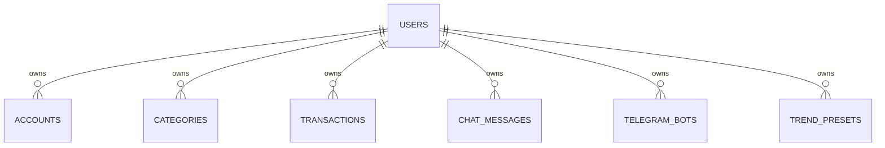
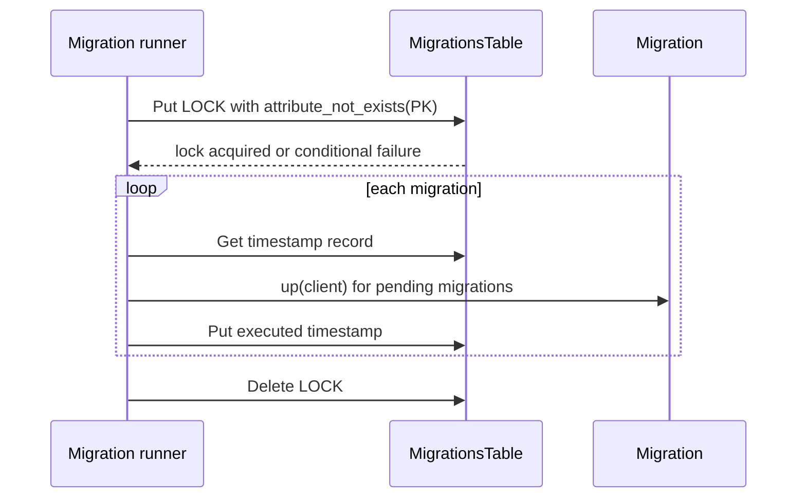

# Data and Storage

The backend stores durable application state in DynamoDB. Infrastructure in `infra-cdk/lib/backend-cdk-stack.ts` owns table creation, retention settings, indexes, and Lambda permissions; repository implementations under `backend/src/repositories/` own read/write access patterns and enforce the most important integrity rules for their tables.

## Persistence boundary

Application state is not split across a relational database or external document store. The CDK stack provisions DynamoDB tables for users, accounts, categories, transactions, migrations, chat messages, Telegram bots, and trend presets, then injects the table names into the backend Lambdas through environment variables.

That makes DynamoDB the authoritative persistence boundary for the backend runtime. Anything that needs to survive a Lambda restart must be written through one of these tables or derived from them.

## Table ownership and shape

The stack creates all application tables with on-demand billing, point-in-time recovery, deletion protection, and `RemovalPolicy.RETAIN` for the durable business tables. The retention decision is deliberate: these tables are user-owned data stores, so infrastructure deletion should not quietly destroy their contents.

This shows the user-scoped ownership model that the table keys and repositories rely on.

### UsersTable

- Primary key: `id`
- GSIs: `EmailIndex` on `email`, `McpTokenIndex` on `mcpToken`
- Repository behavior: `DynUserRepository` reads by email through the email index, reads by `mcpToken` through the token index, and uses conditional writes for create/update safety.

The repository treats multiple matches on an indexed lookup as a data integrity error rather than silently picking one record.

### AccountsTable

- Primary key: `userId` + `id`
- Repository behavior: `DynAccountRepository` scopes every read and write by `userId`, hides archived rows from the default lookup, and uses optimistic locking on `version` for updates.

The update path requires the current `version` to match and increments it in the same write, which prevents lost updates when multiple writers race.

### CategoriesTable

- Primary key: `userId` + `id`
- The stack provisions it with the same durable retention model as the other user-owned entities.

### TransactionsTable

- Primary key: `userId` + `id`
- GSIs: `UserCreatedAtSortableIndex` on `userId` + `createdAtSortable`, and `UserDateIndex` on `userId` + `date`
- Repository behavior: `DynTransactionRepository` uses those indexes for descending queries, cursor pagination, and date-based filtering.

The repository also applies optimistic locking on `version` for updates. Like accounts, transaction writes include a conditional expression so concurrent updates fail instead of overwriting each other.

### MigrationsTable

- Primary key: `PK`
- Purpose: stores migration history and a transient `LOCK` item for concurrency control
- The stack grants the migration Lambda read/write access to this table.

### ChatMessagesTable

- Primary key: `userId` + `sessionSortKey`
- TTL attribute: `expiresAt`
- Repository behavior: `DynChatMessageRepository` writes `expiresAt` using a configured TTL window and queries recent messages by session prefix in reverse chronological order.

TTL is part of product behavior, not just storage cleanup. Messages are expected to disappear automatically after the configured retention period, so changes to this table must preserve the expiration contract.

### TelegramBotsTable

- Primary key: `userId` + `id`
- GSI: `WebhookSecretIndex` on `webhookSecret`
- Repository behavior: `DynTelegramBotRepository` uses the GSI to resolve webhook requests by secret and treats multiple connected matches as an integrity error.

The repository also soft-archives bots by setting `isArchived` and rejecting updates to archived rows.

### TrendPresetsTable

- Primary key: `userId` + `id`
- Used for per-user preset data and granted to the web and background-job Lambdas.

## Access patterns and indexes

The table schema reflects the main query paths rather than generic secondary indexing:

- users are found by email during authentication and by `mcpToken` for MCP access
- transactions are read by creation order and by date, both scoped to a single user
- Telegram bots are resolved from webhook secrets for inbound webhook dispatch
- chat messages are retrieved by session and expire automatically

Because the keys are user-scoped, repository methods consistently include the authenticated `userId` in lookups. That is a data boundary as well as a query strategy: it prevents cross-user reads and writes from being represented in the storage model.

## Migrations and concurrency control

Migrations live under `backend/src/migrations/` and are executed by `runMigrations()`.

The runner behaves as follows:

1. It requires `MIGRATIONS_TABLE_NAME` to be present in the environment.
2. It loads the migration list from the migration loader.
3. It acquires a lock record in the migrations table using a conditional `PutCommand` on `PK = "LOCK"`.
4. It checks each migration timestamp against the history table.
5. It executes only the pending migrations, in order, and writes a history record after each successful step.
6. It always releases the lock in a `finally` block if it was acquired.

This shows the lock-backed migration control flow.

The lock is the concurrency safeguard. If another migration process already holds it, the conditional put fails and the runner aborts rather than running two migration sequences at once. That protects the migration history table from duplicate or out-of-order execution.

## Repository-level integrity and safe change rules

Several repositories enforce invariants that matter when changing storage shape or write paths:

- `DynUserRepository` rejects duplicate indexed matches for `email` or `mcpToken`.
- `DynAccountRepository` and `DynTransactionRepository` use optimistic locking on `version` to prevent silent overwrite races.
- `DynTelegramBotRepository` treats multiple connected bots for one user or webhook secret as an integrity error.
- The account and transaction repositories default to hiding archived rows while still offering explicit archived lookups where needed.
- `DynChatMessageRepository` calculates `expiresAt` at write time, so the storage contract depends on the repository’s TTL computation as well as the table attribute.

These checks are the main line of defense against unsafe concurrent changes. When altering a table, index, or schema helper, the change usually needs to preserve both the DynamoDB shape and the repository behavior that interprets it.

## Where to change things

- Table definitions and Lambdas: `infra-cdk/lib/backend-cdk-stack.ts`
- Local table definitions and creation helpers: `backend/src/scripts/table-definitions.ts`
- Migration execution and locking: `backend/src/migrations/runner.ts` and `backend/src/migrations/operations/migrations-table.ts`
- User persistence rules: `backend/src/repositories/dyn-user-repository.ts`
- Account persistence rules: `backend/src/repositories/dyn-account-repository.ts`
- Transaction persistence rules: `backend/src/repositories/dyn-transaction-repository.ts`
- Chat message TTL behavior: `backend/src/repositories/dyn-chat-message-repository.ts`
- Telegram bot lookup and archive behavior: `backend/src/repositories/dyn-telegram-bot-repository.ts`
