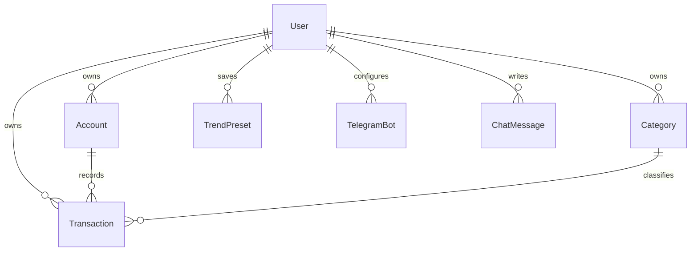
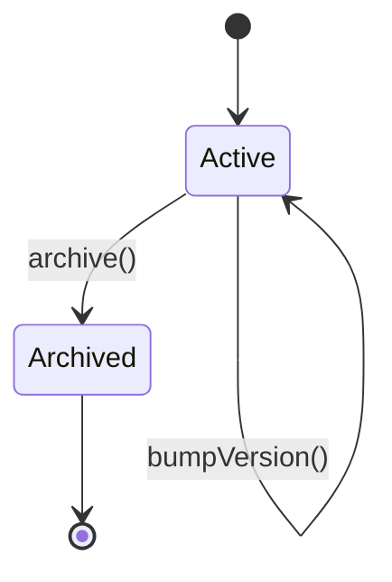
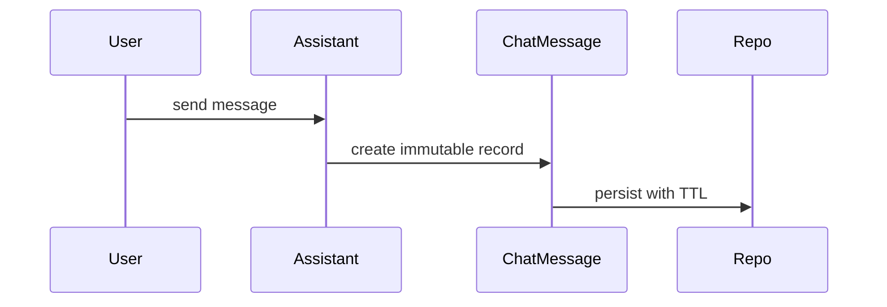

# Domain model and concepts

This repository models a user-scoped personal finance system. The domain layer is intentionally strict: models and repository schemas encode business rules about ownership, currencies, dates, archiving, reporting, and assistant/chat persistence so that invalid state is rejected close to the boundary.

## Ownership and scoping

User identity is the top-level boundary. Most persistent records carry a `userId`, and the GraphQL context wires services and loaders only after authentication, so every safe change must preserve user scoping across repositories, services, and embedded lookups.

The core domain relationships are user-owned, with transactions linked to an account and optionally to a category. Chat messages and Telegram bot records also belong to a user even though they serve assistant and integration workflows.

## Users

Users store the account-level preferences that affect downstream behavior:

- email is normalized and validated before persistence
- interface language, voice input language, and transaction pattern limits are optional preferences
- MCP token generation is part of the user lifecycle and can be regenerated without changing identity

The model does not support user deletion today, so there is no soft-delete flag on `User`. That is an explicit exception in the codebase, not an omission.

## Accounts

Accounts are the money-holding ledgers for a user. They have a name, a currency, an initial balance, and a transaction balance that accumulates the effect of transactions.

Important account rules:

- account names are trimmed and must be non-empty, up to 100 characters
- currency must be one of the supported currency codes
- `balance` is derived as `initialBalance + transactionBalance`
- archived accounts cannot be updated
- account versioning is used for persistence concurrency, while `nextVersion()` and `bumpVersion()` keep the version boundary explicit

Accounts are the source of truth for transaction currency: when a transaction is created or moved to another account, the transaction currency follows the selected account rather than being set independently.

## Categories

Categories classify transactions for reporting and assistant workflows. They are also user-scoped, archived rather than deleted, and versioned.

A category has:

- a trimmed, non-empty name up to 100 characters
- a type of `INCOME` or `EXPENSE`
- an `excludeFromReports` flag
- an archive state and a version number

The type is not cosmetic: transaction creation and updates reject mismatches between a category and transaction kind. Categories of type `INCOME` can only be attached to income transactions, while `EXPENSE` categories can be attached to expenses and refunds.

Categories excluded from reports still exist for bookkeeping, but reporting logic must omit them from totals and make that omission visible to the user.

## Transactions

Transactions are the central financial record. They belong to exactly one user and one account, may reference one category, and may optionally carry a transfer ID when they are part of a transfer pair.

### Transaction kinds

The domain supports these transaction kinds:

- `INCOME`
- `EXPENSE`
- `REFUND`
- `TRANSFER_IN`
- `TRANSFER_OUT`

A transaction must have a positive amount, a date, and a currency. Description is optional and is normalized/truncated by the model boundary rules, but the stored value must not exceed the maximum length.

The sign rules are:

- `INCOME`, `REFUND`, and `TRANSFER_IN` are positive
- `EXPENSE` and `TRANSFER_OUT` are negative

That signed value is what balance logic uses to keep account totals correct.

### Transaction invariants

Transactions enforce several safety rules at construction and update time:

- the referenced account must belong to the same user and must not be archived
- the referenced category, if present, must belong to the same user and must not be archived
- transfer transactions cannot have a category
- transfer transactions must include a transfer ID
- non-transfer transactions cannot include a transfer ID
- the category type must match the transaction type
- archived transactions cannot be updated

Those rules are important because services and reports rely on the model to reject cross-user contamination, impossible transfer shapes, and misclassified spending.

### Lifecycle

Transactions are archived, not hard-deleted, so historical reports and assistant lookups can still preserve prior state. Versioning is also present for optimistic persistence updates.

Caption: transaction lifecycle at the domain boundary.

## Transfers

Transfers are represented by paired transactions rather than a separate cash-flow type. The `TRANSFER_OUT` side reduces one account, and the `TRANSFER_IN` side increases the other account, while both remain transaction records tied to the same user.

The model rules make transfers special in two ways:

- they do not carry categories
- they require a shared transfer ID so the pair can be correlated

That means transfer features must keep both sides balanced and must not let reporting logic count the movement as spending.

## Reporting

Reports aggregate transactions for a user over time and by category. The domain rules that most affect reporting are:

- exclude-from-reports categories must be omitted from totals
- transfers must not inflate spending or income totals
- archived data still matters for historical views
- currency is part of the report key, so report logic must stay currency-aware

Trend presets capture saved report filters. They store a user, a period unit, a lookback window, a currency, selected category IDs, and an optional `includeUncategorized` flag. Lookback is constrained to whole numbers from 1 to 12, and the currency must not be empty.

## Chat messages and assistant sessions

Assistant chat history is persisted as immutable chat messages with a TTL.

Key rules:

- chat messages are user-scoped and session-scoped
- a session ID may be a UUID or a Telegram-specific compound key of the form `${botId}#${chatId}`
- messages have only `ASSISTANT` and `USER` roles
- content and session ID are required
- expiration must be after creation; the storage layer treats `expiresAt` as a Unix seconds TTL attribute
- there is no update/archive lifecycle for chat messages, because their persistence is time-bounded rather than mutable

This makes assistant history append-only and disposable, which is important for safe storage and replay behavior.

Caption: assistant chat persistence flow.

## Telegram bots

Telegram bot configuration is a separate user-owned entity. It stores the Telegram token, a generated webhook secret, and a status that models the webhook lifecycle:

- `PENDING` means the webhook is being registered and the bot is not yet usable
- `CONNECTED` means the webhook is active and inbound messages are accepted
- `DELETING` means disconnect has been requested and the webhook is being removed

The model only allows valid transitions:

- `connect()` is only valid from `PENDING`
- `disconnect()` is only valid from `CONNECTED`
- `archive()` marks the bot archived

Token and webhook secret are required, so bot creation and persistence cannot silently accept empty integration credentials.

## Currency rules

Currency handling is a domain boundary, not a formatting detail.

- account currency must be supported by `Intl.supportedValuesOf("currency")`
- transaction currency is derived from the account used to create or update the transaction
- trend presets store a currency filter and reject empty values
- repository schemas validate persisted currency fields with the shared currency schema

Because balances, reports, and trend views are currency-sensitive, changes that introduce conversion or free-form currency values would violate the current model.

## Date and persistence rules

The domain uses separate string types for dates and date-times so that transaction dates stay as dates while entity timestamps stay as ISO datetimes.

- transaction `date` is a date-only value
- entity `createdAt` and `updatedAt` fields are date-time values
- chat TTL uses a Unix timestamp in seconds
- repository schemas transform persisted ISO strings back into the internal date/date-time string types

That separation matters for reporting windows, sorting, and persistence correctness.

## Repository and schema boundaries

The repository schemas mirror the domain model rather than exposing loose document shapes:

- entity IDs are UUIDs
- user references are UUIDs
- transaction dates, chat TTLs, and currency fields are validated at the storage boundary
- `createdAtSortable` and `sessionSortKey` are storage-specific helpers, not domain state

When changing a model, the schema and repository layer should usually be updated with it, because they enforce the same contract from the persistence side.

## Safe change checklist

When editing the domain, keep these constraints in mind:

- preserve user scoping across every entity and lookup
- keep account/category archival semantics intact
- do not break transaction sign, category-type, or transfer invariants
- keep report-excluded categories out of aggregate totals
- keep currency and date types aligned with their current string contracts
- preserve append-only chat message semantics and TTL behavior
- preserve Telegram bot status transitions and credential requirements
