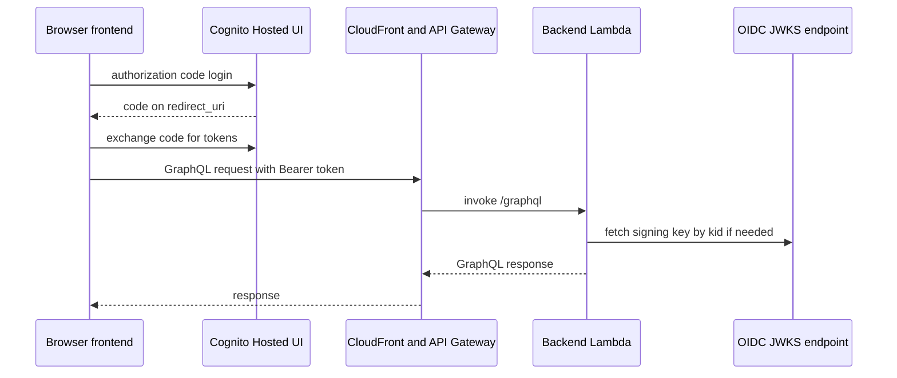
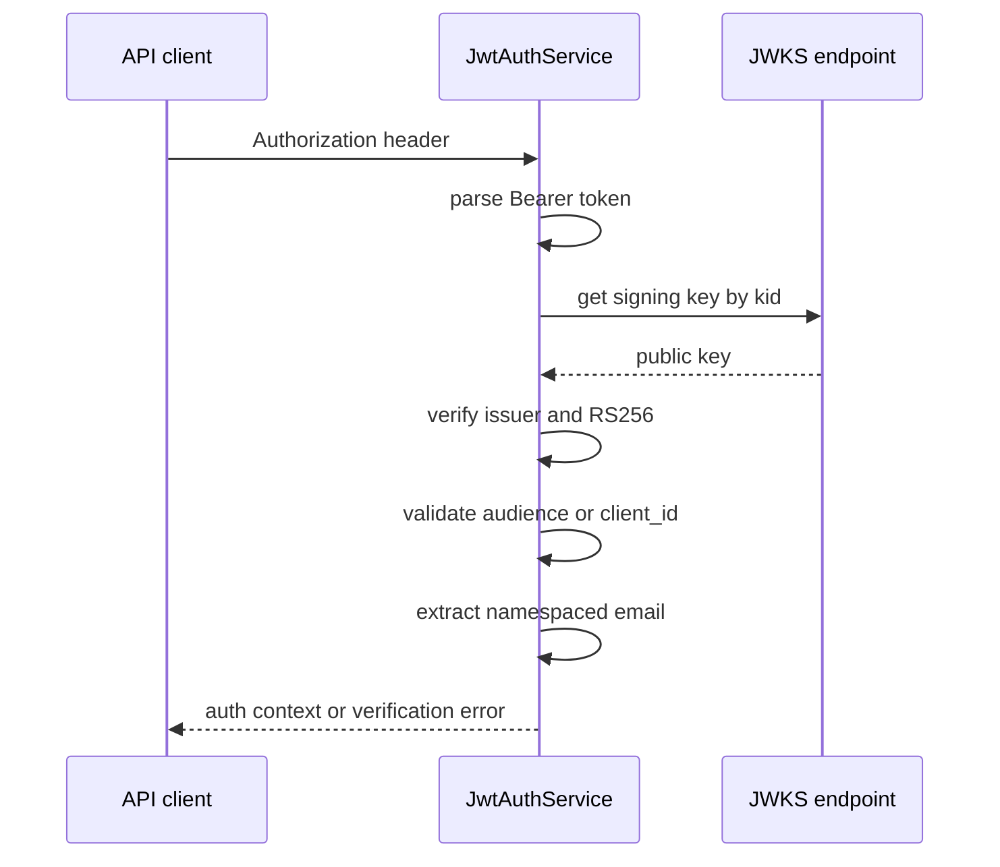
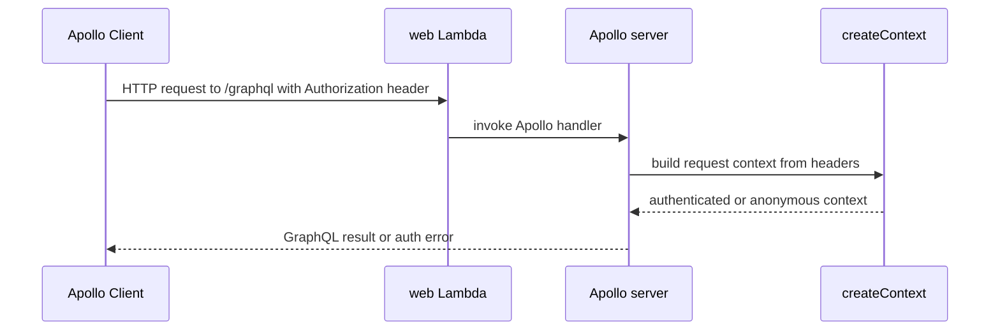

# Integrations

This page documents the system boundaries that matter for safe change: how the Vue frontend signs in, how the backend verifies identity, how AWS services are provisioned and reached, and how third-party protocols fail when an integration is misconfigured or unavailable.

## End-to-end boundary map

The application is split into a browser client, an API edge on CloudFront, and Lambda-backed services behind API Gateway. The frontend authenticates with an OIDC provider through Cognito-hosted login, then sends the resulting access token as a bearer token to backend requests. The backend verifies JWTs against the issuer JWKS and only then builds the GraphQL auth context.

The sequence above is the normal happy path; failures usually happen at the token exchange, JWKS fetch, or JWT claim validation steps.

## Frontend authentication

The Vue app uses `oidc-client-ts` in `frontend/src/plugins/auth.ts` to drive the authorization code flow.

- `VITE_AUTH_ISSUER`, `VITE_AUTH_CLIENT_ID`, and `VITE_AUTH_SCOPE` are required at build time.
- `authority` points at the OIDC issuer, `response_type` is `code`, and the callback is `window.location.origin`.
- The plugin stores the authenticated user in `localStorage` through `WebStorageStateStore`, so sessions persist across tabs and reloads.
- If `audience` is configured, it is passed as an extra query parameter; this is used in Auth0-style setups and omitted for Cognito.
- The plugin handles redirect callbacks when `code=` and `state=` are present, then removes the callback query string from the browser URL.
- Automatic silent renewal is enabled, so expired sessions should refresh without a user interaction when the identity provider still honors refresh or iframe renewal.

Failure modes that matter:

- Missing required Vite auth variables aborts app startup early.
- A redirect callback with invalid `state`, expired `code`, or network failure logs an error and leaves the app without a loaded user.
- Silent renewal failure is surfaced through the OIDC events, after which the user must sign in again.

## Backend JWT verification and auth context

`backend/src/auth/jwt-auth.ts` is the boundary where bearer tokens become application identity.

- The service requires `AUTH_ISSUER` and at least one of `AUTH_AUDIENCE` or `AUTH_CLIENT_ID`.
- It constructs a JWKS client against `${AUTH_ISSUER}/.well-known/jwks.json` and verifies tokens with `RS256`.
- When `AUTH_AUDIENCE` is configured, the token must satisfy the `aud` claim.
- When `AUTH_CLIENT_ID` is configured, the token must match `client_id` after signature verification.
- The backend reads email from a namespaced claim configured by `AUTH_CLAIM_NAMESPACE`, falling back to the standard `email` claim.
- If the `Authorization` header is absent or not `Bearer <token>`, the request is treated as unauthenticated rather than as a hard parse failure.

The important failure distinction is between “unauthenticated” and “invalid token.” Missing or malformed headers produce an unauthenticated context, while signature, issuer, audience, client ID, or email-claim problems fail verification and prevent authenticated use of the request.

## Cognito infrastructure contract

`infra-cdk/lib/auth-cdk-stack.ts` defines the Cognito side of the boundary.

- Users sign in with email aliases and a public client with no secret.
- The SPA uses authorization code grant, not implicit grant or client credentials.
- The user pool enables password and passkey first-factor authentication.
- A pre-token-generation Lambda injects a namespaced email claim into access tokens so the backend can read email without a separate profile lookup.
- The token customization trigger uses `LambdaVersion.V2_0`; that matters because access-token customization is not available in `V1_0`.
- Access tokens are valid for one hour, refresh tokens for thirty days, and token revocation is enabled.

Operationally, this means the frontend and backend must agree on the issuer, client ID, scope set, and claim namespace. If any of those drift, login may still succeed while API authentication fails.

## CloudFront, GraphQL, and MCP routing

`infra-cdk/lib/frontend-cdk-stack.ts` serves the frontend from CloudFront and forwards API traffic to API Gateway.

- The default origin is the S3 static website bucket for the SPA.
- `/graphql*` and `/mcp*` are routed to the API Gateway origin.
- Viewer traffic is HTTPS-only and API origin requests also use HTTPS-only.
- The distribution returns `index.html` for SPA route fallthrough on 404.
- Custom domains are optional and depend on an exact Route 53 hosted-zone match plus an ACM certificate in `us-east-1`.

This boundary makes client-side routing simple but creates a few integration expectations:

- Client code should use `/graphql` and `/mcp` unless an explicit environment override is set.
- API calls must tolerate CloudFront path routing and the SPA fallback behavior separately.
- A missing or mismatched custom-domain parameter prevents domain resources from being created, but the CloudFront distribution still exists.

## GraphQL client/server handshake

`frontend/src/apollo.ts` builds the GraphQL client.

- The HTTP endpoint is read from `VITE_GRAPHQL_ENDPOINT` or defaults to `/graphql`.
- Before each request, the auth link asks the app for a token and sends `Authorization: Bearer <token>` when one exists.
- Global GraphQL errors populate a shared reactive error state.
- `AbortError` network failures are ignored instead of being turned into user-facing connection errors.

On the backend side, `backend/src/lambdas/web.ts` constructs the Apollo Lambda handler and creates request context from the incoming headers. The same Lambda also multiplexes the Telegram webhook and MCP endpoints, and it returns a clean `404` for `/.well-known/*` discovery probes so MCP clients do not misread Apollo’s CSRF guard as an auth failure.

The most important failure mode here is header loss. If the token getter fails or returns null, the request still goes out, but the backend sees an anonymous context and resolvers must enforce authorization themselves.

## Bedrock and LangChain assistant runtime

`backend/src/langchain/agents/assistant-agent.ts` creates the assistant agent with LangChain and a Bedrock-backed chat model.

- The agent is built with a fixed system prompt that describes the finance domain and reporting rules.
- It receives tools for reading and mutating accounts, categories, transactions, and aggregate calculations.
- The system prompt is dynamically extended with the current date from runtime context.

The architecture boundary is important: the model does not own business rules. Tools and backend services do. That keeps calculations and writes inside the application’s domain services instead of inside prompt text.

Failure modes are mostly tool-loop failures and model/runtime errors. If the model or one tool is misconfigured, the agent may fail to complete a user request even though the surrounding web and auth layers are healthy.

## MCP server

`backend/src/mcp/server.ts` creates an authenticated MCP server only after `authenticateMcpToken()` succeeds.

- A missing or invalid token yields `null`, so the MCP server is not created for unauthenticated callers.
- Registered tools are scoped to the authenticated user ID.
- Business and model errors are returned to the caller as structured failures with their message preserved.
- Unexpected exceptions are logged and converted to a generic tool failure message.

That means MCP has a stricter access boundary than GraphQL: authentication happens before the tool registry exists, and tool execution is always user-scoped.

## Telegram webhook integration

`backend/src/providers/http-telegram-api-client.ts` talks to Telegram’s HTTP Bot API.

- `getWebhookInfo`, `setWebhook`, `deleteWebhook`, and `sendMessage` call Telegram endpoints under `https://api.telegram.org`.
- `setWebhook` sends both the webhook URL and Telegram `secret_token`.
- All methods parse the Telegram JSON envelope and return a `Result` instead of throwing on expected API failures.
- HTTP non-200 responses, schema mismatches, and Telegram-level `ok: false` responses are logged and converted to failures.

This is a good example of a defensive third-party boundary: callers can distinguish success from failure without needing to know Telegram response shapes.

## AWS service responsibilities

The integration code divides AWS responsibilities cleanly:

- Cognito handles identity, hosted login, OAuth flows, refresh tokens, and claim issuance.
- DynamoDB-backed services hold application data such as users, accounts, categories, and transactions.
- Lambda hosts the API entrypoints and integration handlers.
- CloudFront serves the SPA and forwards API paths.
- Route 53 and ACM are only involved when a custom frontend domain is configured.
- Bedrock is used indirectly through LangChain model invocation permissions and runtime configuration.

The practical invariant is that identity is established at the auth boundary, while business data and agent actions are scoped by the authenticated user afterward.

## Change-sensitive checks

When modifying integrations, the most important regression checks are:

- Frontend login still completes the authorization code callback and stores a token that the API accepts.
- Backend JWT verification still matches the issuer, audience or client ID, and claim namespace expected by the deployed auth stack.
- CloudFront still routes `/graphql` and `/mcp` to API Gateway while leaving SPA routes on the static origin.
- MCP discovery paths still return a clean 404 instead of Apollo CSRF errors.
- Telegram API failures still convert into structured `Result` failures instead of uncaught exceptions.
- Assistant tool changes still keep writes and aggregations inside application services rather than embedding policy in the model prompt.
