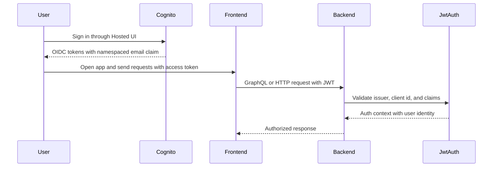
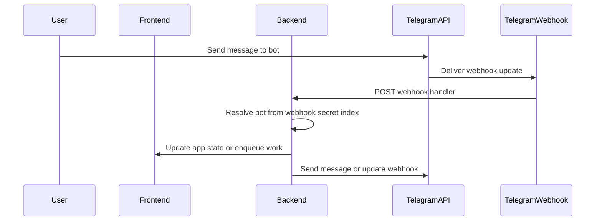

# Integrations and external systems

This page documents the system boundaries that connect the application to AWS services, Cognito/OIDC, Bedrock/LangChain, MCP, Telegram, and the cloud infrastructure that exposes those integrations. The implementation keeps those boundaries behind ports, providers, services, and CDK stacks so the rest of the code can stay testable and mostly unaware of transport details.

## Architecture of the integration layer

The backend follows a port-and-adapter pattern:

- application code depends on interfaces in `backend/src/ports/*`
- outbound calls are wrapped by providers such as `HttpTelegramApiClient` and `LambdaBackgroundJobDispatcher`
- AWS state is accessed through DynamoDB repositories and CDK-provisioned environment variables
- tests mock the ports and wrap the protocol clients, so behavior can change without forcing the whole application to depend on AWS or external APIs

That separation matters because the same domain services are reused from GraphQL, MCP, webhook handlers, background jobs, and LangChain tools. The external boundary is the adapter, not the service.

## Cognito and OIDC authentication

Authentication is built on AWS Cognito, OIDC/OAuth configuration, and JWT validation.

`infra-cdk/lib/auth-cdk-stack.ts` provisions the user pool, app client, hosted UI domain, and pre-token-generation trigger. The stack uses email as the sign-in alias, allows optional self-sign-up, supports password and passkey first-factor sign-in, and configures an authorization-code flow suitable for a SPA client. It also emits the issuer URL, client ID, domain URL, and OAuth scopes that the backend and frontend consume.

A pre-token-generation Lambda adds a namespaced email claim to access tokens so the backend can derive the user identity without an extra `/userinfo` call. The CDK comments call out that V2_0 is required because the claim customization targets access tokens, not just ID tokens.

`infra-cdk/lib/backend-cdk-stack.ts` passes `AUTH_CLIENT_ID`, `AUTH_ISSUER`, and `AUTH_CLAIM_NAMESPACE` into the backend Lambdas. The backend then validates incoming JWTs in `backend/src/auth/jwt-auth.ts` and creates request context from the resolved auth service.

This shows the token flow across the auth boundary.

## AWS infrastructure and runtime state

`infra-cdk/lib/backend-cdk-stack.ts` defines the core backend persistence and execution environment:

- DynamoDB tables for users, accounts, categories, transactions, chat messages, telegram bots, trend presets, and migrations
- table indexes for email lookup, MCP token lookup, transaction sorting, webhook-secret lookup, and date-based querying
- Lambda execution roles and permissions for DynamoDB, Bedrock invocation, SSM parameter access, and Lambda-to-Lambda invocation
- environment variables that point application code at the provisioned tables and auth configuration

The stack is also where runtime coupling is intentionally made explicit. For example, the web Lambda receives the background job function name, and the background job Lambda receives the permissions needed to write DynamoDB data and call Bedrock.

`LambdaBackgroundJobDispatcher` is the adapter that turns a domain-level background job into an asynchronous Lambda invoke. It requires `BACKGROUND_JOB_FUNCTION_NAME` and uses `InvocationType: "Event"`, which means the caller does not wait for the job to finish.

The dispatcher is covered by a unit test that injects a mocked `LambdaClient` and asserts the exact `InvokeCommand` payload and fire-and-forget invocation type. That test is the boundary guard: changes to the integration should not leak Lambda SDK usage into business logic.

## Bedrock and LangChain

The assistant and transaction-understanding flows use LangChain as the orchestration layer and AWS Bedrock as the model provider.

`backend/src/langchain/langchain-agent.ts` is the thin adapter from the app's `Agent` port to LangChain's `ReactAgent`. It converts the application's message format into LangChain message objects, installs a `CallbackManager`, and collects two kinds of runtime metadata:

- `agentTrace`, built from LLM callback events and tool-end events
- `toolExecutions`, which records the tool name, input, and output observed during the run

The wrapper deliberately hides LangChain internals from the rest of the app. Higher-level services only see the answer, trace, and tool execution summary.

`infra-cdk/lib/backend-cdk-stack.ts` grants `bedrock:InvokeModel` to both the web Lambda and the background job Lambda, which is what makes the model calls possible at runtime. The stack does not hard-code a particular model in infrastructure; model choice stays in the application LangChain configuration.

`backend/src/langchain/assistant-agent.ts` and related agents build the task-specific behavior on top of the generic adapter, while tests keep the agent boundary stable by exercising the wrapper and its callback-derived trace output.

## MCP server and protocol boundary

The MCP integration exposes the domain model to external MCP clients over the Model Context Protocol.

`backend/src/mcp/server.ts` authenticates the incoming MCP token before it creates a server. It resolves the user by token, returns `null` when the token is missing or invalid, and only registers tools after authentication succeeds. That means tool availability is user-scoped rather than global.

The server then wires tools to the application services and repositories:

- account and category tools use the corresponding services
- transaction listing uses the transaction repository
- aggregation uses the aggregate-transactions service
- guide loading is exposed as a separate tool

`BusinessError` and `ModelError` are surfaced to the caller as tool failures with the underlying message, while unexpected errors are logged server-side and collapsed into a generic failure. That preserves user-facing diagnostics without exposing implementation detail.

The MCP server test exercises the real protocol boundary with an in-memory transport. It connects a real client, performs `tools/list`, and verifies the registered tool names. This is important because it checks the public MCP contract instead of reaching into private server state.

## Telegram integration

Telegram is integrated through a dedicated outbound API client, a webhook handler, and application services that map Telegram events to user-owned bots and chats.

`backend/src/providers/http-telegram-api-client.ts` is the network adapter for the Telegram Bot API. It owns the HTTP details for `getWebhookInfo`, `setWebhook`, `deleteWebhook`, and `sendMessage`. Each method:

- builds the correct Telegram endpoint URL from the bot token
- uses `fetch` directly
- validates the JSON response with Zod
- returns a `Result` instead of throwing for expected API failures

That design keeps Telegram parsing and transport failures contained in one place. Callers work with success/failure values rather than raw HTTP exceptions.

The Telegram client test suite mocks `global.fetch` and verifies success, HTTP failure, Telegram `ok: false` failure, unexpected payload shape, and network exceptions. Those tests are the main safety net for the outbound API boundary.

This diagram summarizes the webhook and outbound-message path. The actual webhook secret lookup is backed by the `WebhookSecretIndex` on the Telegram bots table, which lets the backend map a webhook request back to the correct bot and user.

## CloudFront, Route 53, S3, and custom domains

`infra-cdk/lib/frontend-cdk-stack.ts` is the hosting boundary for the frontend. It creates:

- an S3 bucket for static assets
- a CloudFront distribution with the frontend as the default origin
- CloudFront behaviors that route `/graphql*` and `/mcp*` to the API origin
- optional custom-domain support using Route 53 and ACM

The stack reads `/manual/budget/${nodeEnv}/frontend/custom-domain` from SSM. If the parameter is absent, empty, unresolved, or a dummy placeholder, the stack skips custom-domain provisioning entirely. When the value is present, the stack looks up the hosted zone, creates an ACM certificate in `us-east-1` using a sibling cross-region stack, and creates a Route 53 alias A record pointing the custom domain to CloudFront.

This matters operationally because the frontend hosting boundary is not just static-file delivery. It also defines the path by which browser traffic reaches GraphQL and MCP through CloudFront rather than directly to the API.

## How these boundaries are preserved in tests

The repository uses tests to keep the integration seams stable:

- `backend/src/providers/http-telegram-api-client.test.ts` mocks `fetch` instead of hitting Telegram
- `backend/src/providers/lambda-background-job-dispatcher.test.ts` mocks `LambdaClient` instead of invoking Lambda
- `backend/src/mcp/server.test.ts` exercises the real MCP handshake through an in-memory transport
- LangChain agent tests verify the adapter and callback-trace behavior without requiring the rest of the app to know LangChain internals
- CDK stacks are structured so the app consumes outputs and environment variables rather than constructing AWS clients inline

The broad rule is that external systems are wrapped once, then mocked or protocol-tested at the boundary. That keeps the rest of the code focused on application logic and makes it safer to change infrastructure or providers without rewriting core services.
