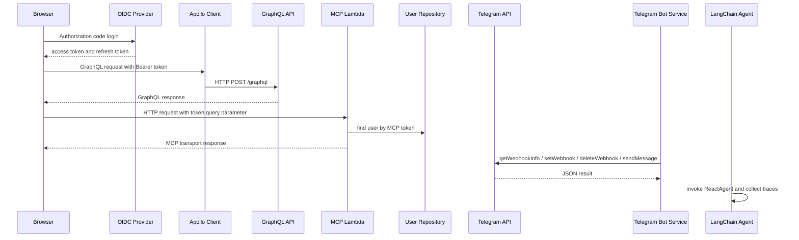
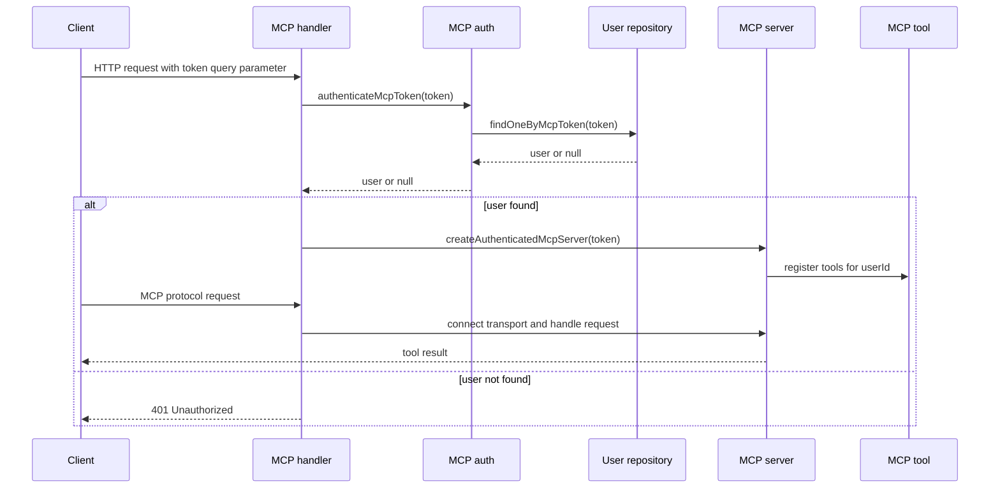
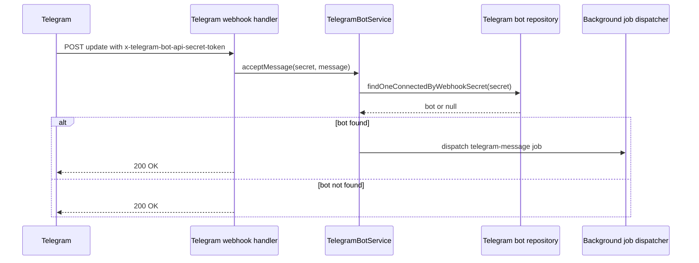

# External Integrations

This page describes the main integration seams where the app crosses a system boundary: browser auth against Cognito, GraphQL requests to the backend, the MCP HTTP endpoint, Telegram webhook/API calls, and the LangChain adapter used to drive agent execution. These integrations are intentionally wrapped in repo-owned clients, services, or handlers so the rest of the codebase can stay focused on domain logic.

## Integration topology

The diagram shows the external systems this page centers on. GraphQL uses an Authorization header, while MCP uses a separate token in the query string and resolves that token to an internal user before any tools are exposed.

## Cognito-backed browser auth

The Vue auth plugin is the browser entrypoint for OIDC. `frontend/src/plugins/auth.ts` creates a `UserManager` from `oidc-client-ts` using build-time environment variables for issuer, client id, audience, and scope. It is configured for authorization-code flow with PKCE, silent renew, and localStorage persistence through `WebStorageStateStore`.

The auth plugin owns the browser-side OIDC lifecycle:

- redirecting the user to the provider for login
- handling the callback when `code` and `state` are present
- exchanging the code for tokens
- keeping tokens available across tabs and sessions
- exposing the configured manager to the rest of the app via Vue provide/inject

The repository infrastructure stack defines the Cognito side of that contract. `infra-cdk/lib/auth-cdk-stack.ts` creates the user pool, SPA client, hosted UI domain, and outputs the issuer and scopes used by the frontend. The stack also enables password and passkey sign-in, requires email as the immutable user attribute, and configures token lifetimes and revocation.

### Auth boundary and identity mapping

Cognito identities are not used directly as application user records. The app maps the external OIDC subject and claims into internal user records through backend auth logic and repositories. The important boundary is:

- the browser holds OIDC tokens from Cognito
- the GraphQL API authenticates requests from the Bearer token
- the backend resolves that authenticated identity to an internal user model
- the MCP server uses a separate MCP token and maps it to an internal user through `UserRepository.findOneByMcpToken`

This separation means a Cognito session does not automatically authorize MCP access, and an MCP token is not a substitute for GraphQL JWT authentication.

## GraphQL client integration

`frontend/src/apollo.ts` is the client-side seam for GraphQL communication. It composes three concerns:

- `createHttpLink` points to `VITE_GRAPHQL_ENDPOINT` or falls back to `/graphql`
- `setContext` injects `authorization: Bearer <token>` using an async token getter
- `onError` captures network failures and surfaces a global connection error state

The token getter is injected through `setAuthTokenGetter`, which keeps the Apollo client independent of the auth plugin implementation while still allowing the current Cognito session token to be attached to requests.

Operationally, this means:

- GraphQL requests always go through the same Apollo client
- the auth header is optional when no token is available
- abort errors are ignored so request cancellation does not become a global user-facing connection error
- network failures are centralized in `globalError`

## MCP HTTP integration

The MCP endpoint is the second external-facing protocol in the app. `backend/src/lambdas/mcp-handler.ts` adapts API Gateway HTTP events into Node `Request` objects, connects them to a `WebStandardStreamableHTTPServerTransport`, and converts the MCP response back into an API Gateway result.

Authentication happens before the MCP server is created:

1. the Lambda reads `queryStringParameters.token`
2. `createAuthenticatedMcpServer` calls `authenticateMcpToken`
3. `authenticateMcpToken` asks `UserRepository.findOneByMcpToken` for a matching internal user
4. the Lambda returns `401 Unauthorized` when no user is found
5. only authenticated users get a connected `McpServer`

`backend/src/mcp/server.ts` then registers tools bound to that internal `userId`. The tools are constructed with the repositories and services they need, so every MCP operation runs in the context of the authenticated internal user rather than an anonymous session.

### MCP request flow

The MCP tests verify the contract at the protocol boundary. The server test connects to a real in-memory MCP transport and confirms that a valid token exposes the expected tool set, while missing or unmatched tokens return `null`.

## Telegram API integration

Telegram is integrated through a repo-owned HTTP adapter and a domain service that keep Telegram-specific details out of the rest of the application.

`backend/src/providers/http-telegram-api-client.ts` implements the `TelegramApiClient` port with direct HTTP calls to the Telegram Bot API. It wraps four endpoints:

- `getWebhookInfo`
- `setWebhook`
- `deleteWebhook`
- `sendMessage`

The adapter validates the response envelope with Zod and converts all failures into `Result` values, so callers do not need to parse Telegram payloads or catch fetch failures themselves. It also logs unexpected response shapes and HTTP failures before returning a failure result.

`backend/src/services/telegram-bot-service.ts` is the stateful integration orchestrator. It is responsible for:

- creating pending Telegram bot records before webhook registration
- setting the webhook with a per-bot secret token
- archiving the bot if webhook registration fails
- disconnecting bots and best-effort deleting the webhook before archive
- dispatching inbound Telegram messages into background jobs after verifying the webhook secret

The webhook secret is the key trust boundary here. Incoming Telegram webhooks are accepted only when the secret token in the request header matches a bot record stored internally. That lets the backend map an external Telegram update to the correct internal user and bot without trusting chat input alone.

### Telegram webhook flow

The service is deliberately tolerant of unknown webhook secrets: it logs a warning and returns success instead of surfacing an error to Telegram. That avoids turning stale or malicious webhook traffic into noisy failures.

## LangChain and Bedrock-facing agent wrapper

`backend/src/langchain/langchain-agent.ts` is an adapter around `ReactAgent` from LangChain. It does not implement agent planning itself. Instead, it translates between the app’s `Agent` port and LangChain’s runtime callback model.

The wrapper’s responsibilities are:

- normalize the incoming message state into the format expected by LangChain
- install a callback manager that captures LLM outputs and tool lifecycle events
- extract trace text from AI messages
- record tool executions with tool name, input, and output
- return the final answer text alongside trace and tool execution metadata

This wrapper matters because it is the seam where agent execution becomes observable to the application. The callback handler converts LangChain events into stable app-level trace structures, so downstream code does not need to understand LangChain’s internal callback objects.

The code in this repository does not hard-code a particular foundation model in the adapter itself, but the adapter is the place where LangChain/Bedrock-facing agent plumbing is isolated from the rest of the app.

## Contracts, failure modes, and change boundaries

A few invariants are worth preserving across these integrations:

- Browser auth tokens stay in the frontend and are only attached to GraphQL requests by the Apollo auth link.
- MCP access is separate from GraphQL access and is authorized by MCP token lookup, not by the browser’s JWT alone.
- Telegram webhooks are trusted only after the webhook secret matches an internal bot record.
- Telegram API failures are normalized to `Result` values so service code can decide whether a failure is fatal.
- The LangChain wrapper records traces and tool executions without exposing LangChain internals to the rest of the app.

These seams are also the most likely places for coordinated changes:

- changing OIDC provider settings requires updating both the frontend plugin and the CDK auth stack
- changing GraphQL auth headers affects the Apollo client and backend JWT verification
- changing MCP authentication affects the Lambda handler, MCP auth, and user repository lookup
- changing Telegram webhook behavior affects the HTTP client, bot service, and webhook handler
- changing agent observability affects the LangChain wrapper and any consumers of trace/tool-execution metadata

When modifying one of these boundaries, update the adapter or handler first and keep the internal domain code insulated from external protocol details.
