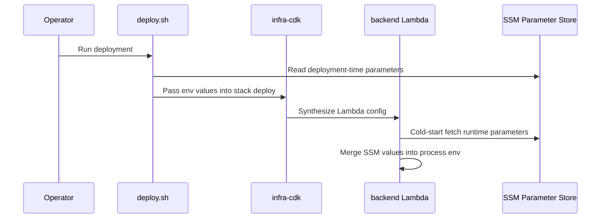

# Operations

This page collects the configuration and runtime rules that matter when you deploy, run, or safely change the system. It focuses on where settings come from, how they flow into the backend and frontend, and which operational choices affect debugging and day-two maintenance.

## Configuration model

The system uses two distinct configuration layers:

- **Deployment-time configuration** is read by `deploy.sh` and the CDK app while stacks are created or updated. Changing these values requires another deployment.
- **Runtime configuration** is injected into the backend Lambda at cold start. Changing these values takes effect on the next cold start without a redeploy.

The distinction is important because some settings shape the deployed infrastructure, while others only affect Lambda behavior after the stack is already live.

Caption: deployment-time parameters are consumed before stack creation, while runtime parameters are loaded by the Lambda bootstrap on cold start.

## Local development setup

The repository expects a Node.js workspace with package installs in the package you are changing.

- Read `.tool-versions` for the Node.js version to use.
- Run `npm install` in `backend/`, `frontend/`, or `infra-cdk/` before modifying or testing that package.
- Before the first backend test run, copy `backend/.env.test.example` to `backend/.env.test` and run `npm run test:db:setup`.
- The root `README.md` recommends `AWS CLI`, `Node.js`, and `jq` for deployment.

The environment examples show the expected local values:

- `backend/.env.example` sets development defaults such as `NODE_ENV=development`, local DynamoDB at `DYNAMODB_ENDPOINT=http://localhost:8000`, and localhost callback URLs for auth and API access.
- `frontend/.env.example` points the SPA at `http://localhost:4000/graphql` and `http://localhost:4000/mcp`.
- `infra-cdk/.env.example` shows the CDK-side auth settings and optional Lambda sizing overrides used during deployment.

## Backend runtime bootstrap

The backend entrypoint calls `injectRuntimeEnv` before the application proceeds. That bootstrap is responsible for pulling selected SSM parameters into `process.env` so the rest of the backend can read them like normal environment variables.

Key behaviors:

- It only runs SSM injection when `AWS_LAMBDA_FUNCTION_NAME` is present, so local development does not hit SSM.
- It also requires `NODE_ENV`; that value determines the SSM path prefix under `/manual/budget/<env>/...`.
- The bootstrap reads parameters in chunks of up to 10 names per `GetParameters` call.
- Existing Lambda environment values are preserved. SSM only fills variables that are still unset.
- Missing parameters are logged and skipped rather than crashing the process.
- The runtime bindings currently cover LangChain model settings, chat history settings, and LangSmith tracing settings.

The explicit binding map in `backend/src/lambdas/bootstrap.ts` is the extension point for new runtime-loaded variables. If you add a new runtime SSM parameter, the code comment says you must also grant read permission in infrastructure.

## Environment variable validation

`backend/src/utils/require-env.ts` enforces that required environment variables are present before use.

- `requireEnv` throws when a variable is missing and no default is supplied.
- `requireIntEnv` and `requireFloatEnv` validate that numeric variables parse cleanly.
- This means misconfigured runtime values fail fast instead of producing subtle downstream errors.

When you change any code that consumes configuration, check whether the failure mode should be an explicit startup error or a logged skip.

## Deployment workflow

`deploy.sh` is the canonical deployment entrypoint. It validates `ENV`, defaults it to `production`, and uses that environment name to derive SSM paths and stack names.

The script performs these steps in order:

1. Resolve deployment-time SSM values such as auth registration, claim namespace, domain prefix, and Lambda sizing.
2. Build the backend.
3. Deploy the auth, backend, and frontend stacks with CDK.
4. Extract auth outputs such as issuer, client ID, scope, and hosted UI URL.
5. Invoke the migration Lambda and require a `200` response.
6. Build the frontend with the auth and API values from the deployed stacks.
7. Sync frontend assets to S3 and invalidate CloudFront when a distribution ID is available.

The script also supports `ENV=staging ./deploy.sh` for non-production environments.

Deployment-time SSM parameters include:

- `/manual/budget/<env>/auth/allow-user-registration`
- `/manual/budget/<env>/auth/claim-namespace`
- `/manual/budget/<env>/auth/domain-prefix`
- `/manual/budget/<env>/frontend/custom-domain`
- `/manual/budget/<env>/lambda/memory-size`
- `/manual/budget/<env>/lambda/timeout-seconds`

Runtime SSM parameters include:

- `/manual/budget/<env>/langchain/max-tokens`
- `/manual/budget/<env>/langchain/model-id`
- `/manual/budget/<env>/langchain/temperature`
- `/manual/budget/<env>/langchain/timeout`
- `/manual/budget/<env>/app/chat-history-max-messages`
- `/manual/budget/<env>/app/chat-message-ttl-seconds`
- `/manual/budget/<env>/langsmith/tracing`
- `/manual/budget/<env>/langsmith/api-key`
- `/manual/budget/<env>/langsmith/project`

## Lambda sizing and tracing

`infra-cdk/lib/default-lambda-options.ts` applies `Tracing.ACTIVE` to the default Lambda options and only sets memory or timeout when those values are provided. That means tracing is on by default, while memory and timeout remain configurable through deployment inputs.

The root `README.md` and `infra-cdk/.env.example` both show `AWS_LAMBDA_MEMORY_SIZE` and `AWS_LAMBDA_TIMEOUT_SECONDS` as optional configuration values.

## Logging, observability, and retention

Operational visibility comes from three places:

- The backend bootstrap logs when it injects, skips, or ignores runtime parameters.
- `deploy.sh` prints the deployment inputs, outputs, and migration result so an operator can trace a failed release.
- Lambda tracing is enabled by default through CDK.

For day-two operations, this means:

- Check deploy output first when a release fails; the script surfaces missing outputs and migration failures explicitly.
- Check backend Lambda logs when runtime parameters seem wrong; skipped or missing SSM values are reported there.
- Keep in mind that runtime configuration changes may not appear until the next cold start.

## Safe change rules

- Treat deployment-time and runtime configuration separately. A change to SSM may or may not need a redeploy depending on which path consumes it.
- When adding a new runtime-loaded backend setting, update both the bootstrap binding map and the CDK permissions that allow SSM reads.
- When adding a deployment-time setting, thread it through `deploy.sh` and the CDK stack inputs rather than the runtime bootstrap.
- Preserve the bootstrap guard that prevents local development from hitting SSM.
- Prefer explicit failures for missing required variables and explicit logs for optional or absent runtime parameters.

## Related flows

- See `/openwiki/architecture.md` for the broader system layout.
- See `/openwiki/integrations.md` for Auth, Bedrock, LangSmith, Telegram, and other external services.
- See `/openwiki/workflows.md` for request and job flows that depend on these configuration rules.
