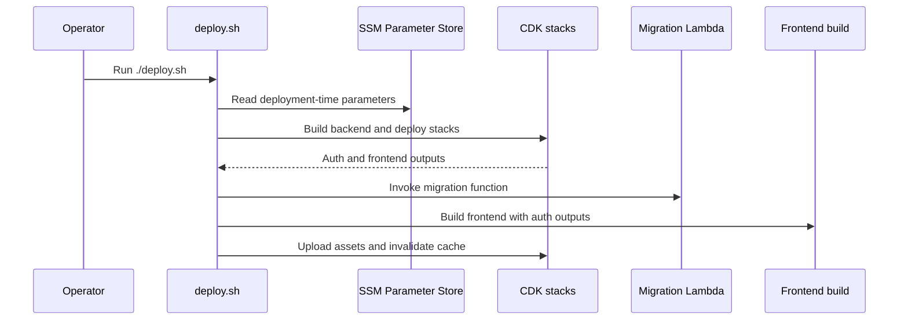

# Operations and configuration

This page covers the knobs operators and developers can change safely without reading the full source tree first: deployment flow, local setup, environment variables, SSM parameters, stack outputs, and the AWS prerequisites for custom domains.

## What is deployment-time vs runtime configuration?

The repository splits configuration into two categories:

- **Deployment-time configuration** is consumed by `deploy.sh` and CDK when stacks are synthesized and deployed. Changing it takes effect on the next deployment.
- **Runtime configuration** is read by the backend Lambda on cold start. Changing it in Parameter Store takes effect after the next cold start, without a full redeploy.

That split matters operationally: deployment-time parameters shape the stacks and generated outputs, while runtime parameters change application behavior without changing infrastructure.

## Local setup with the minimum safe prerequisites

For routine development, the minimum safe setup is:

1. Install Node.js using the version pinned in `.tool-versions`.
2. Run `npm install` in every package you will modify: `backend/`, `frontend/`, and/or `infra-cdk/`.
3. For backend work, copy `backend/.env.test.example` to `backend/.env.test` before the first test run.
4. For backend local development, also copy `backend/.env.example` to `backend/.env`, set the auth variables the app expects, and start DynamoDB Local with the backend scripts.
5. Before the first backend test run, initialize the local test database with `cd backend && npm run test:db:setup`.

The backend package uses Docker Compose for local DynamoDB, and its development and test scripts assume the local tables exist before the server or tests run.

## Deployment entrypoint and flow

The root deployment entrypoint is `./deploy.sh`. The script is responsible for the full production deployment sequence:

1. Read environment-specific SSM parameters.
2. Build the backend.
3. Deploy auth infrastructure.
4. Deploy backend infrastructure.
5. Deploy frontend infrastructure.
6. Update Cognito callback and logout URLs with the actual frontend URL.
7. Run database migrations.
8. Build the frontend and upload assets.
9. Invalidate CloudFront if a distribution ID was produced.

The script defaults to the `production` environment, but it accepts another environment name through `ENV`, for example `ENV=staging ./deploy.sh`.

`ENV` is validated before use so stack names, SSM paths, and filenames stay safe. Downstream commands rely on `NODE_ENV` being set from the same validated value.

## SSM parameters and environment variables

`deploy.sh` reads these deployment-time SSM parameters:

- `/manual/budget/$ENV/auth/allow-user-registration` → `AUTH_ALLOW_USER_REGISTRATION`
- `/manual/budget/$ENV/auth/claim-namespace` → `AUTH_CLAIM_NAMESPACE`
- `/manual/budget/$ENV/auth/domain-prefix` → `AUTH_DOMAIN_PREFIX`
- `/manual/budget/$ENV/lambda/memory-size` → `AWS_LAMBDA_MEMORY_SIZE`
- `/manual/budget/$ENV/lambda/timeout-seconds` → `AWS_LAMBDA_TIMEOUT_SECONDS`

It then passes those values into CDK so the auth stack and Lambda defaults are synthesized with the intended settings.

The backend Lambda also receives runtime values from Parameter Store at cold start. The documented runtime knobs are:

- `/manual/budget/$ENV/langchain/max-tokens`
- `/manual/budget/$ENV/langchain/model-id`
- `/manual/budget/$ENV/langchain/timeout`
- `/manual/budget/$ENV/langchain/temperature`
- `/manual/budget/$ENV/app/chat-history-max-messages`
- `/manual/budget/$ENV/app/chat-message-ttl-seconds`
- `/manual/budget/$ENV/langsmith/tracing`
- `/manual/budget/$ENV/langsmith/api-key`
- `/manual/budget/$ENV/langsmith/project`

These runtime values are changed in Parameter Store, not by editing the deployment script.

### Environment variables downstream scripts rely on

These values are consumed by deployment and build steps after the CDK deploy succeeds:

- `AUTH_ISSUER`
- `AUTH_CLIENT_ID`
- `AUTH_SCOPE`
- `AUTH_UI_URL`
- `VITE_AUTH_CLIENT_ID`
- `VITE_AUTH_ISSUER`
- `VITE_AUTH_SCOPE`
- `VITE_AUTH_UI_URL`
- `VITE_GRAPHQL_ENDPOINT`
- `VITE_MCP_ENDPOINT`

`deploy.sh` extracts the first four from the auth stack outputs, checks that none are empty, and then injects them into the frontend build environment.

## Stack outputs that downstream scripts depend on

The auth stack publishes these outputs for the deployment pipeline:

- `UserPoolId`
- `UserPoolClientId`
- `UserPoolDomainUrl`
- `AuthIssuer`
- `AuthScope`

`deploy.sh` requires `AuthIssuer`, `UserPoolClientId`, `AuthScope`, and `UserPoolDomainUrl` to be present in the auth stack outputs. If any are missing, deployment stops before the frontend is built.

The frontend stack publishes these outputs for deployment and operator use:

- `S3BucketName` — used by `deploy.sh` to upload the built frontend assets
- `CloudFrontDistributionId` — used by `deploy.sh` to invalidate the cache after upload
- `CloudFrontFullURL` — the direct CloudFront URL for opening the app
- `CustomDomainURL` — emitted only when a custom domain is configured

If the frontend stack does not produce a CloudFront distribution ID, the deploy script skips invalidation and warns that the frontend infrastructure may need to be redeployed.

## Auth stack behavior and safe change points

The auth stack is designed around Cognito hosted UI and SPA login flows:

- Users sign in with email.
- Self sign-up is controlled by `AUTH_ALLOW_USER_REGISTRATION`.
- The user pool client has no secret because the frontend is a public SPA client.
- The client uses authorization code flow with the standard OIDC scopes `openid profile email`.
- The stack outputs the issuer, client ID, scope string, and hosted UI URL for downstream scripts.
- The pre-token generation Lambda injects a namespaced email claim using `AUTH_CLAIM_NAMESPACE`.

The Cognito domain prefix must be globally unique across AWS accounts. If the prefix collides, the auth stack cannot be created successfully.

## Frontend stack behavior and custom domains

The frontend stack deploys the static site to S3 behind CloudFront and routes `/graphql*` and `/mcp*` to the backend API.

Custom domain support is optional and depends on an SSM lookup:

- The parameter `/manual/budget/$ENV/frontend/custom-domain` enables custom-domain provisioning when it resolves to a real hosted zone name.
- The value must exactly match a Route 53 hosted zone domain name.
- When enabled, the stack creates a sibling certificate stack in `us-east-1` because CloudFront certificates must live there.
- The frontend stack also needs `crossRegionReferences: true` so the certificate ARN can be used across regions.

If the custom domain changes, remove the corresponding cached `ssm:` and `hosted-zone:` entries from `infra-cdk/cdk.context.json` before redeploying. If you remove the domain, delete the Parameter Store value and explicitly destroy the certificate stack after the main deploy, because the conditional stack will not be removed automatically.

## AWS prerequisites that affect deployment and custom domains

The repository assumes these AWS-side prerequisites:

- AWS CLI is installed and configured.
- `jq` is available for deployment output parsing.
- CDK is bootstrapped in the target account and region.
- For custom domains, CDK must also be bootstrapped in `us-east-1` because ACM certificates for CloudFront must be created there.
- A Route 53 hosted zone exists for the custom domain, and its NS records are delegated from the domain registrar or current DNS provider.

When verifying DNS delegation for a custom domain, the expected check is an NS lookup against the exact hosted zone name.

## Failure and recovery notes

Most deployment failures fall into a few buckets:

- Missing or misnamed SSM parameters cause `deploy.sh` to stop early when it cannot read required configuration.
- Missing auth outputs stop the script before the frontend build, which prevents a partial deploy from shipping broken auth settings.
- A failed migration invocation stops the deploy before frontend asset publishing is considered complete.
- A missing CloudFront distribution ID does not fail the deploy, but it does skip cache invalidation.

For custom domain recovery, the safe sequence is:

1. Update or remove the SSM parameter.
2. Remove the relevant cached CDK context entries.
3. Redeploy.
4. Destroy the cert stack separately if the domain was removed.

## Practical operator checklist

Use this short checklist when changing behavior:

- Deployment pipeline changes: adjust SSM parameters first, then rerun `./deploy.sh`.
- Runtime AI behavior: change the runtime SSM parameters, then wait for the backend Lambda cold start.
- Frontend auth changes: verify the auth stack outputs still include the values `deploy.sh` reads.
- Custom domain changes: verify the hosted zone, us-east-1 bootstrap, and Route 53 delegation before redeploying.

## Control flow summary

This shows the deployment-time handoff from Parameter Store through CDK outputs into the frontend build.
