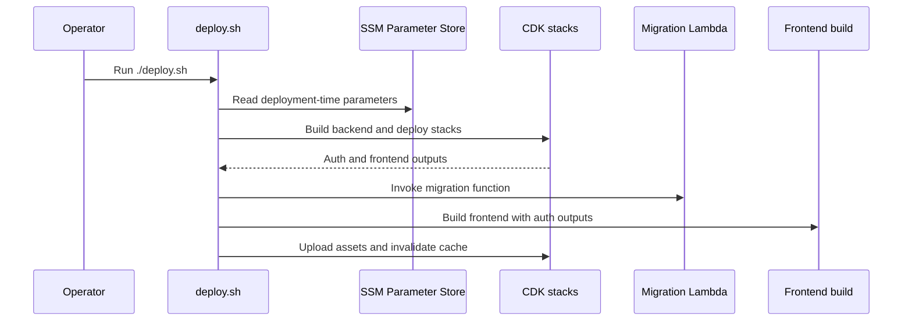
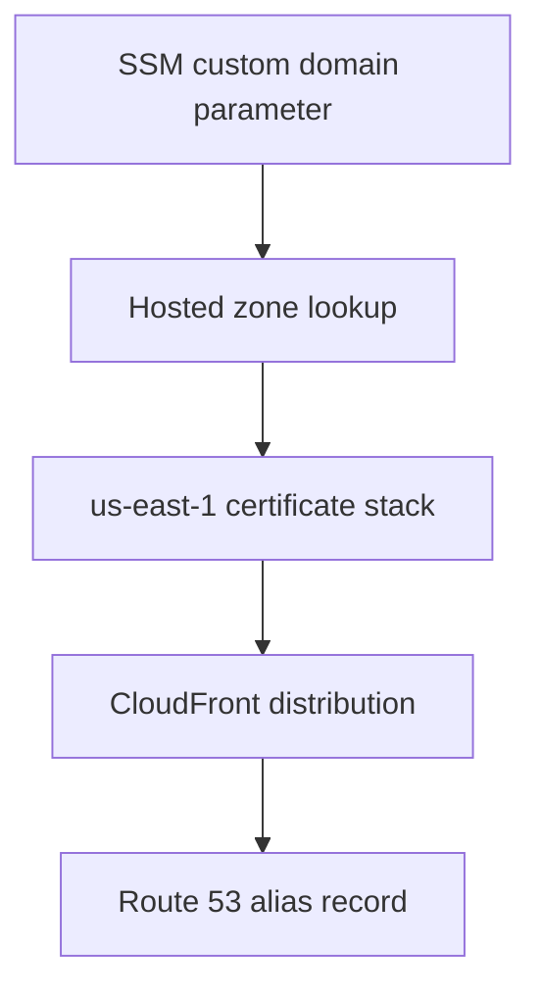

# Operations, Deployment, and Configuration

This page documents how the system is deployed, which configuration is consumed at deploy time versus runtime, and which AWS prerequisites must exist before custom-domain or stack wiring changes are safe.

## Operational boundaries: deployment-time vs runtime

The repository draws a hard line between two configuration lifecycles:

- **Deployment-time configuration** is read by `deploy.sh` and the CDK app while stacks are synthesized and deployed. Changing these values affects the next deployment.
- **Runtime configuration** is read by the backend Lambda from Parameter Store on cold start. Changing these values takes effect on the next cold start, without rebuilding or redeploying the stacks.

That boundary is important because some settings shape infrastructure, while others only tune application behavior. For example, Lambda memory and timeout are deployment-time knobs because they are passed into CDK and baked into the stack, whereas LangChain and chat-history settings are runtime knobs because the backend reads them from SSM during startup.

## Deployment order and what each step depends on

The root deployment entrypoint is `./deploy.sh`. It defaults to `production`, but accepts another environment name through `ENV`, for example `ENV=staging ./deploy.sh`. The script validates `ENV` before use so it can safely derive stack names, SSM paths, and filenames.

`deploy.sh` performs a fixed sequence:

1. Read deployment-time SSM parameters.
2. Build the backend.
3. Deploy auth infrastructure.
4. Deploy backend infrastructure.
5. Deploy frontend infrastructure.
6. Extract auth outputs and update Cognito callback and logout URLs.
7. Run database migrations.
8. Build the frontend with auth values injected into the build.
9. Upload frontend assets to S3.
10. Invalidate CloudFront if a distribution ID exists.

This sequence matters because the frontend build needs auth outputs from the auth stack, and the callback URL update depends on the deployed frontend URL.

The backend build is required before CDK deploys the backend stack because `infra-cdk/lib/backend-cdk-stack.ts` loads code from `../backend/dist`. The frontend build happens later, after the auth outputs have been extracted, because `deploy.sh` injects `VITE_AUTH_CLIENT_ID`, `VITE_AUTH_ISSUER`, `VITE_AUTH_SCOPE`, and `VITE_AUTH_UI_URL` into the frontend environment.

## SSM parameters and environment variables

`deploy.sh` reads these deployment-time SSM parameters:

- `/manual/budget/$ENV/auth/allow-user-registration` → `AUTH_ALLOW_USER_REGISTRATION`
- `/manual/budget/$ENV/auth/claim-namespace` → `AUTH_CLAIM_NAMESPACE`
- `/manual/budget/$ENV/auth/domain-prefix` → `AUTH_DOMAIN_PREFIX`
- `/manual/budget/$ENV/lambda/memory-size` → `AWS_LAMBDA_MEMORY_SIZE`
- `/manual/budget/$ENV/lambda/timeout-seconds` → `AWS_LAMBDA_TIMEOUT_SECONDS`

Those values are forwarded into CDK so the auth stack and Lambda defaults are synthesized with the intended settings. In practice, that means changes to registration policy, token-claim namespace, Cognito domain prefix, or Lambda sizing are deployment changes, not runtime changes.

The backend Lambda also reads runtime values from Parameter Store on cold start. The documented runtime knobs are:

- `/manual/budget/$ENV/langchain/max-tokens`
- `/manual/budget/$ENV/langchain/model-id`
- `/manual/budget/$ENV/langchain/timeout`
- `/manual/budget/$ENV/langchain/temperature`
- `/manual/budget/$ENV/app/chat-history-max-messages`
- `/manual/budget/$ENV/app/chat-message-ttl-seconds`
- `/manual/budget/$ENV/langsmith/tracing`
- `/manual/budget/$ENV/langsmith/api-key`
- `/manual/budget/$ENV/langsmith/project`

These runtime values are not wired through the deployment script. Change them in Parameter Store and let the backend pick them up on its next cold start.

## Configuration values that bridge stacks

The deployment flow depends on several stack outputs and environment variables being present after CDK runs.

### Auth outputs used by later steps

The auth stack publishes these outputs:

- `UserPoolId`
- `UserPoolClientId`
- `UserPoolDomainUrl`
- `AuthIssuer`
- `AuthScope`

`deploy.sh` requires `AuthIssuer`, `UserPoolClientId`, `AuthScope`, and `UserPoolDomainUrl` to exist before it proceeds to the frontend build. If any are missing, deployment stops instead of shipping a frontend with incomplete auth settings.

The auth stack itself is configured for email-based sign-in, SPA-style OAuth, and a pre-token-generation Lambda that injects a namespaced email claim. The user pool client does not use a secret, and it uses the authorization-code flow with the `openid profile email` scopes.

### Frontend outputs used by deployment

The frontend stack publishes these outputs:

- `S3BucketName` — where `deploy.sh` uploads the built assets
- `CloudFrontDistributionId` — used for cache invalidation after upload
- `CloudFrontFullURL` — the default URL for opening the app
- `CustomDomainURL` — emitted only when a custom domain is configured

If the frontend stack does not produce a CloudFront distribution ID, the deploy script skips invalidation and warns that the frontend infrastructure may need to be redeployed.

### Environment variables passed into the frontend build

After CDK deploys the auth stack, `deploy.sh` injects these values into the frontend build:

- `AUTH_ISSUER`
- `AUTH_CLIENT_ID`
- `AUTH_SCOPE`
- `AUTH_UI_URL`
- `VITE_AUTH_CLIENT_ID`
- `VITE_AUTH_ISSUER`
- `VITE_AUTH_SCOPE`
- `VITE_AUTH_UI_URL`
- `VITE_GRAPHQL_ENDPOINT`
- `VITE_MCP_ENDPOINT`

This is the boundary between infrastructure and the SPA bundle: the frontend receives concrete auth endpoints and IDs at build time, while its API routes remain fixed as `/graphql` and `/mcp`.

## Lambda configuration and cold-start behavior

The shared Lambda defaults come from `infra-cdk/lib/default-lambda-options.ts`. Those defaults always enable tracing, and they optionally apply memory and timeout values if the corresponding deployment-time SSM parameters are present.

That makes the runtime boundary explicit:

- memory size and timeout are stack configuration
- application tuning values are cold-start configuration
- token, model, tracing, and chat-history settings are not redeployed through CDK unless the stack wiring itself changes

The pre-token-generation Lambda in the auth stack is also part of this boundary. It receives `AUTH_CLAIM_NAMESPACE` through environment variables and writes the user email into a namespaced access-token claim during token issuance.

## Database and persistence setup

The backend package expects local DynamoDB tables to exist before local development or tests run. The scripts in `backend/package.json` expose this separation clearly:

- `npm run db:start` starts the local DynamoDB container with Docker Compose.
- `npm run db:create` creates tables from the backend scripts.
- `npm run db:setup` does both in sequence for development.
- `npm run test:db:setup` starts the local database and creates the test tables from `.env.test`.

For local backend work, the repository also expects `.env.example` to be copied to `backend/.env`, and `.env.test.example` to be copied to `backend/.env.test` before running tests. The operational implication is that a backend developer should create the local tables before starting the server or running repository tests that touch DynamoDB.

In deployed environments, the backend stack creates several DynamoDB tables with point-in-time recovery enabled, deletion protection enabled, and retention policies chosen to avoid accidental data loss. It also tags its tables for AWS Backup and sets up a daily backup plan. That means changes to table names, key structure, or backup selection have persistence and recovery consequences, not just schema consequences.

## Custom domain setup and related caveats

Custom domains are optional, but they introduce the most operationally sensitive deployment dependency in the repository.

The frontend stack looks up `/manual/budget/$ENV/frontend/custom-domain` through SSM. When the parameter resolves to a real hosted-zone name, CDK creates the extra certificate and Route 53 resources needed for the custom domain.

The custom-domain setup has three key constraints:

- The SSM value must exactly match a Route 53 hosted zone name.
- The certificate must be created in `us-east-1` because CloudFront certificates live there.
- CDK must be bootstrapped in both the target region and `us-east-1` for the certificate flow to work.

The frontend stack also uses `crossRegionReferences: true` so the certificate ARN from the `us-east-1` stack can be consumed by the distribution stack in the application region. If the domain changes, remove the cached `ssm:` and `hosted-zone:` entries from `infra-cdk/cdk.context.json` before redeploying. If the domain is removed entirely, delete the SSM value and destroy the certificate stack separately; the conditional cert stack is not removed automatically by the main deploy.

This shows the custom-domain bootstrap path that must succeed before the frontend can serve from the branded URL.

## Failure points and safe recovery

Most deployment failures fall into a few categories:

- Missing or misnamed SSM parameters stop `deploy.sh` early when required configuration cannot be read.
- Missing auth outputs stop the script before the frontend build, which prevents a partial deploy from shipping broken auth settings.
- A failed migration invocation stops the deploy before frontend publishing is treated as complete.
- A missing CloudFront distribution ID does not fail the deploy, but it does skip invalidation.

For custom-domain recovery, the safe order is:

1. Update or delete the SSM parameter.
2. Clear the cached CDK context entries.
3. Redeploy.
4. Destroy the certificate stack separately if the domain was removed.

The auth stack has its own operational caveat: the Cognito domain prefix must be globally unique across AWS accounts, so a collision will prevent stack creation. That is why domain-prefix changes should be treated as deploy-time changes with rollout risk.

## Local build and verification entrypoints

The relevant package-level scripts are:

- `backend/package.json`: `build`, `db:setup`, `test`, `test:db:setup`, `test:integration`, `test:repositories`, `test:unit`
- `frontend/package.json`: `build`, `codegen`, `dev`, `test`, `typecheck`
- `infra-cdk/package.json`: `build`, `deploy`, `synth`, `diff`, `test`, `typecheck`

These are the entrypoints that matter when changing deployment or configuration behavior because they correspond to the three layers that deployment touches: application code, UI bundle, and infrastructure.

## Deployment summary

If you are changing deployment behavior, treat the repository as three coupled layers:

- **Parameter Store** provides the deploy-time and runtime knobs.
- **CDK** turns deploy-time values into infrastructure and stack outputs.
- **The deploy script** sequences the build, deploy, migration, and asset publish steps.

The safe change rule is simple: if a value affects stack shape, outputs, or permissions, it belongs to the deployment path; if it only affects application behavior after startup, it belongs in runtime SSM and should be verified through a cold start or a fresh Lambda execution.
