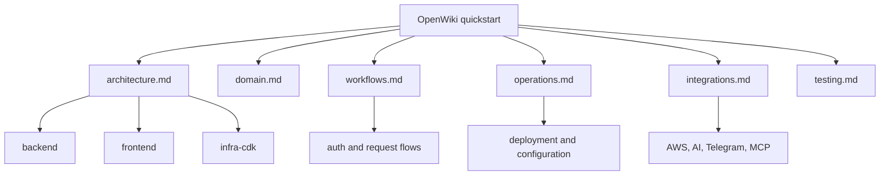

# OpenWiki quickstart

This page is the shortest path into the repository wiki. Use it to decide where to read next based on what you are changing.

## Start here by change intent

- **Backend feature, bug fix, or GraphQL change** → [System architecture](architecture.md), [Workflows and request flows](workflows.md), [Testing and verification](testing.md)
- **Frontend UI or composable change** → [System architecture](architecture.md), [Workflows and request flows](workflows.md), [Testing and verification](testing.md)
- **Infrastructure, auth, deployment, or environment change** → [System architecture](architecture.md), [Operations and configuration](operations.md), [Testing and verification](testing.md)
- **Domain rule or data model change** → [Domain model and concepts](domain.md), [Workflows and request flows](workflows.md), [Testing and verification](testing.md)
- **Integration change for AI, Telegram, MCP, or external services** → [Integrations and external systems](integrations.md), [System architecture](architecture.md), [Workflows and request flows](workflows.md)
- **Validation, unit tests, repo tests, or CDK checks** → [Testing and verification](testing.md)
- **Release, bootstrap, SSM, or runtime tuning work** → [Operations and configuration](operations.md)

## What each page is for

- **[System architecture](architecture.md)** explains how the SPA, GraphQL backend, Cognito auth, DynamoDB persistence, and CloudFront/CDK deployment fit together.
- **[Domain model and concepts](domain.md)** covers the finance concepts and rules that shape safe application changes.
- **[Integrations and external systems](integrations.md)** describes the AWS, Cognito, Bedrock/LangChain, MCP, and Telegram boundaries.
- **[Operations and configuration](operations.md)** covers deployment flow, SSM parameters, stack outputs, bootstrap requirements, and runtime knobs.
- **[Testing and verification](testing.md)** lists the useful test entrypoints and the smallest checks for backend, frontend, and infra work.
- **[Workflows and request flows](workflows.md)** walks through authentication, GraphQL requests, assistant chat, quick transaction entry, Telegram processing, migrations, and deploy flow.

## Common task routing

### Feature work

1. Identify the subsystem first: backend, frontend, infrastructure/auth, or integration.
2. Read the architecture page for the relevant boundary.
3. Read the workflow page for the user or request path you are touching.
4. Finish with the testing page to choose the smallest useful verification.

### Bug fixes and debugging

1. Reproduce the issue in the relevant workflow.
2. Check the architecture page to confirm where the behavior belongs.
3. Use the operations page if the problem involves deploy-time or runtime configuration.
4. Run the narrowest test that proves the fix.

### Deployment and ops changes

1. Read the operations page for SSM parameters, stack outputs, and bootstrap requirements.
2. Read the architecture page if the change alters routing, auth, or resource ownership.
3. Read the testing page before changing deployment scripts or stack wiring.

### Auth and access changes

1. Start with the architecture page for the Cognito and request-scoping model.
2. Read the operations page for auth stack outputs and environment variables.
3. Check the workflows page for request entry points that depend on auth.

### Data and domain changes

1. Read the domain page for invariants and terminology.
2. Check the workflows page for how the data is created, updated, or queried.
3. Use the testing page to verify repository or service behavior at the right layer.

## Practical entrypoints

If you need a source starting point after reading the wiki pages, the most common code entrypoints are:

- `backend/src/server.ts` — GraphQL request context and backend bootstrap
- `backend/src/graphql/resolvers/index.ts` — resolver composition
- `backend/src/services/assistant-service.ts` and `backend/src/services/create-transaction-from-text-service.ts` — assistant and text-entry flows
- `frontend/src/main.ts` — SPA bootstrap
- `infra-cdk/lib/backend-cdk-stack.ts` and `infra-cdk/lib/frontend-cdk-stack.ts` — deployment wiring

## Fast navigation map

This map is intentionally small: it routes you to the right system page instead of mirroring the repository tree.

## How to use this page

- Start with the page that matches your change intent.
- Use the workflow page to understand request order and failure behavior.
- Use the operations page for anything involving deployment, bootstrap, or SSM.
- Use the testing page before editing code so you can choose the smallest useful verification.
- Return here whenever you need a fast pointer to the rest of the wiki.
