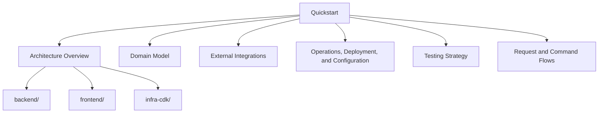

# Quickstart

Use this page as the shortest route into the wiki. It is meant to help you decide what to read next, not to restate the full architecture.

## Repo-level orientation

This repository has three main code areas:

- `backend/` — GraphQL app runtime, background jobs, integrations, and persistence-facing logic
- `frontend/` — Vue single-page app that talks to the backend
- `infra-cdk/` — AWS CDK stacks, deployment wiring, and environment configuration

Start with [Architecture Overview](architecture/overview.md) if you need the big picture first.

## Where to go next

- **Understanding the runtime shape and boundaries** → [Architecture Overview](architecture/overview.md)
- **Understanding business entities and rules** → [Domain Model](concepts/domain-model.md)
- **Understanding external systems and service boundaries** → [External Integrations](integrations/external-systems.md)
- **Understanding deploys, configuration, and runtime operations** → [Operations, Deployment, and Configuration](operations/deployment-and-config.md)
- **Understanding tests and what to run for a change** → [Testing Strategy](testing/testing-strategy.md)
- **Tracing request, command, and background-job flows** → [Request and Command Flows](workflows/request-and-command-flows.md)

## Change routing

### Backend changes

Read, in order:

1. [Architecture Overview](architecture/overview.md)
2. [Request and Command Flows](workflows/request-and-command-flows.md)
3. [Testing Strategy](testing/testing-strategy.md)

Use this path for GraphQL, services, background jobs, MCP, Telegram, persistence, and validation work.

### Frontend changes

Read, in order:

1. [Architecture Overview](architecture/overview.md)
2. [Request and Command Flows](workflows/request-and-command-flows.md)
3. [Testing Strategy](testing/testing-strategy.md)

Use this path for Vue UI, router, Apollo client, session/auth handling, and composables.

### Infrastructure and deployment changes

Read, in order:

1. [Architecture Overview](architecture/overview.md)
2. [Operations, Deployment, and Configuration](operations/deployment-and-config.md)
3. [Testing Strategy](testing/testing-strategy.md)

Use this path for CDK stacks, AWS resources, environment variables, SSM parameters, and deployment behavior.

### Domain or data-model changes

Read, in order:

1. [Domain Model](concepts/domain-model.md)
2. [Request and Command Flows](workflows/request-and-command-flows.md)
3. [Testing Strategy](testing/testing-strategy.md)

Use this path when a change affects finance concepts, invariants, or cross-entity behavior.

### Integration changes

Read, in order:

1. [External Integrations](integrations/external-systems.md)
2. [Architecture Overview](architecture/overview.md)
3. [Request and Command Flows](workflows/request-and-command-flows.md)

Use this path for AWS, auth, Bedrock/LangChain, MCP, Telegram, or other external services.

## Common local entrypoints

If you need source starting points after reading the wiki pages, the usual entrypoints are:

- `backend/src/server.ts` — backend request context and GraphQL setup
- `backend/src/lambdas/web.ts` — HTTP routing for GraphQL, Telegram, and MCP
- `frontend/src/main.ts` — SPA bootstrap
- `infra-cdk/lib/backend-cdk-stack.ts` — backend resources and wiring
- `infra-cdk/lib/frontend-cdk-stack.ts` — frontend distribution and API routing

## Minimal navigation map

```mermaid
flowchart TD
  Quickstart["Quickstart"] --> Arch["Architecture Overview"]
  Quickstart --> Domain["Domain Model"]
  Quickstart --> Integrations["External Integrations"]
  Quickstart --> Ops["Operations, Deployment, and Configuration"]
  Quickstart --> Testing["Testing Strategy"]
  Quickstart --> Workflows["Request and Command Flows"]

  Arch --> Backend["backend/"]
  Arch --> Frontend["frontend/"]
  Arch --> Infra["infra-cdk/"]
```

## Practical rule of thumb

- Read the architecture page first when you are unsure which subsystem owns a change.
- Read the workflow page when you need request order, dispatch behavior, or failure shape.
- Read the operations page before changing deployment or environment settings.
- Read the testing page before editing code so you can choose the smallest useful verification.
- Return here when you need a fast pointer to the right wiki page.
