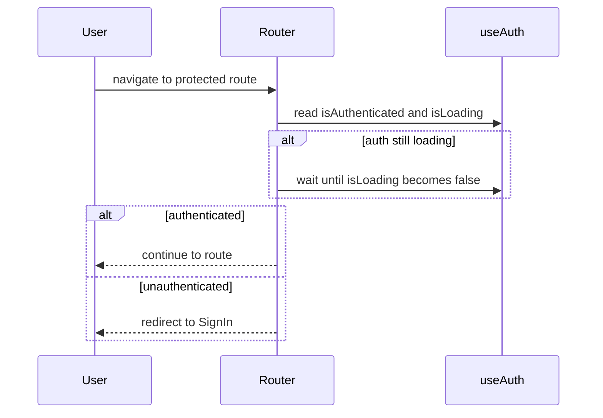
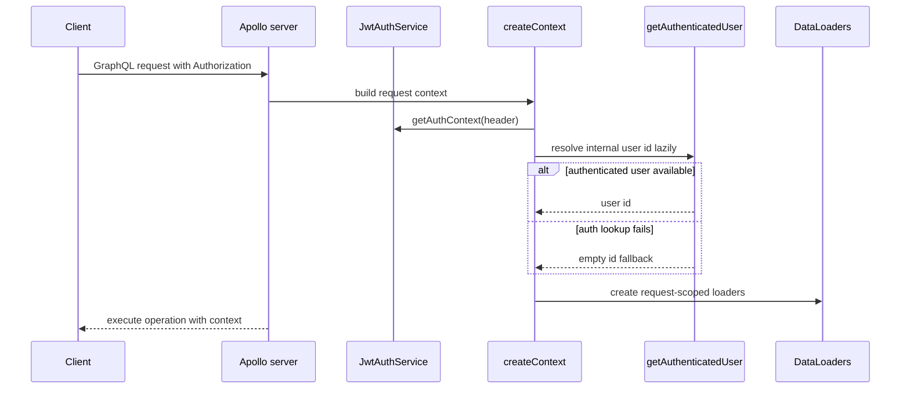
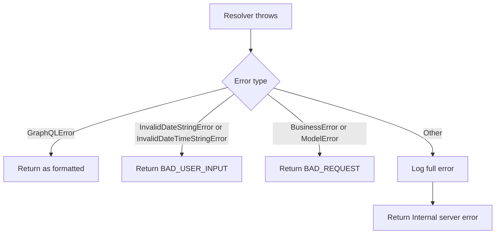
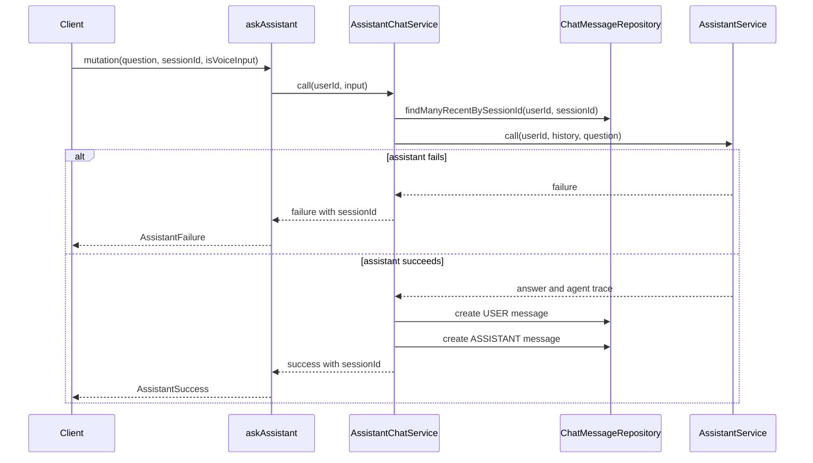
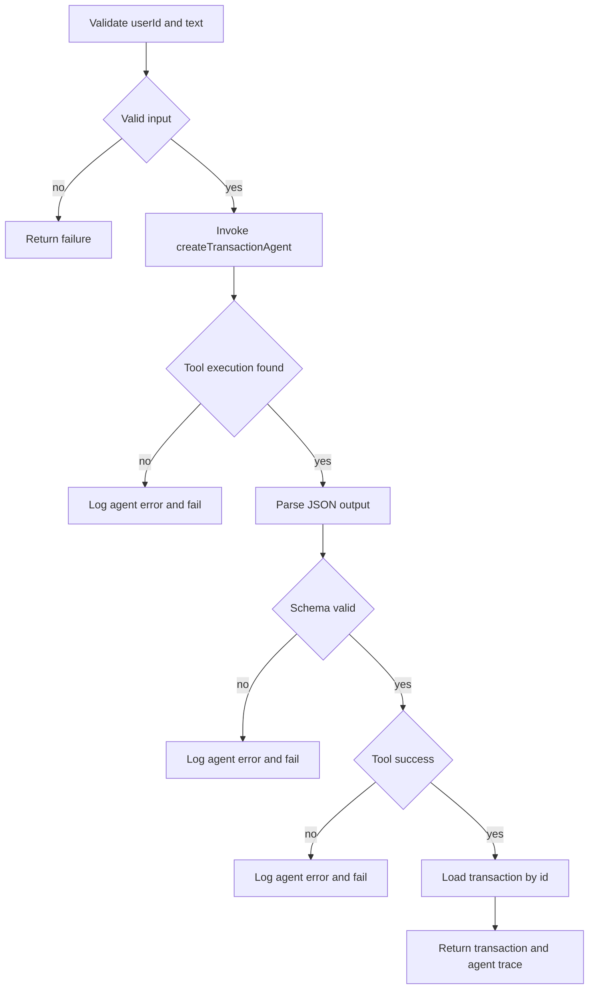
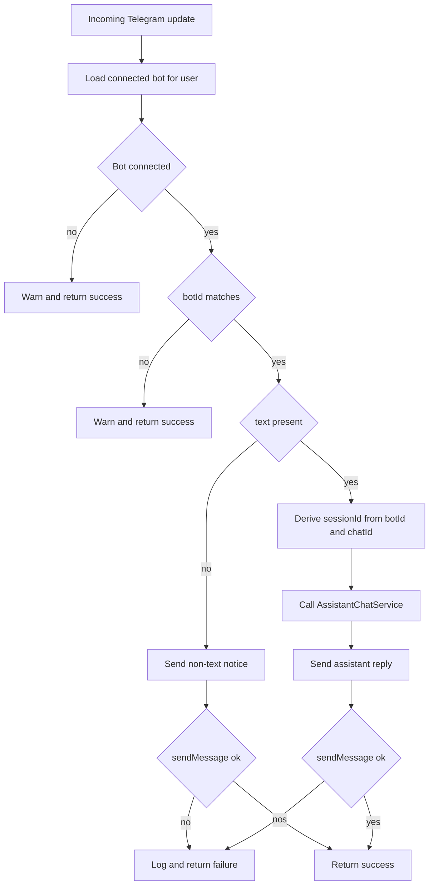
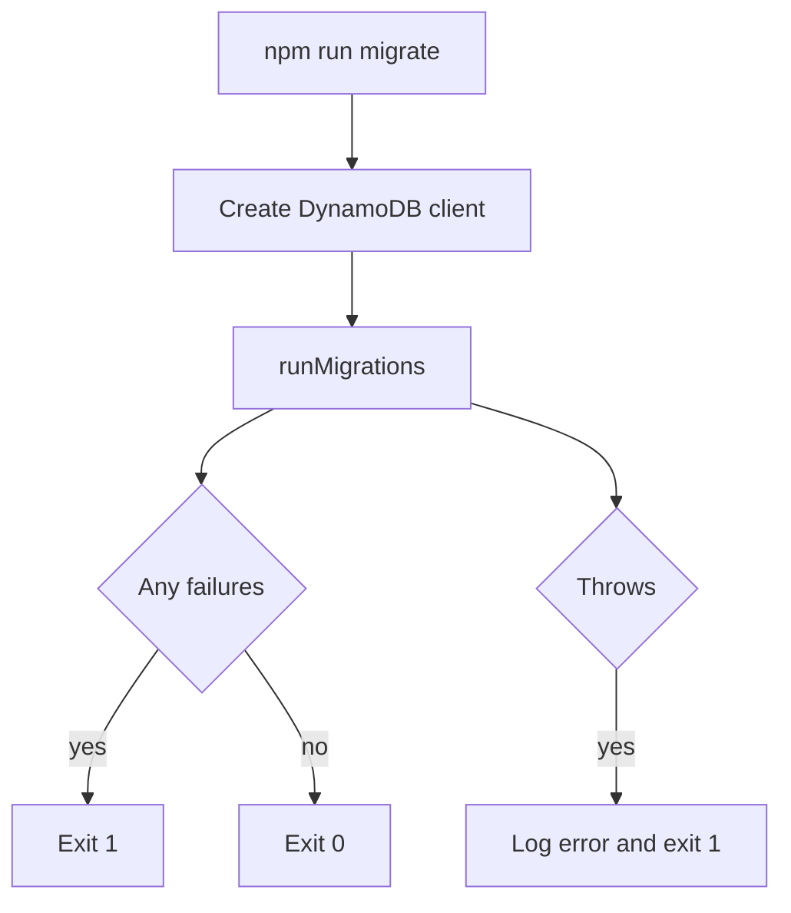
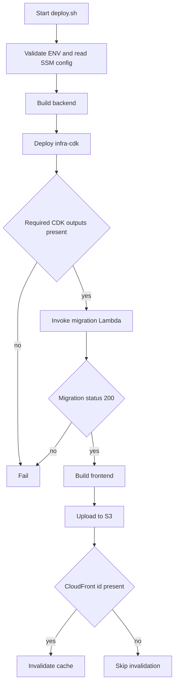

# Workflows and request flows

This page ties the main user and operator intents to the code paths that execute them. It focuses on where requests enter the system, how they branch, when data is persisted, and which failures are surfaced to the caller versus only logged.

## Authenticate and enter the SPA

A user who opens the frontend and tries to reach a protected route goes through the Vue router guard first. The `SignIn` route is public, while `Accounts`, `Categories`, `Transactions`, `ByCategoryReport`, `Trends`, `Assistant`, and `Settings` all use `beforeEnter: requireAuth`.

`requireAuth` waits for the auth composable to finish loading before deciding. If the app is still loading auth state, it watches `isLoading` until it becomes false. It then routes authenticated users through and redirects unauthenticated users back to `SignIn`.

The guard only decides client-side navigation. The backend still authenticates GraphQL requests separately.

## Authenticate a GraphQL request

Every GraphQL request builds a fresh request context in `backend/src/server.ts`. The server reads the `Authorization` header, normalizes array-valued headers to a single string, and passes that value to `resolveJwtAuthService().getAuthContext(...)`.

The context is assembled after auth resolution and includes repositories, CRUD services, reporting services, AI services, and Telegram services. The request also gets per-request DataLoaders for accounts and categories. Those loaders are created after a lazy `getUserId` function is defined so the loaders can resolve the authenticated internal user id only when needed.

If a request is unauthenticated, `getUserId` returns an empty string. If user lookup fails for loader scoping, the helper also falls back to an empty string rather than throwing.

## Handle GraphQL errors

The Apollo server uses a custom `formatError` policy to separate user-facing failures from internal faults. Intentional `GraphQLError` instances pass through unchanged, which covers auth checks and inline validation. Date parsing errors are translated to `BAD_USER_INPUT`. `BusinessError` and `ModelError` become `BAD_REQUEST` responses.

Anything else is treated as an internal fault: the server logs the full error with the GraphQL path, then returns a generic `Internal server error` with `INTERNAL_SERVER_ERROR` to the client.

## Ask the assistant from the web app

A signed-in user who opens the Assistant screen submits a GraphQL `askAssistant` mutation. The resolver authenticates the user, then calls `context.assistantChatService.call(user.id, ...)` with the question, optional voice flag, and optional session id.

`AssistantChatServiceImpl` owns the chat session boundary. It either reuses the provided `sessionId` or generates a new UUID. It loads recent messages for that user and session from `ChatMessageRepository`, reverses them into chronological order, converts them into the agent message format, and passes them to `AssistantService`.

If `AssistantService` fails, the service returns a failure result that includes the same `sessionId` so the caller can retry in the same conversation thread. It does not persist any new messages on this path.

If `AssistantService` succeeds, the service persists the user question first and the assistant answer second, both with the configured TTL, then returns success with the answer, agent trace, and session id.

The chat history limit and message TTL come from the async singleton in `backend/src/dependencies.ts`, which reads the relevant runtime environment settings.

## Create a transaction from free text

A user who types a quick-entry phrase such as `coffee 4.50` goes through `CreateTransactionFromTextService`. The service first validates the caller by checking that `userId` is present and that the trimmed text is non-empty. Invalid input returns a failure immediately and the agent is never invoked.

For valid input, the service invokes the create-transaction agent with a single user message and a context object containing `userId`, `isVoiceInput`, and today’s date. It then inspects the agent’s tool executions and requires that the create-transaction tool was actually called.

If no matching tool execution exists, the service logs an agent error and returns a failure message to the caller. If the tool output is not valid JSON, does not match the expected schema, or reports `success: false`, the service also logs the details and returns a failure. These branches are user-visible failures, but the logging preserves the agent output for debugging.

When the tool reports success, the service fetches the created transaction by id through `TransactionService.getTransactionById(transactionId, userId)` and returns the persisted transaction plus the agent trace.

The service reuses the last `create-transaction` tool execution when the agent calls the tool more than once.

## Process a Telegram message

Telegram message handling is intentionally conservative. `ProcessTelegramMessageService` first asks `TelegramBotRepository.findOneConnectedByUserId(userId)` for the currently connected bot.

If no bot is connected, it logs a warning and returns success without doing anything. If the connected bot id does not match the incoming `botId`, it also logs a warning and returns success. This prevents stale Telegram deliveries from an old bot connection from affecting the current session.

For non-text messages, the service replies with `I can only process text messages` through `TelegramApiClient.sendMessage`. If that send fails, the service logs the error and returns a failure result; otherwise it exits successfully.

For text messages, the service derives a deterministic session id from `botId` and `chatId`, then forwards the text to `AssistantChatService`. It sends the assistant answer, or the assistant failure message, back to Telegram. Again, send failures are logged and returned as failures.

## Run migrations locally

The local migration script `backend/src/scripts/migrate.ts` creates a DynamoDB client, runs `runMigrations(client)`, and exits with a process status based on the result.

If `runMigrations` reports any failed migrations, the script prints `Migrations failed` and exits with code 1. If the runner throws, the script logs `Migration error:` with the exception and also exits with code 1. Only the all-success path exits with code 0.

## Deploy the full stack

`deploy.sh` is the operator entrypoint for release ordering. It defaults `ENV` to `production`, validates that the environment name is alphanumeric with dashes, and then reads deployment-time SSM parameters before doing any build or infrastructure work. Those parameter reads are strict: missing parameters are tolerated, but AWS transport, IAM, or CLI failures stop the script.

The script then builds the backend, deploys the infrastructure, extracts auth and backend outputs from the CDK output file, and refuses to continue if the required auth values or migration function name are missing. Only after backend deployment succeeds does it invoke the migration Lambda.

After migrations succeed, the script switches to the frontend, builds the SPA with the auth values and GraphQL endpoints injected as environment variables, uploads the static assets to S3, and invalidates CloudFront when a distribution id is present.

This order matters: auth and backend infrastructure must exist before the frontend build needs the auth outputs, and migrations must complete before the frontend is published.

## How these workflows connect

These flows are intentionally layered:

- the router gate keeps unauthenticated users out of protected views
- Apollo context authenticates each GraphQL request again on the backend
- assistant chat persists history only after a successful model call
- Telegram processing reuses assistant chat but does not persist Telegram-specific state itself
- quick-entry transaction creation validates, invokes the agent, then resolves the created transaction through the transactional service layer
- deployment always builds and deploys backend pieces before publishing the frontend

For code changes, the main entrypoints to inspect are `frontend/src/router/index.ts`, `backend/src/server.ts`, `backend/src/graphql/resolvers/assistant-resolvers.ts`, `backend/src/services/assistant-chat-service.ts`, `backend/src/services/create-transaction-from-text-service.ts`, `backend/src/services/process-telegram-message-service.ts`, `backend/src/scripts/migrate.ts`, and `deploy.sh`.
