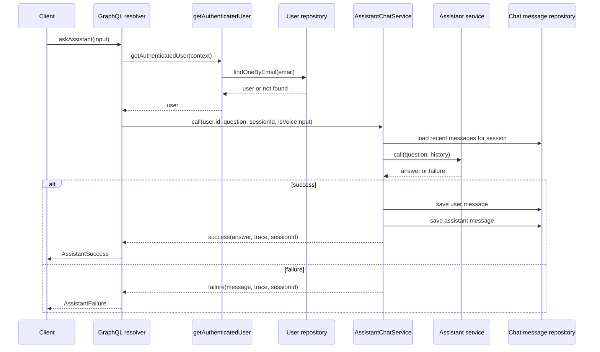
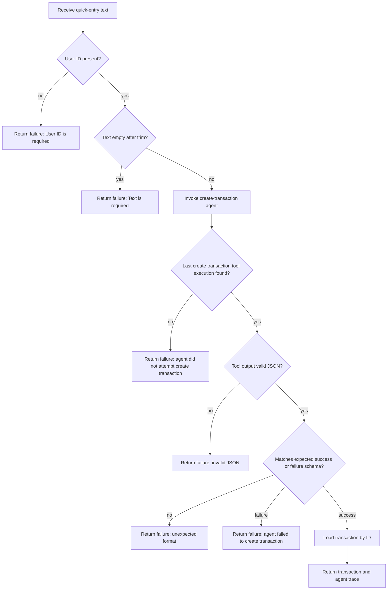
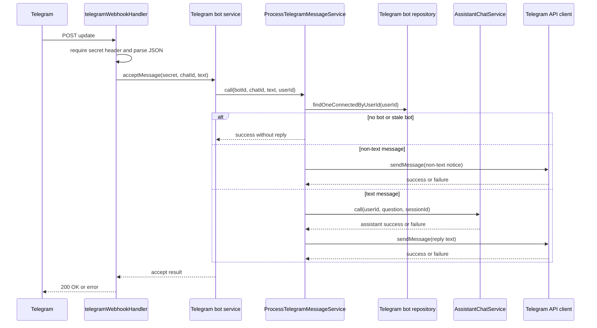
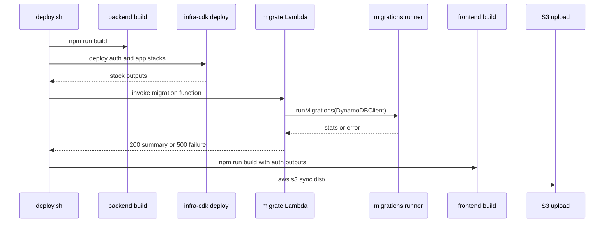

# Workflows

This page traces the highest-value runtime and release flows across the backend. It focuses on authenticated GraphQL use, assistant chat, quick transaction creation, Telegram message handling, and production deployment.

## Authenticated GraphQL assistant flow

The assistant mutation is exposed through the GraphQL resolver layer. It first resolves the authenticated user from the request context, then calls the chat service with the user ID and the request input. The resolver returns either an `AssistantSuccess` payload or an `AssistantFailure` payload, so the client always receives the session identifier even when the assistant call fails.

Authentication is validated before any assistant work happens:

- `getAuthenticatedUser` requires an authenticated context and looks up the persisted user record by email.
- Missing auth produces a GraphQL error.
- A missing database user also fails the mutation.
- Unexpected resolver errors are normalized through `handleResolverError`.

This diagram shows the authenticated request path and the fact that chat history is loaded and persisted inside the chat service, not in the resolver.

## Assistant chat session lifecycle

`AssistantChatServiceImpl` creates a new session ID when the caller does not provide one. If the caller passes an existing `sessionId`, the service reuses it so a client can continue the same conversation.

The service loads the most recent messages for that user and session, reverses them into chronological order, and maps stored chat roles into agent roles before calling the assistant model. After a successful assistant response, it persists both the user question and the assistant answer. On failure, it returns a failure result that still includes the session ID and agent trace so callers can retry without losing conversational continuity.

The repository lookup is scoped by both user and session, which keeps chat history isolated per user and per conversation.

## Quick transaction creation from text

Quick-entry text is handled by `CreateTransactionFromTextService`. The service rejects empty user IDs and blank text immediately, before invoking the agent. For valid input, it sends a single user message to the transaction-creation agent together with runtime context containing the user ID, the current date, and whether the input came from voice.

After the agent responds, the service expects the last `CREATE_TRANSACTION_TOOL_NAME` execution to contain JSON describing either a successful transaction creation or a tool failure. It logs and returns failures when:

- the agent never attempted the create-transaction tool
- the tool output is not valid JSON
- the JSON does not match the expected schema
- the tool itself reports failure

When the tool succeeds, the service fetches the created transaction by ID and returns the persisted transaction together with the agent trace.

Caption: quick-entry validation and agent/tool outcome handling.

## Telegram message handling

Telegram updates enter through the webhook Lambda. The handler requires the Telegram secret header, rejects empty bodies, and parses the webhook payload before it forwards the message to the Telegram bot service.

`ProcessTelegramMessageService` then revalidates the user-to-bot relationship before it does any assistant work:

- if the user has no connected bot, the service logs a warning and returns success without replying
- if the incoming bot ID does not match the user’s currently connected bot, it also returns success without replying
- if the Telegram update has no text, it sends a fixed non-text message reply and stops
- otherwise it derives a deterministic session ID from `botId#chatId`, calls the assistant chat service, and relays either the assistant answer or the assistant failure message back to Telegram

If Telegram cannot send the reply, the service returns failure.

Caption: webhook validation, bot ownership checks, and reply forwarding.

## Deployment and migrations

`deploy.sh` orchestrates the production release. It reads deployment-time configuration from SSM, builds the backend, deploys auth and application infrastructure, invokes the migration Lambda, then builds and uploads the frontend assets. It also extracts auth outputs from CDK to wire the frontend build and the deployed auth URLs.

The migration Lambda is a dedicated deployment step. It refreshes runtime environment values, runs `runMigrations` against DynamoDB, and returns a JSON summary with executed, skipped, failed, and total duration statistics. If migration execution throws, the Lambda logs the error and returns a 500 response body.

Caption: release sequencing from build to migration to frontend publish.

## Operational expectations and extension points

A few invariants matter when changing these flows:

- Assistant chat continuity depends on session IDs; callers should pass the session ID back on retries when they want to continue a conversation.
- Assistant chat history is limited by the configured maximum message count and is loaded per user and session.
- Telegram handling deliberately treats missing or mismatched bot state as a no-op success, which prevents stale webhook deliveries from creating noise.
- Quick-entry creation requires a successful create-transaction tool execution before the service will fetch and return a transaction.
- Deployment-time configuration is consumed during `deploy.sh` and CDK deploys, while runtime AI configuration is loaded by the backend Lambda on cold start.

When extending these workflows, the safest change order is:

1. update the relevant service first
2. adjust the GraphQL resolver or Lambda entrypoint
3. update tests that cover the success and failure paths
4. change deployment tooling only if the runtime needs new config or permissions

## Focused tests that matter

Representative tests already cover the main control-flow guarantees:

- assistant chat service tests verify history handling, persisted session behavior, and failure propagation
- quick-entry service tests verify validation, tool selection, JSON parsing, schema validation, and transaction lookup
- Telegram message service tests verify bot matching, non-text replies, assistant replies, and Telegram send failures

Those tests are the best starting point when changing the flows documented here.
