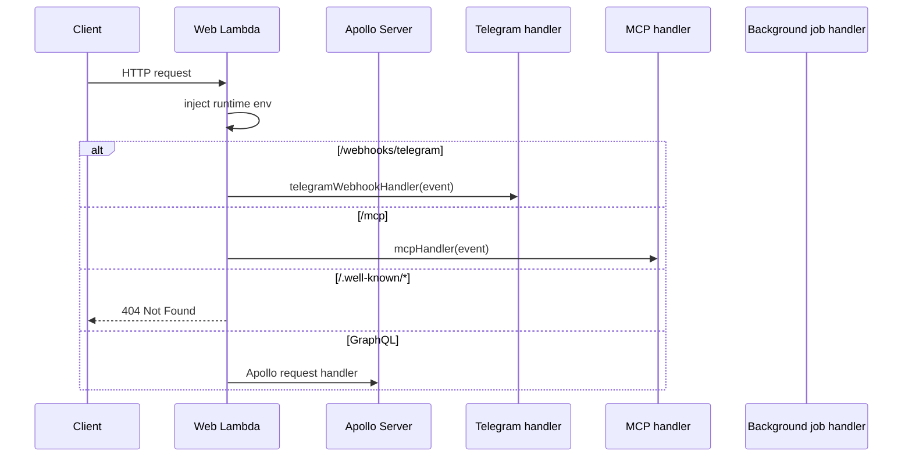
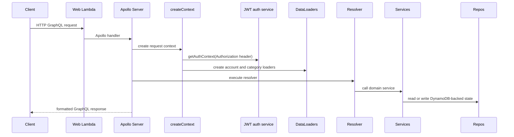
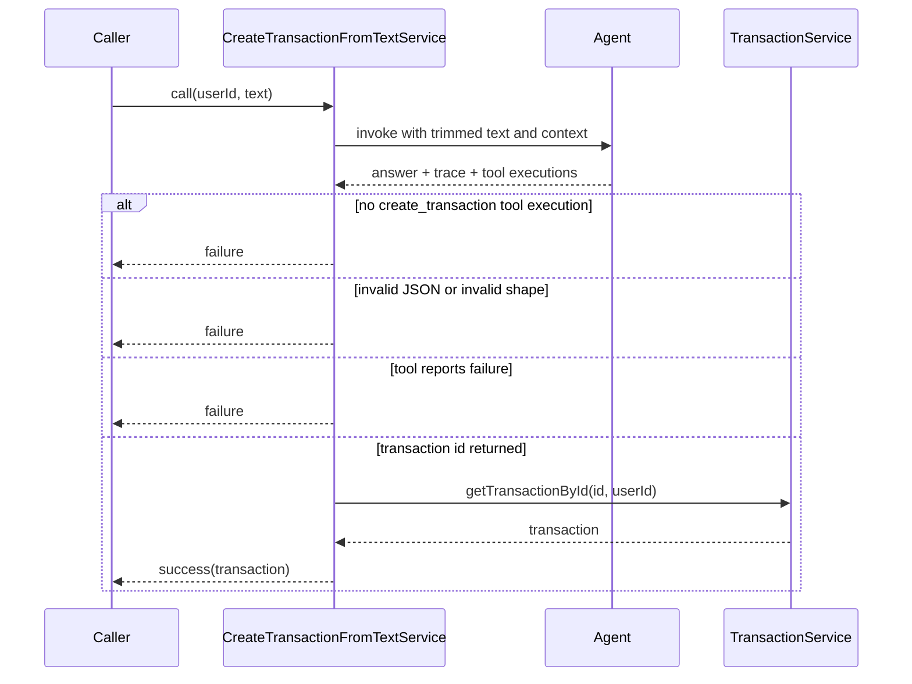
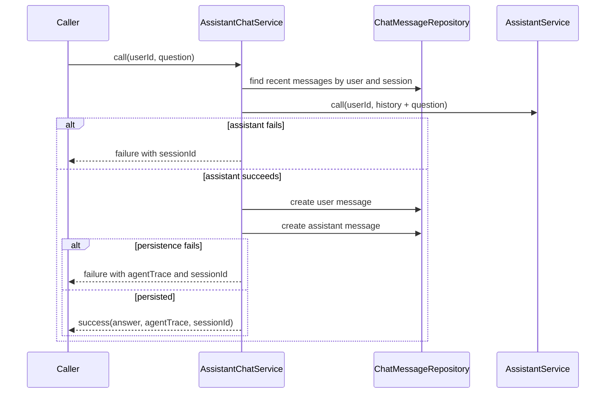
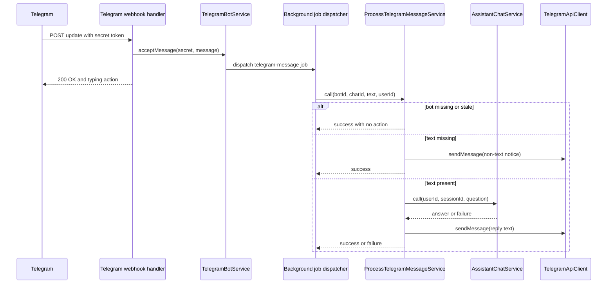
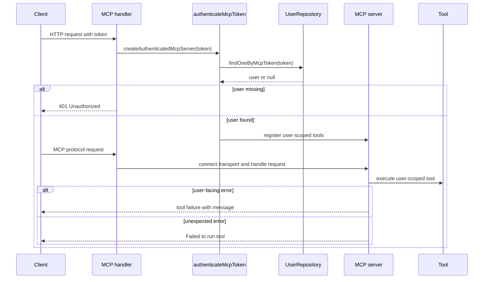
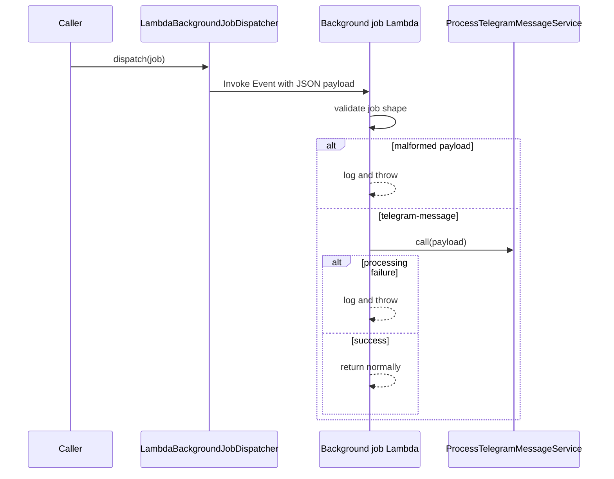

# Request and Command Flows

This page traces the main backend execution paths from the network or job entrypoint to the service and repository boundaries that own the business logic. The goal is to show where requests are authenticated, how user scope is established, where agents and external protocols are invoked, and which failures are translated into user-visible responses versus internal errors.

## Entry points and routing

The backend has four public execution surfaces that share the same dependency graph but enter through different adapters:

- `backend/src/lambdas/web.ts` routes HTTP traffic for GraphQL, Telegram webhooks, and MCP.
- `backend/src/server.ts` constructs the Apollo Server and request-scoped GraphQL context.
- `backend/src/lambdas/telegram-webhook-handler.ts` validates Telegram webhook traffic and forwards accepted messages into the Telegram bot service.
- `backend/src/lambdas/background-job.ts` consumes asynchronous job events, validates the payload, and dispatches the matching job handler.
- `backend/src/lambdas/mcp-handler.ts` authenticates MCP access and bridges API Gateway requests to the MCP transport.

The web Lambda loads runtime configuration once per warm container before dispatching. It also short-circuits `/.well-known/*` requests with a 404 so MCP discovery probes do not fall through to Apollo’s CSRF and GraphQL handling.

This diagram shows the first routing decision before any domain service is invoked.

## GraphQL request flow

`backend/src/server.ts` is the GraphQL boundary. It loads the schema, registers resolvers, and defines the error policy that determines what the client sees.

### Request-scoped context

`createContext` normalizes the `Authorization` header, resolves JWT authentication, and assembles a fresh `GraphQLContext` for each request. The context includes repositories and services for the current request, including the AI services that are resolved asynchronously because they require model initialization.

The request context also creates request-scoped DataLoaders. The loaders call a lazy `getUserId` helper that returns the authenticated internal user id when available and falls back to an empty string on unauthenticated or failed lookups. That keeps loader caches scoped to the current request and prevents user data from leaking between requests.

### GraphQL error translation

Apollo error formatting splits failures into three categories:

- intentional `GraphQLError` values are passed through unchanged
- user-facing validation and domain errors keep their message and become `BAD_USER_INPUT` or `BAD_REQUEST`
- unexpected errors are logged with the GraphQL path and rewritten to `Internal server error` with `INTERNAL_SERVER_ERROR`

That means resolver and service code can raise actionable business errors without exposing stack traces, while internal failures stay visible in logs but not to clients.

### GraphQL sequence

This shows the typical request path from transport to repository boundary.

### Change boundaries

When changing GraphQL behavior, keep these boundaries intact:

- authentication stays in `createContext`
- loader scoping stays request-local
- business validation stays in services and model constructors
- raw repository access stays out of resolvers
- unexpected exceptions remain hidden behind the error formatter

## Transaction creation from text

`backend/src/services/create-transaction-from-text-service.ts` is the command path that turns natural-language input into a persisted transaction. It is called from the GraphQL and agent surfaces, so it acts as a coordination layer between the agent and the transaction service.

The service does four things in order:

1. validate that `userId` and non-empty text are present
2. invoke the `createTransactionAgent` with the trimmed text and a context containing `userId`, `isVoiceInput`, and today’s date
3. parse the last `create_transaction` tool execution as JSON and validate that it contains either a successful transaction id or a failure message
4. fetch the created transaction from `TransactionService.getTransactionById`

The service does not trust the agent response blindly. It requires the agent to actually use the `create_transaction` tool and it rejects malformed JSON or responses that do not match the expected success/failure envelope.

This path matters because the transaction id comes from the tool result, but the final transaction payload is reloaded from the repository-backed transaction service.

## Assistant chat flow

`backend/src/services/assistant-chat-service.ts` owns conversational history and the handoff to `AssistantService`. It is the service used by Telegram processing and by other chat-oriented callers.

The chat service derives or reuses a `sessionId`, loads recent messages for that user and session, and converts them into LangChain-style agent messages. It then calls `AssistantService.call` with the normalized history and persists both the user question and assistant answer only after the assistant returns successfully.

If the assistant service fails, the failure is returned with the same `sessionId` so the caller can retry the same conversation without reconstructing state. If persistence of either chat message fails, the service also returns a failure, but it still includes the agent trace from the successful assistant response.

### Assistant chat sequence

This keeps chat persistence ordered after the model response, which prevents storing messages for requests that never produced an answer.

`backend/src/services/assistant-service.ts` is the lower-level agent wrapper. It validates that the caller supplied a user id and a non-empty question, appends the current question to any supplied history, invokes the assistant agent with `userId`, `isVoiceInput`, and today’s date in the agent context, and returns a trimmed non-empty answer plus agent trace.

## Telegram webhook handling and message processing

Telegram messages enter through `backend/src/lambdas/telegram-webhook-handler.ts`. The handler requires the `x-telegram-bot-api-secret-token` header, rejects requests without it with `403 Forbidden`, and rejects missing or unparseable bodies with `400 Bad Request`. When a message is present, it forwards the chat id and text to `TelegramBotService.acceptMessage`.

The handler returns a `sendChatAction` payload that tells Telegram the bot is typing while the downstream work continues. If `acceptMessage` fails, the handler logs the error and throws, which makes the Lambda invocation fail instead of pretending the webhook was accepted.

`backend/src/services/process-telegram-message-service.ts` owns the actual command processing after the webhook has been accepted. It verifies that the user still has a connected bot and that the incoming bot id matches the currently connected bot. If no bot is connected, or the bot id is stale, it logs a warning and returns success without doing any work. That makes stale or replayed jobs harmless.

When the incoming Telegram message has no text, the service replies immediately with `I can only process text messages`. When the message contains text, it derives a deterministic `sessionId` from `botId#chatId`, calls `AssistantChatService`, and sends the assistant answer or assistant failure message back through `TelegramApiClient.sendMessage`.

This flow keeps Telegram-specific concerns at the edges and pushes conversational logic into services that can be reused elsewhere.

## MCP authentication and tool execution

`backend/src/lambdas/mcp-handler.ts` converts API Gateway HTTP events into MCP transport requests. It authenticates the request before the server is created and returns `401 Unauthorized` when no user can be resolved from the query-string token.

`backend/src/mcp/auth.ts` is intentionally small: a missing token is rejected immediately, and a present token is resolved through `UserRepository.findOneByMcpToken`. `backend/src/mcp/server.ts` then creates the MCP server only for an authenticated internal user.

The MCP server registers a fixed tool set bound to the authenticated user id. Tool execution catches user-facing errors and returns their message directly. Unexpected errors are logged server-side and collapsed into `Failed to run <tool>` so internal stack details do not leak into protocol responses.

### MCP sequence

This flow preserves a strong separation between token authentication and tool registration.

## Background job execution

`backend/src/lambdas/background-job.ts` receives asynchronous job events from the Lambda dispatcher. It loads runtime env, validates the raw event with a discriminated union, and fails fast on malformed payloads after logging the validation issues. For a recognized job, it resolves the corresponding service and rethrows failures so the job runtime can observe the failure instead of treating it as a successful run.

The current representative job is `telegram-message`, which carries `botId`, `chatId`, `text`, and `userId`. That payload is the contract between the job dispatcher and the Telegram message processor.

`backend/src/providers/lambda-background-job-dispatcher.ts` is the production dispatcher that sends the job to the configured Lambda function using `InvocationType: "Event"`, which makes job execution fire-and-forget from the caller’s perspective. The function name is required, so the dispatcher cannot be constructed without the target Lambda being configured.

This path is the main asynchronous handoff used by Telegram processing.

## Operational invariants and change boundaries

The most important invariants across these flows are:

- GraphQL contexts are request-scoped and must not be reused between requests.
- The authenticated internal user id is derived from the request identity before loaders or services need it.
- Agent output is treated as untrusted input until it has been parsed and validated.
- Telegram webhooks are trusted only after the secret token matches the stored bot record.
- MCP access is separate from GraphQL access and must be authenticated independently.
- Background jobs are validated before dispatch to a service.
- The Lambda background-job dispatcher is asynchronous, so callers should not expect the job to complete before the dispatch call returns.

These are the seams to preserve when making targeted changes:

- change GraphQL auth or loader behavior in `backend/src/server.ts`
- change agent orchestration in `backend/src/services/assistant-service.ts` or `backend/src/services/create-transaction-from-text-service.ts`
- change Telegram webhook acceptance in `backend/src/lambdas/telegram-webhook-handler.ts` and `backend/src/services/telegram-bot-service.ts`
- change job payloads in `backend/src/lambdas/background-job.ts` and the dispatcher together
- change MCP access in `backend/src/lambdas/mcp-handler.ts` and `backend/src/mcp/server.ts` together

## Tests that protect these flows

The most useful tests are boundary tests that exercise coordination across components:

- `backend/src/server.test.ts` verifies the Apollo Server is constructed.
- `backend/src/services/create-transaction-from-text-service.test.ts` checks agent invocation, tool-output parsing, and transaction reloading.
- `backend/src/services/process-telegram-message-service.test.ts` covers bot matching, non-text handling, assistant replies, and Telegram send failures.
- `backend/src/mcp/server.test.ts` verifies token-based MCP authentication and the registered tool set over a real transport.

These tests matter because they lock in the request-to-service choreography that the page documents: who authenticates, where state is loaded, where replies are emitted, and which failures are allowed to surface.
