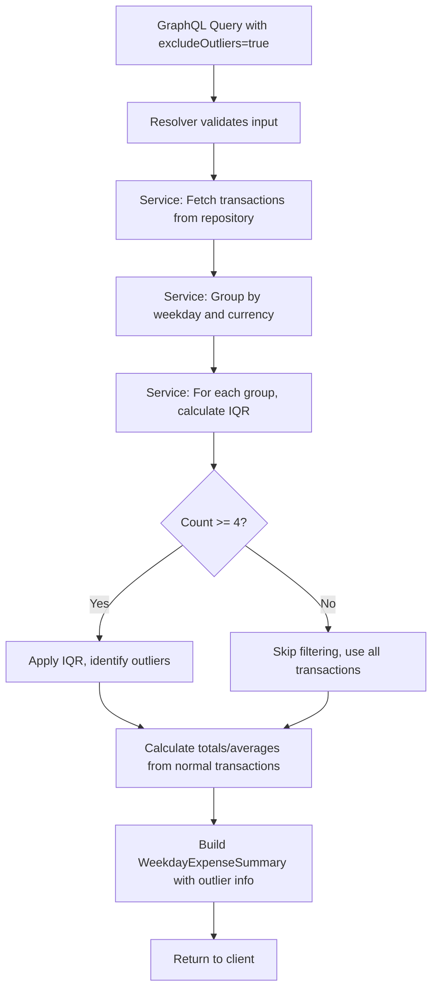
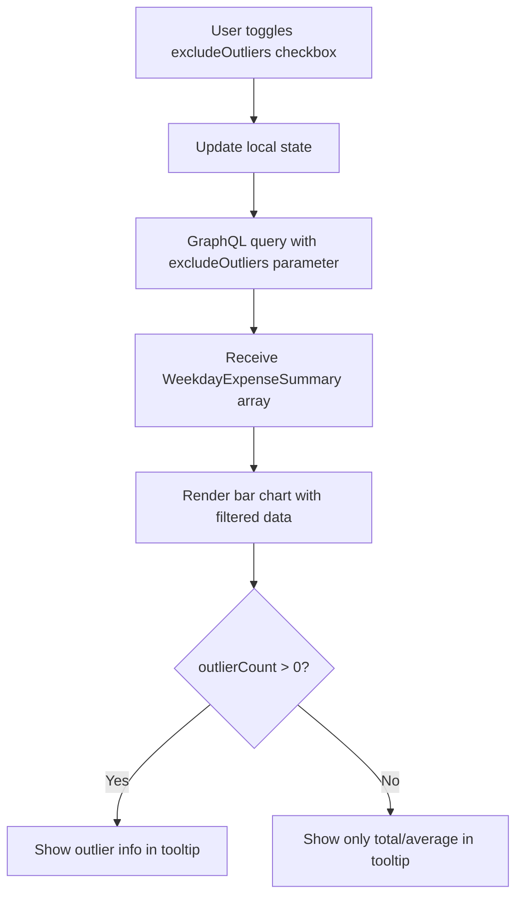

# Data Model: Weekday Expense Report Outlier Filtering

**Feature**: 011-weekday-outlier-filter
**Date**: 2025-11-19
**Phase**: 1 (Design & Contracts)

## Overview

This document defines the data structures and entities involved in implementing outlier filtering for the weekday expense report.

## Entity Definitions

### MonthlyWeekdayReportCurrencyBreakdown (Modified)

Currency-specific breakdown for a weekday in the monthly report with optional outlier information.

**Fields**:

| Field | Type | Required | Description | Notes |
|-------|------|----------|-------------|-------|
| `currency` | `string` | Yes | ISO 4217 currency code (USD, EUR, etc.) | Existing field |
| `totalAmount` | `number` | Yes | Total transaction amount for the weekday | When filtering: excludes outliers |
| `averageAmount` | `number` | Yes | Average transaction amount per transaction | When filtering: calculated from non-outlier transactions |
| `percentage` | `number` | Yes | Percentage of total monthly amount for this currency | Existing field |
| `outlierCount` | `number` | No | Number of transactions excluded as outliers | **NEW**: Only present when `excludeOutliers=true` and outliers detected |
| `outlierTotalAmount` | `number` | No | Sum of excluded outlier transaction amounts | **NEW**: Only present when `excludeOutliers=true` and outliers detected |

**Validation Rules**:
- `currency` must be valid ISO 4217 currency code
- `totalAmount`, `averageAmount`, `outlierTotalAmount` must be non-negative
- `percentage` must be 0-100
- `outlierCount` must be non-negative integer
- When `outlierCount > 0`, `outlierTotalAmount` must be present
- When `outlierCount = 0` or null, `outlierTotalAmount` should be null/absent

**State Transitions**: N/A (read-only aggregate)

**Relationships**:
- Part of `MonthlyWeekdayReportDay` which contains array of currency breakdowns
- Derived from `Transaction` entities grouped by weekday and currency
- No persistence (calculated on-demand per query)

### Transaction (Existing - No Changes)

Represents a single financial transaction. No schema changes required for this feature.

**Relevant Fields for Outlier Detection**:
- `amount`: Transaction amount (used in IQR calculation)
- `type`: Transaction type (only EXPENSE transactions are included)
- `date`: Transaction date (used for weekday grouping)
- `currency`: Currency code (used for grouping before outlier calculation)
- `isArchived`: Soft-deletion flag (archived transactions excluded from report)

### OutlierCalculationResult (Internal Service Layer Type)

Internal data structure used by service layer during outlier calculation. Not exposed via GraphQL.

**Fields**:

| Field | Type | Description |
|-------|------|-------------|
| `normalTransactions` | `Transaction[]` | Transactions below outlier threshold |
| `outlierTransactions` | `Transaction[]` | Transactions above outlier threshold |
| `threshold` | `number` | Calculated upper bound (Q3 + 1.5×IQR) |
| `q1` | `number` | First quartile value |
| `q3` | `number` | Third quartile value |
| `iqr` | `number` | Interquartile range (Q3 - Q1) |

**Usage**: Intermediate calculation result passed between utility functions and service layer.

## Data Flow

### Backend Data Flow (Outlier Filtering)



### Frontend Data Flow



## Derived Calculations

### IQR Outlier Detection

**Input**: Array of transaction amounts for a specific (weekday, currency) group

**Output**: Segregated normal and outlier transactions

**Algorithm**:
1. Sort amounts in ascending order
2. Calculate Q1 (25th percentile), Q3 (75th percentile)
3. Calculate IQR = Q3 - Q1
4. Calculate upper bound = Q3 + 1.5 × IQR
5. Transactions with amount > upper bound are outliers

**Edge Case Handling**:
- If count < 4: Return all as normal, empty outliers
- If all values equal: IQR = 0, upper bound = Q3, no outliers detected
- If all values are outliers (rare): Service returns original values with warning (per spec FR-007)

### Summary Aggregation (with Outlier Filtering)

**For each (weekday, currency) group:**

```typescript
interface WeekdayExpenseSummary {
  weekday: string;
  currency: string;

  // When excludeOutliers=false (default)
  totalAmount: sum(all_transactions.amount);
  averageAmount: totalAmount / transactionCount;
  transactionCount: all_transactions.length;
  outlierCount: null;
  outlierTotalAmount: null;

  // When excludeOutliers=true
  totalAmount: sum(normal_transactions.amount);
  averageAmount: totalAmount / normal_transactions.length;
  transactionCount: normal_transactions.length;
  outlierCount: outlier_transactions.length;  // Only if > 0
  outlierTotalAmount: sum(outlier_transactions.amount);  // Only if count > 0
}
```

## Database Impact

**No schema changes required**:
- Outlier filtering operates on in-memory data after fetching from database
- Uses existing `Transaction` table/collection
- No new indexes required
- No new fields persisted

**Query Pattern**:
```typescript
// Fetch transactions for date range (existing query)
const transactions = await transactionRepository.findByDateRange(
  userId,
  startDate,
  endDate,
  { type: 'EXPENSE', isArchived: false }
);

// Apply outlier filtering in-memory
const summaries = calculateWeekdaySummaries(transactions, excludeOutliers);
```

## Type Safety

### Backend TypeScript Types (Generated from GraphQL Schema)

```typescript
// Generated by graphql-codegen from backend/src/schema.graphql

export interface MonthlyWeekdayReportCurrencyBreakdown {
  currency: string;
  totalAmount: number;
  averageAmount: number;
  percentage: number;
  outlierCount?: number | null;
  outlierTotalAmount?: number | null;
}

export interface MonthlyWeekdayReportDay {
  weekday: Weekday;
  currencyBreakdowns: MonthlyWeekdayReportCurrencyBreakdown[];
}

export interface MonthlyWeekdayReport {
  year: number;
  month: number;
  type: TransactionType;
  weekdays: MonthlyWeekdayReportDay[];
  currencyTotals: MonthlyWeekdayReportCurrencyTotal[];
}

export interface MonthlyWeekdayReportArgs {
  year: number;
  month: number;
  type: TransactionType;
  excludeOutliers?: boolean;
}
```

### Frontend TypeScript Types (Generated from Synced Schema)

```typescript
// Generated by @graphql-codegen/vue-apollo from frontend/src/schema.graphql

export interface MonthlyWeekdayReportCurrencyBreakdown {
  __typename?: 'MonthlyWeekdayReportCurrencyBreakdown';
  currency: string;
  totalAmount: number;
  averageAmount: number;
  percentage: number;
  outlierCount?: number | null;
  outlierTotalAmount?: number | null;
}

// Generated typed composable
export function useMonthlyWeekdayReportQuery(
  variables: {
    year: number;
    month: number;
    type: TransactionType;
    excludeOutliers?: boolean;
  }
): UseQueryReturn<{ monthlyWeekdayReport: MonthlyWeekdayReport }, ...>;
```

## Validation Summary

| Layer | Validation Type | Rules |
|-------|----------------|-------|
| **GraphQL** | Input validation (Zod) | `excludeOutliers` is optional boolean, defaults to `false` |
| **Service** | Business validation | Minimum 4 transactions required for IQR calculation |
| **Service** | Edge case handling | Handle zero transactions, all outliers, insufficient data |
| **Repository** | Data validation (existing) | Validate transaction records against schema on read |

## Notes

- **Backward Compatibility**: New optional fields (`outlierCount`, `outlierTotalAmount`) maintain backward compatibility with existing clients
- **Performance**: O(n log n) complexity due to sorting, acceptable for typical data volumes (100-1000 transactions per month)
- **Testability**: Pure calculation functions enable comprehensive unit testing without database dependencies
- **Multi-Currency**: IQR applied separately per currency group, no cross-currency comparisons
