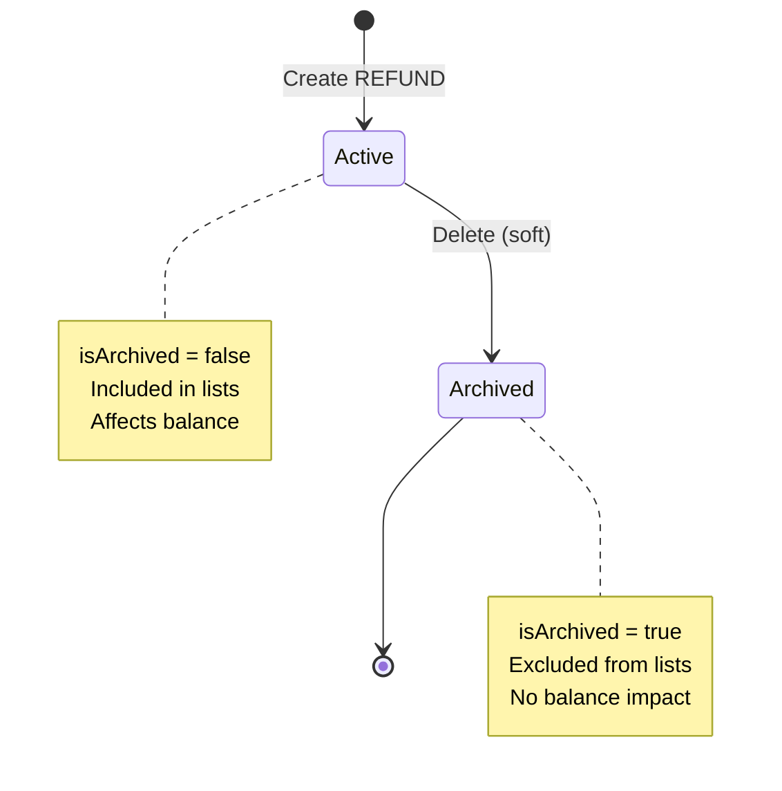

# Data Model: REFUND Transaction Type

**Feature**: Minimal Refund Transaction Type
**Branch**: `012-minimal-refund`
**Date**: 2025-11-27

## Overview

REFUND is a new transaction type variant added to the existing Transaction entity. It represents money received back from previous purchases (e.g., product returns, service refunds).

## Entity: Transaction

### Existing Structure

The Transaction entity already exists in the system. This feature adds REFUND as a new value for the `type` field.

**Storage**: DynamoDB table (TRANSACTIONS_TABLE_NAME)
**Primary Key**:
- Partition Key: `userId` (string)
- Sort Key: `id` (string, UUID)

**Indexes**:
- `UserDateIndex`: Partition key `userId`, Sort key `date`
- `UserCreatedAtIndex`: Partition key `userId`, Sort key `createdAt`

### Fields

| Field | Type | Required | Description | REFUND-Specific Notes |
|-------|------|----------|-------------|----------------------|
| `id` | string (UUID) | Yes | Unique transaction identifier | Generated on creation |
| `userId` | string (UUID) | Yes | Owner of the transaction | From authenticated context |
| `accountId` | string (UUID) | Yes | Account this transaction affects | Must exist and belong to user |
| `categoryId` | string (UUID) | No | Category for classification | If provided, must be EXPENSE category type |
| `type` | TransactionType enum | Yes | Transaction type | Value: `REFUND` |
| `amount` | number | Yes | Transaction amount (always positive) | Must be > 0 |
| `date` | string (YYYY-MM-DD) | Yes | Transaction date | ISO 8601 date string |
| `description` | string | No | User notes | Optional text field |
| `isArchived` | boolean | Yes | Soft-deletion flag | Default: false |
| `createdAt` | string (ISO 8601) | Yes | Creation timestamp | Auto-generated |
| `updatedAt` | string (ISO 8601) | Yes | Last update timestamp | Auto-updated |

### TransactionType Enum

**Before** (4 values):
```typescript
enum TransactionType {
  INCOME       // Increases balance
  EXPENSE      // Decreases balance
  TRANSFER_IN  // Increases balance (system-created)
  TRANSFER_OUT // Decreases balance (system-created)
}
```

**After** (5 values):
```typescript
enum TransactionType {
  INCOME       // Increases balance
  EXPENSE      // Decreases balance
  TRANSFER_IN  // Increases balance (system-created)
  TRANSFER_OUT // Decreases balance (system-created)
  REFUND       // Increases balance (NEW)
}
```

## REFUND Transaction Behavior

### Balance Impact

**Formula**:
```
Account Balance = initialBalance
                + INCOME
                + REFUND
                + TRANSFER_IN
                - EXPENSE
                - TRANSFER_OUT
```

**Implementation**:
- Positive impact: Increases account balance by `amount`
- Same calculation logic as INCOME type
- Excluded from balance when `isArchived = true`

### Category Rules

**Validation**:
- Category is **optional** (can be null/undefined)
- If category is provided, it **must** be an EXPENSE category type
- Category type mismatch throws `BusinessError` with code `INVALID_CATEGORY_TYPE`

**Rationale**: REFUND represents money returned from a previous expense, so it semantically belongs to expense categories

**Example Valid Scenarios**:
```
✓ REFUND with no category
✓ REFUND with categoryId pointing to "Shopping" (expense category)
✓ REFUND with categoryId pointing to "Groceries" (expense category)
✗ REFUND with categoryId pointing to "Salary" (income category) → ERROR
```

### Soft-Deletion

**Behavior**:
- Deletion sets `isArchived = true` (soft-delete)
- Archived REFUND transactions:
  - Excluded from transaction lists
  - Excluded from balance calculations
  - Excluded from filters
  - Excluded from reports

**Balance Impact of Deletion**:
- When REFUND is archived, account balance **decreases** by the refund amount
- Example: Account has $1000, user creates $50 REFUND → balance becomes $1050
- User deletes REFUND → balance becomes $1000

## Relationships

```mermaid
erDiagram
    User ||--o{ Transaction : owns
    Account ||--o{ Transaction : contains
    Category ||--o{ Transaction : classifies

    Transaction {
        string id PK
        string userId FK
        string accountId FK
        string categoryId FK_nullable
        TransactionType type
        number amount
        string date
        string description
        boolean isArchived
    }
```

### Relationships Details

| Relationship | Type | Description | Constraints |
|--------------|------|-------------|-------------|
| User → Transaction | One-to-Many | User owns transactions | `userId` required, must exist |
| Account → Transaction | One-to-Many | Account contains transactions | `accountId` required, must belong to user |
| Category → Transaction | One-to-Many (optional) | Category classifies transactions | `categoryId` optional; if provided for REFUND, must be EXPENSE type |

## Validation Rules

### Field-Level Validation (GraphQL/Zod Layer)

| Field | Rules |
|-------|-------|
| `accountId` | Must be valid UUID, must exist, must belong to authenticated user |
| `categoryId` | Must be valid UUID or null, if provided must exist and belong to user |
| `type` | Must be valid TransactionType enum value (including REFUND) |
| `amount` | Must be number > 0 |
| `date` | Must be valid YYYY-MM-DD format |
| `description` | String, max length TBD (follows existing constraints) |

### Business-Level Validation (Service Layer)

| Rule | Error Code | Error Message |
|------|------------|---------------|
| Category type must be EXPENSE if provided for REFUND | `INVALID_CATEGORY_TYPE` | `Category type "INCOME" doesn't match transaction type "REFUND"` |
| Account must exist and belong to user | `ACCOUNT_NOT_FOUND` | `Account not found or doesn't belong to user` |
| Category must exist and belong to user (if provided) | `CATEGORY_NOT_FOUND` | `Category not found or doesn't belong to user` |

## State Management

### No State Transitions

REFUND transactions are stateless. The only state flag is `isArchived`:



## Query Patterns

### Common Queries

**Get all REFUND transactions for a user**:
```typescript
findActiveByUserId(userId, pagination, { types: [TransactionType.REFUND] })
```

**Get REFUND transactions for a specific account**:
```typescript
findActiveByUserId(userId, pagination, {
  accountIds: [accountId],
  types: [TransactionType.REFUND]
})
```

**Get REFUND transactions for a specific category**:
```typescript
findActiveByUserId(userId, pagination, {
  categoryIds: [categoryId],
  types: [TransactionType.REFUND]
})
```

**Get uncategorized REFUND transactions**:
```typescript
findActiveByUserId(userId, pagination, {
  types: [TransactionType.REFUND],
  includeUncategorized: true,
  categoryIds: []
})
```

## Report Behavior

### Exclusion from Expense Reports

**Affected Reports**:
1. Monthly Expense Report by Category
2. Monthly Expense Report by Weekday

**Exclusion Mechanism**:
- Reports query with `type: TransactionType.EXPENSE`
- REFUND type (distinct from EXPENSE) is automatically excluded
- No additional filtering logic required

**Rationale**: REFUND represents money received, not spent, so it should not appear in expense analysis

## Migration Impact

**Database Migration**: Not required

**Reason**:
- Adding enum value is a non-breaking change
- Existing transactions remain valid
- No schema changes to DynamoDB table structure
- All existing queries and indexes work unchanged

**Backward Compatibility**: Full

## Performance Considerations

**Index Usage**:
- REFUND transactions use existing indexes (UserDateIndex, UserCreatedAtIndex)
- No new indexes required

**Query Performance**:
- Filter by type uses DynamoDB FilterExpression with IN operator
- Performance unchanged (same as filtering for existing types)

**Balance Calculation**:
- Complexity remains O(n) where n = number of active transactions
- Adds one additional type check in reduce operation (negligible impact)

## Examples

### Example 1: Create REFUND with Category

```graphql
mutation {
  createTransaction(input: {
    accountId: "account-123"
    categoryId: "groceries-category-456"
    type: REFUND
    amount: 25.50
    date: "2025-11-27"
    description: "Returned expired milk"
  }) {
    id
    type
    amount
    category { name type }
  }
}
```

**Result**:
- Transaction created with type REFUND
- Account balance increases by $25.50
- Category "Groceries" (expense type) is valid
- Transaction appears in transaction list

### Example 2: Create REFUND without Category

```graphql
mutation {
  createTransaction(input: {
    accountId: "account-123"
    type: REFUND
    amount: 15.00
    date: "2025-11-27"
    description: "Refund from online store"
  }) {
    id
    type
    amount
  }
}
```

**Result**:
- Transaction created without category (valid)
- Account balance increases by $15.00
- Transaction appears in uncategorized filters

### Example 3: Invalid REFUND with Income Category

```graphql
mutation {
  createTransaction(input: {
    accountId: "account-123"
    categoryId: "salary-category-789"  # Income category
    type: REFUND
    amount: 50.00
    date: "2025-11-27"
  }) {
    id
  }
}
```

**Result**:
- ERROR: `INVALID_CATEGORY_TYPE`
- Message: `Category type "INCOME" doesn't match transaction type "REFUND"`
- Transaction not created

## Summary

REFUND extends the existing Transaction entity with:
- New enum value in TransactionType
- Positive balance impact (like INCOME)
- Optional EXPENSE category constraint
- Standard soft-deletion behavior
- Automatic exclusion from expense reports
- No new database schema or indexes required
