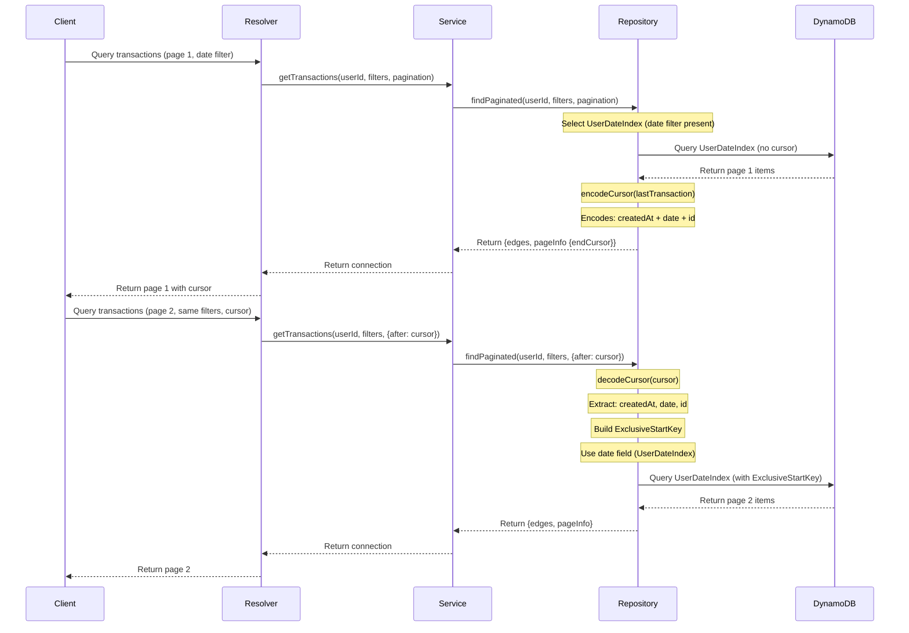
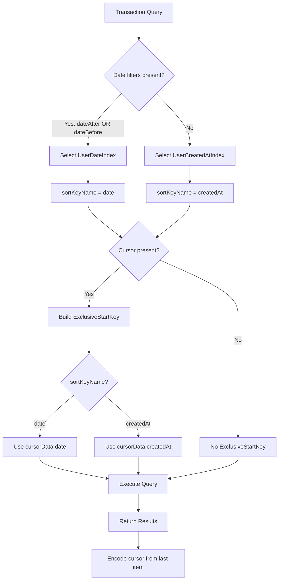

# Data Model: Pagination Cursor Structures

**Feature**: Fix Pagination Cursor Bug - UserDateIndex Incompatibility
**Date**: 2025-11-29

## Overview

This document defines the data structures involved in fixing the pagination cursor bug for transaction queries with date filters.

## Core Entities

### CursorData

Represents the pagination cursor metadata used to resume query pagination from a specific position.

#### Current Structure (Broken)

```typescript
interface CursorData {
  createdAt: string;  // ISO 8601 timestamp (e.g., "2024-01-20T14:23:45.678Z")
  id: string;         // Transaction UUID
}
```

#### Fixed Structure (Required)

```typescript
interface CursorData {
  createdAt: string;  // ISO 8601 timestamp - for UserCreatedAtIndex queries
  date: string;       // YYYY-MM-DD format - for UserDateIndex queries
  id: string;         // Transaction UUID - unique identifier
}
```

#### Field Descriptions

| Field | Type | Format | Required | Purpose |
|-------|------|--------|----------|---------|
| `createdAt` | string | ISO 8601 timestamp | Yes | Sort key for UserCreatedAtIndex queries. System-generated timestamp when transaction record was created. |
| `date` | string | YYYY-MM-DD | Yes | Sort key for UserDateIndex queries. User-specified transaction date (can differ from createdAt when transactions are backdated). |
| `id` | string | UUID v4 | Yes | Unique transaction identifier. Required in ExclusiveStartKey for both indexes. |

#### Validation Rules

**Schema** (Zod):
```typescript
const cursorDataSchema = z.object({
  createdAt: z.string(),  // ISO 8601 format (not validated beyond string type)
  date: z.string(),       // YYYY-MM-DD format (not validated beyond string type)
  id: z.string(),         // UUID format (not validated beyond string type)
});
```

**Validation Location**: `backend/src/repositories/TransactionRepository.ts` in `decodeCursor()` function

**Error Handling**:
- Invalid base64 encoding → `TransactionRepositoryError("Invalid cursor format", "INVALID_CURSOR")`
- Invalid JSON structure → `TransactionRepositoryError("Invalid cursor format", "INVALID_CURSOR")`
- Missing required fields → `TransactionRepositoryError("Invalid cursor format", "INVALID_CURSOR")`

#### Encoding/Decoding

**Encoding**:
```typescript
function encodeCursor(transaction: Transaction): string {
  const cursorData: CursorData = {
    createdAt: transaction.createdAt,
    date: transaction.date,
    id: transaction.id,
  };
  return Buffer.from(JSON.stringify(cursorData)).toString("base64");
}
```

**Decoding**:
```typescript
function decodeCursor(cursor: string): CursorData {
  try {
    const decoded = Buffer.from(cursor, "base64").toString("utf-8");
    const parsed = JSON.parse(decoded);
    const cursorData = cursorDataSchema.parse(parsed);
    return cursorData;
  } catch (error) {
    throw new TransactionRepositoryError(
      "Invalid cursor format",
      "INVALID_CURSOR",
      error,
    );
  }
}
```

**Storage Format**: Base64-encoded JSON string

**Example Encoded Cursor**:
```
eyJjcmVhdGVkQXQiOiIyMDI0LTAxLTIwVDE0OjIzOjQ1LjY3OFoiLCJkYXRlIjoiMjAyNC0wMS0yMCIsImlkIjoiYWJjLTEyMyJ9
```

**Example Decoded Cursor** (JSON):
```json
{
  "createdAt": "2024-01-20T14:23:45.678Z",
  "date": "2024-01-20",
  "id": "abc-123"
}
```

### Transaction Entity (Relevant Fields)

The Transaction entity contains the source data for cursor construction.

#### Relevant Fields

| Field | Type | Format | Description |
|-------|------|--------|-------------|
| `id` | string | UUID v4 | Unique transaction identifier |
| `createdAt` | string | ISO 8601 | System timestamp when record was created in database |
| `date` | string | YYYY-MM-DD | User-specified transaction date (can be backdated) |
| `userId` | string | UUID v4 | Owner of the transaction (partition key for queries) |

#### Field Relationships

- `createdAt` and `date` are independent fields with different semantics
- `createdAt` represents when the record entered the system
- `date` represents when the financial transaction actually occurred
- These can differ when users create transactions for past dates

**Example Scenario**:
```typescript
// User creates a transaction on 2024-01-25 for a purchase that occurred on 2024-01-20
{
  id: "abc-123",
  createdAt: "2024-01-25T10:30:00.000Z",  // Created today
  date: "2024-01-20",                      // Transaction occurred 5 days ago
  userId: "user-456",
  // ... other fields
}
```

### ExclusiveStartKey Structure

DynamoDB pagination marker indicating where to resume query execution.

#### Structure

```typescript
interface ExclusiveStartKey {
  userId: string;     // Partition key (same for all indexes)
  [sortKey]: string;  // Sort key name varies by index
  id: string;         // Unique identifier (same for all indexes)
}
```

#### Index-Specific Variations

**UserCreatedAtIndex**:
```typescript
{
  userId: "user-456",
  createdAt: "2024-01-20T14:23:45.678Z",  // ISO 8601 timestamp
  id: "abc-123"
}
```

**UserDateIndex**:
```typescript
{
  userId: "user-456",
  date: "2024-01-20",  // YYYY-MM-DD format
  id: "abc-123"
}
```

#### Construction Logic

```typescript
const decodedCursor = decodeCursor(after);

const exclusiveStartKey = {
  userId: userId,
  id: decodedCursor.id,
  [queryParams.sortKeyName]:
    queryParams.sortKeyName === "date"
      ? decodedCursor.date       // For UserDateIndex
      : decodedCursor.createdAt  // For UserCreatedAtIndex
};
```

#### Validation Requirements

- All three fields must be present: partition key, sort key, and id
- Sort key field name must match the index being queried
- Sort key value must match the format expected by the index:
  - `createdAt`: ISO 8601 timestamp format
  - `date`: YYYY-MM-DD format
- Type must match DynamoDB schema (all STRING for this table)

### DynamoDB Index Metadata

#### UserCreatedAtIndex

| Attribute | Value |
|-----------|-------|
| Index Name | `UserCreatedAtIndex` |
| Partition Key | `userId` (STRING) |
| Sort Key | `createdAt` (STRING) |
| Projection Type | ALL |
| Purpose | Efficient queries for unfiltered transaction lists ordered by creation time |

**Query Pattern**:
- Primary use case: Unfiltered transaction lists
- Sort order: Descending by creation time (newest first)
- Filter conditions: None (or filters other than date)

#### UserDateIndex

| Attribute | Value |
|-----------|-------|
| Index Name | `UserDateIndex` |
| Partition Key | `userId` (STRING) |
| Sort Key | `date` (STRING) |
| Projection Type | ALL |
| Purpose | Efficient queries for date-filtered transaction lists ordered by transaction date |

**Query Pattern**:
- Primary use case: Date-filtered transaction lists
- Sort order: Descending by transaction date (newest first)
- Filter conditions: `dateAfter` and/or `dateBefore`

## Data Flow

### Pagination Flow (Fixed)



### Index Selection Logic



## State Transitions

### Cursor Lifecycle

1. **Creation**: Generated when a page of results is returned
   - Extract `createdAt`, `date`, and `id` from last transaction in page
   - Encode as base64 JSON string
   - Return in `PageInfo.endCursor`

2. **Transmission**: Passed from client to server
   - Client includes cursor in `after` parameter for next page request
   - Transmitted as opaque string (client doesn't decode)

3. **Validation**: Decoded and validated on server
   - Base64 decode to JSON
   - Parse JSON to object
   - Validate structure with Zod schema
   - Throw error if invalid

4. **Consumption**: Used to construct ExclusiveStartKey
   - Select appropriate field based on index (date or createdAt)
   - Build ExclusiveStartKey with userId, sortKey, and id
   - Execute DynamoDB query

5. **Expiration**: Implicitly expired when pagination session ends
   - No explicit TTL or storage
   - Client discards cursor when leaving transaction list view
   - Server stateless (no cursor storage)

## Error States

### Invalid Cursor Errors

| Error Condition | Error Code | Error Message | HTTP Status |
|----------------|------------|---------------|-------------|
| Invalid base64 encoding | `INVALID_CURSOR` | "Invalid cursor format" | 400 |
| Invalid JSON structure | `INVALID_CURSOR` | "Invalid cursor format" | 400 |
| Missing `createdAt` field | `INVALID_CURSOR` | "Invalid cursor format" | 400 |
| Missing `date` field | `INVALID_CURSOR` | "Invalid cursor format" | 400 |
| Missing `id` field | `INVALID_CURSOR` | "Invalid cursor format" | 400 |

**Client Handling**: Display error message, reset to first page

## Performance Characteristics

### Cursor Size

- **Fixed Structure**: 3 fields (createdAt, date, id)
- **Typical Size**: ~120 characters before base64 encoding, ~160 characters after
- **Maximum Size**: ~200 characters (for maximum-length UUIDs and timestamps)

**Example**:
```json
{"createdAt":"2024-01-20T14:23:45.678Z","date":"2024-01-20","id":"550e8400-e29b-41d4-a716-446655440000"}
```
→ Base64: ~160 characters

### Memory Impact

- **Per Request**: Single cursor decoded per paginated query
- **Allocation**: ~200 bytes per cursor object
- **Garbage Collection**: Cursor objects freed after request completion

### Query Performance

- **No Impact**: Cursor modification doesn't affect DynamoDB query performance
- **Same Query Pattern**: Uses existing indexes without structural changes
- **Expected Latency**: < 2 seconds per page (per success criteria SC-002)

## Migration Considerations

### No Database Migration Required

- **Schema**: No DynamoDB table schema changes
- **Indexes**: No index modifications
- **Data**: No existing data migration
- **Backward Compatibility**: Breaking change acceptable (see research.md)

### Cursor Format Change

**Old Format** (2 fields):
```json
{"createdAt":"2024-01-20T14:23:45.678Z","id":"abc-123"}
```

**New Format** (3 fields):
```json
{"createdAt":"2024-01-20T14:23:45.678Z","date":"2024-01-20","id":"abc-123"}
```

**Impact**: Existing cursors in client applications will fail validation with clear error message. Users restart pagination from first page.

## Testing Data Models

### Test Fixtures

**Minimum Test Dataset** (for pagination test):
- **Record Count**: 6 transactions
- **Date Range**: 2024-01-15 to 2024-01-20 (6 consecutive days)
- **User**: Single test user
- **Page Size**: 3 items per page
- **Expected Pages**: 2 pages

**Test Scenario Data**:
```typescript
const transactions = [
  { date: "2024-01-15", createdAt: "2024-01-15T10:00:00.000Z", id: "id-1" },
  { date: "2024-01-16", createdAt: "2024-01-16T10:00:00.000Z", id: "id-2" },
  { date: "2024-01-17", createdAt: "2024-01-17T10:00:00.000Z", id: "id-3" },
  { date: "2024-01-18", createdAt: "2024-01-18T10:00:00.000Z", id: "id-4" },
  { date: "2024-01-19", createdAt: "2024-01-19T10:00:00.000Z", id: "id-5" },
  { date: "2024-01-20", createdAt: "2024-01-20T10:00:00.000Z", id: "id-6" },
];
```

### Validation Test Cases

| Test Case | Input | Expected Output |
|-----------|-------|-----------------|
| Valid cursor (all fields) | `{"createdAt":"...","date":"...","id":"..."}` | CursorData object |
| Missing createdAt | `{"date":"...","id":"..."}` | Error: "Invalid cursor format" |
| Missing date | `{"createdAt":"...","id":"..."}` | Error: "Invalid cursor format" |
| Missing id | `{"createdAt":"...","date":"..."}` | Error: "Invalid cursor format" |
| Invalid base64 | `"not-base64!!!"` | Error: "Invalid cursor format" |
| Invalid JSON | `"eyJpbnZhbGlkIGpzb259"` (base64 of invalid JSON) | Error: "Invalid cursor format" |

## Summary

The data model changes focus on expanding the `CursorData` structure to include all three fields required for both DynamoDB indexes (`createdAt`, `date`, `id`). This enables correct ExclusiveStartKey construction for both UserCreatedAtIndex (unfiltered queries) and UserDateIndex (date-filtered queries), fixing the pagination bug while maintaining performance and constitutional compliance.
