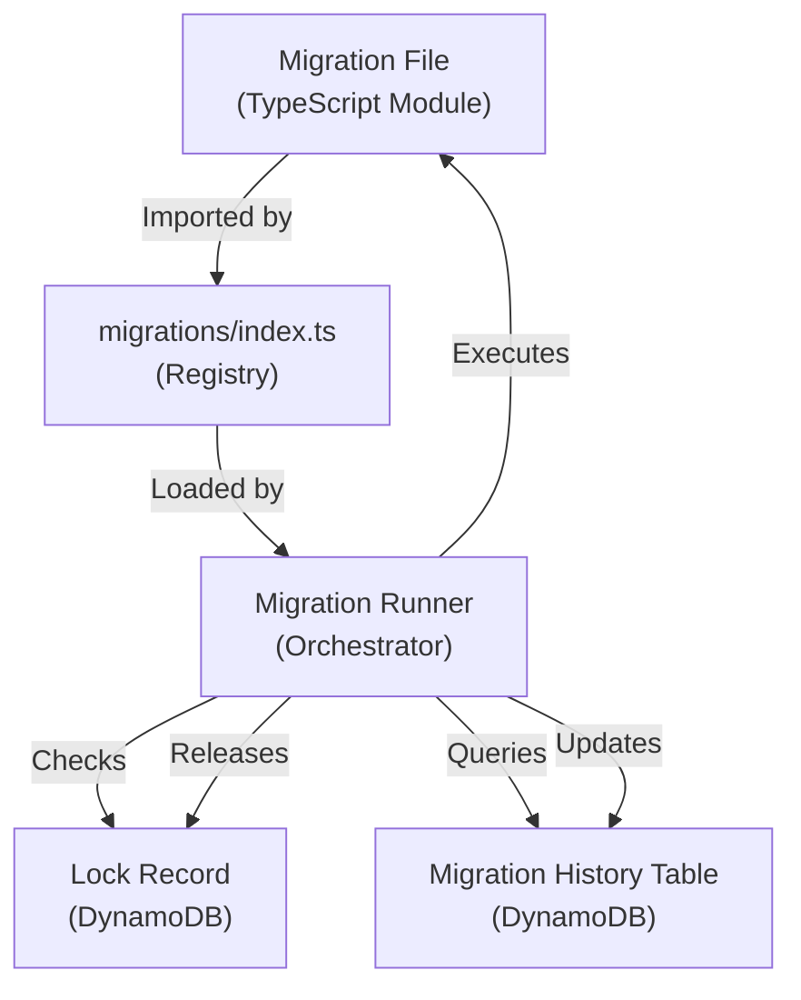

# Data Model: Data Migration Framework

**Date**: 2025-12-03
**Feature**: 019-data-migration-framework

## Overview

This document defines the data entities and their schemas for the migration framework. The framework uses two primary entities: Migration (code) and Migration History (database).

## Entities

### 1. Migration (Code Entity)

A TypeScript module that performs a data transformation on DynamoDB tables.

**File Location**: `backend/src/migrations/YYYYMMDDHHMMSS-description.ts`

**Structure**:
```typescript
import { DynamoDBClient } from "@aws-sdk/client-dynamodb";

/**
 * Migration: [Brief description of what this migration does]
 * Created: YYYY-MM-DD
 *
 * Idempotency: [Describe how this migration ensures safe retries]
 */
export async function up(client: DynamoDBClient): Promise<void> {
  // Migration logic here
}
```

**Fields**:

| Field | Type | Required | Description | Validation |
|-------|------|----------|-------------|------------|
| timestamp | string | Yes | Extracted from filename (YYYYMMDDHHMMSS format) | Must be 14 digits, format: YYYYMMDDHHMMSS |
| description | string | Yes | Extracted from filename after timestamp | Kebab-case, descriptive of migration purpose |
| up | function | Yes | Exported async function that performs migration | Signature: `(client: DynamoDBClient) => Promise<void>` |

**Naming Convention**:
- Format: `YYYYMMDDHHMMSS-description.ts`
- Example: `20231203120000-backfill-category-icons.ts`
- Timestamp must be chronologically ordered (determines execution order)
- Description should be kebab-case and descriptive

**Validation Rules**:
- File must export a named export `up`
- `up` must be an async function
- `up` must accept exactly one parameter of type `DynamoDBClient`
- `up` must return `Promise<void>`
- Migration must be manually added to `backend/src/migrations/index.ts`

**Example**:
```typescript
// 20231203120000-backfill-category-icons.ts
import { DynamoDBClient, ScanCommand, UpdateItemCommand } from "@aws-sdk/client-dynamodb";

/**
 * Migration: Add default icon to all categories missing icons
 * Created: 2023-12-03
 *
 * Idempotency: Uses conditional update (attribute_not_exists) to skip
 * categories that already have icons
 */
export async function up(client: DynamoDBClient): Promise<void> {
  const tableName = process.env.CATEGORIES_TABLE_NAME;
  if (!tableName) throw new Error("CATEGORIES_TABLE_NAME not set");

  // Scan all categories
  const result = await client.send(new ScanCommand({
    TableName: tableName,
    FilterExpression: "attribute_not_exists(icon)"
  }));

  // Update each category without icon
  for (const item of result.Items || []) {
    await client.send(new UpdateItemCommand({
      TableName: tableName,
      Key: { PK: item.PK },
      UpdateExpression: "SET icon = :icon",
      ConditionExpression: "attribute_not_exists(icon)",
      ExpressionAttributeValues: {
        ":icon": { S: "default" }
      }
    })).catch(err => {
      // Ignore if another migration already added icon
      if (err.name !== "ConditionalCheckFailedException") throw err;
    });
  }

  console.log(`Updated ${result.Items?.length || 0} categories`);
}
```

### 2. Migration History (Database Entity)

A DynamoDB record tracking successfully executed migrations.

**Table Name**: Determined by environment variable `MIGRATIONS_TABLE_NAME` (e.g., "Migrations")

**Table Schema**:

| Attribute | Type | Key | Description |
|-----------|------|-----|-------------|
| PK | String | Partition Key | Migration timestamp (e.g., "20231203120000") |

**Access Patterns**:

| Operation | Pattern | Purpose |
|-----------|---------|---------|
| Check if migration executed | `GetItem(PK=timestamp)` | Determine if migration should be skipped (idempotency) |
| Record successful migration | `PutItem(PK=timestamp)` | Mark migration as completed |
| List all executed migrations | `Scan` | Debug/audit purposes (not used by runner) |

**State Transitions**:
1. Migration not executed: Record does not exist
2. Migration executing: Record still does not exist (no in-progress state)
3. Migration completed: Record exists (PK = timestamp)
4. Migration failed: Record does not exist (will retry on next run)

**Validation Rules**:
- PK must match migration timestamp format (14 digits)
- Record existence is the only indicator of success (no additional fields needed)
- Records are never deleted (append-only log)

**Example Records**:
```json
[
  { "PK": "20231203120000" },
  { "PK": "20231203130000" },
  { "PK": "20231204090000" }
]
```

### 3. Lock Record (Special Database Entity)

A special record in the Migration History table used for concurrency control.

**Purpose**: Prevent concurrent migration execution across multiple Lambda invocations or npm script runs.

**Schema**:

| Attribute | Type | Key | Description |
|-----------|------|-----|-------------|
| PK | String | Partition Key | Always "LOCK" |
| acquiredAt | String | - | ISO 8601 timestamp when lock was acquired |

**Lifecycle**:
1. Before migrations start: Acquire lock with conditional `PutItem(attribute_not_exists(PK))`
2. During migrations: Lock exists
3. After migrations complete: Delete lock
4. If Lambda crashes: Lock remains (stale lock, requires manual cleanup)

**Example Record**:
```json
{
  "PK": "LOCK",
  "acquiredAt": "2023-12-03T12:00:00.000Z"
}
```

## Relationships



## Environment Isolation

Each environment (development, staging, production) has its own Migration History table:

| Environment | Identified By | Table Name Example |
|-------------|---------------|-------------------|
| Development | NODE_ENV=development | Migrations-dev |
| Staging | NODE_ENV=staging | Migrations-staging |
| Production | NODE_ENV=production | Migrations-prod |

**Isolation Strategy**: Separate tables per environment (not partition key based).

## Data Integrity Rules

1. **Chronological Ordering**: Migrations execute in timestamp order (ascending)
2. **Idempotency**: Each migration can be re-executed safely (developer responsibility)
3. **Atomicity**: Each migration is atomic (either fully succeeds or fully fails)
4. **No Rollback**: Failed migrations do not auto-rollback (manual intervention required)
5. **Append-Only History**: Migration history records are never deleted or modified

## Migration File Registry

**File**: `backend/src/migrations/index.ts`

**Purpose**: Explicit listing of all migration modules for TypeScript compilation and Lambda bundling.

**Structure**:
```typescript
// backend/src/migrations/index.ts
export * as migration_20231203120000 from "./20231203120000-example-read";
export * as migration_20231203130000 from "./20231203130000-example-write";
// Add new migrations here manually
```

**Validation**:
- Each export must match pattern: `export * as migration_YYYYMMDDHHMMSS from "./YYYYMMDDHHMMSS-description"`
- Timestamp in export name must match filename
- Developer must manually add line for each new migration

## Table Definitions (CDK)

**Migration History Table**:
```typescript
const migrationHistoryTable = new dynamodb.Table(this, "MigrationHistory", {
  partitionKey: { name: "PK", type: dynamodb.AttributeType.STRING },
  billingMode: dynamodb.BillingMode.PAY_PER_REQUEST,
  removalPolicy: RemovalPolicy.RETAIN, // Never delete migration history
  pointInTimeRecovery: true // Enable PITR for safety
});
```

**Rationale for Schema Choices**:
- **Pay-per-request billing**: Low usage (only during migrations)
- **Retain on delete**: Preserve migration history if stack deleted
- **Point-in-time recovery**: Safety net for accidental deletions
- **No TTL**: History is append-only, never expires
- **No GSI**: No query patterns requiring secondary indexes

## Summary

The data model consists of two primary entities:
1. **Migration** (code): TypeScript modules with `up` function
2. **Migration History** (database): DynamoDB records tracking execution

The design prioritizes simplicity, idempotency, and developer clarity. All validation rules and relationships support the core requirement: safe, repeatable data transformations.
