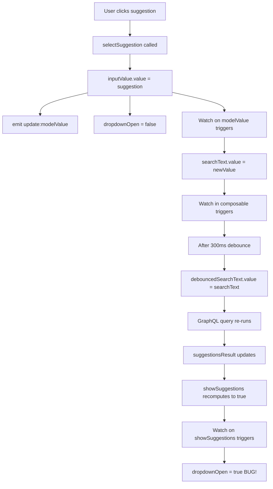

# Research: Transaction Description Suggestion Duplicate Selection Bug

**Date**: 2025-12-20
**Feature**: Fix Transaction Description Suggestion Duplicate Selection
**Status**: Complete

## Bug Analysis

### Current Behavior

When a user interacts with the description autocomplete field in transaction creation/editing:

1. User types partial text (e.g., "groc")
2. After debounce delay (300ms), suggestions appear in dropdown (e.g., "groceries", "grocery shopping")
3. User clicks on a suggestion (e.g., "groceries")
4. Description field populates with selected text
5. Dropdown closes
6. **BUG**: After ~300ms, dropdown re-opens with suggestions matching "groceries"
7. User must click the suggestion a second time for the save button to become enabled

### Expected Behavior

After step 5 above, the dropdown should remain closed and the save button should be immediately enabled without requiring a second selection.

## Root Cause Analysis

### Component Architecture

The bug occurs in the interaction between two files:

**DescriptionAutocomplete.vue** (Component):
- Manages local UI state: `dropdownOpen`, `selectedIndex`, `searchText`
- Consumes `useDescriptionSuggestions` composable
- Watches `showSuggestions` to control dropdown visibility

**useDescriptionSuggestions.ts** (Composable):
- Debounces search text input (300ms delay)
- Queries GraphQL API for suggestions
- Computes `showSuggestions` based on query results

### Reactive Dependency Chain



### The Race Condition

**File: DescriptionAutocomplete.vue**

Line 68-72 (`selectSuggestion` function):
```typescript
const selectSuggestion = (suggestion: string) => {
  inputValue.value = suggestion;  // ← Triggers modelValue watch
  dropdownOpen.value = false;     // ← Closes dropdown
  selectedIndex.value = -1;
};
```

Line 52-57 (`showSuggestions` watcher):
```typescript
watch(showSuggestions, (show) => {
  dropdownOpen.value = show;  // ← Re-opens dropdown when show=true
  if (show) {
    selectedIndex.value = -1;
  }
});
```

Line 60-65 (modelValue watcher):
```typescript
watch(
  () => props.modelValue,
  (newValue) => {
    searchText.value = newValue;  // ← Triggers debounce in composable
  },
);
```

**Timeline of Events:**

| Time | Event | State |
|------|-------|-------|
| T0 | User clicks suggestion "groceries" | dropdownOpen=true, searchText="groc" |
| T0+1ms | `selectSuggestion()` executes | inputValue set to "groceries" |
| T0+2ms | `dropdownOpen.value = false` | Dropdown closes visually |
| T0+3ms | `emit("update:modelValue", "groceries")` | Parent component updates |
| T0+4ms | Watch on `props.modelValue` triggers | searchText.value = "groceries" |
| T0+5ms | Watch in composable triggers debounce timer | debounceTimeout scheduled for T0+305ms |
| **T0+305ms** | Debounce timer fires | debouncedSearchText = "groceries" |
| T0+306ms | GraphQL query re-runs with "groceries" | API call initiated |
| T0+400ms | Query result returns | suggestionsResult updates with matches |
| T0+401ms | `showSuggestions` recomputes to `true` | Because "groceries" matches existing descriptions |
| **T0+402ms** | Watch on `showSuggestions` triggers | **dropdownOpen.value = true** ← BUG! |

**Why the bug occurs:**

The `watch(showSuggestions)` watcher (lines 52-57) **unconditionally** sets `dropdownOpen.value = show`. It has no knowledge that the user just selected a suggestion and intentionally closed the dropdown. When `showSuggestions` becomes true after the debounced query completes, it re-opens the dropdown.

## Fix Strategy Options

### Option A: Add "Just Selected" Flag (RECOMMENDED)

**Approach**: Introduce a `justSelected` ref flag that prevents the `showSuggestions` watcher from re-opening the dropdown immediately after a selection.

**Implementation**:
```typescript
const justSelected = ref(false);

const selectSuggestion = (suggestion: string) => {
  justSelected.value = true;  // Set flag before updating value
  inputValue.value = suggestion;
  dropdownOpen.value = false;
  selectedIndex.value = -1;
};

watch(showSuggestions, (show) => {
  // If we just selected, don't re-open even if showSuggestions becomes true
  if (justSelected.value && show) {
    justSelected.value = false;  // Reset flag
    return;  // Don't open dropdown
  }

  dropdownOpen.value = show;
  if (show) {
    selectedIndex.value = -1;
  }
});
```

**Pros**:
- Minimal code change
- Clear intent - explicitly tracks selection state
- No side effects on other functionality
- Easy to understand and maintain

**Cons**:
- Adds one more ref to component state
- Requires careful flag management

### Option B: Modify `showSuggestions` Computed

**Approach**: Modify the composable's `showSuggestions` computed to return false when the current search text exactly matches one of the suggestions.

**Implementation**:
```typescript
// In useDescriptionSuggestions.ts
const showSuggestions = computed(() => {
  const hasExactMatch = suggestions.value.includes(debouncedSearchText.value);
  if (hasExactMatch) return false;  // Don't show if exact match

  return shouldQuery.value && suggestions.value.length > 0 && !suggestionsLoading.value;
});
```

**Pros**:
- Handles the case automatically
- No component changes needed

**Cons**:
- Changes composable behavior for all consumers
- May hide suggestions when user manually types an exact match (legitimate use case)
- Less explicit - harder to understand why suggestions are hidden
- Could break future use cases where exact match suggestions are desired

### Option C: Clear Search Text After Selection

**Approach**: Clear the `searchText` after selection to prevent the debounced query from re-triggering.

**Implementation**:
```typescript
const selectSuggestion = (suggestion: string) => {
  inputValue.value = suggestion;
  dropdownOpen.value = false;
  selectedIndex.value = -1;
  searchText.value = '';  // Clear to prevent re-query
};
```

**Pros**:
- Simple one-line addition

**Cons**:
- Breaks the reactive binding between `inputValue` and `searchText`
- If user manually edits after selection, suggestions won't work until they clear and retype
- Violates the intended data flow where searchText tracks the input value
- Could cause confusion in debugging when searchText doesn't match inputValue

### Recommended Approach: Option A

**Decision**: Implement Option A (justSelected flag)

**Rationale**:
1. **Explicit Intent**: The flag clearly communicates "I just selected, don't re-open"
2. **No Breaking Changes**: Doesn't modify composable behavior or data flow
3. **Side Effect Free**: Keyboard navigation, manual editing, and other features continue to work
4. **Maintainable**: Future developers can easily understand the purpose of the flag
5. **Minimal Scope**: Changes confined to one watcher in one component

## Side Effect Analysis

### Functionality to Preserve

After implementing the fix, verify these behaviors remain intact:

#### 1. Keyboard Navigation
- **Arrow Up/Down**: Navigate through suggestions
- **Enter**: Select highlighted suggestion
- **Escape**: Close dropdown without selection
- **Tab**: Move to next field, close dropdown

**Verification**: The `justSelected` flag should be set when Enter key triggers selection (line 89-96 in handleKeyDown), ensuring consistent behavior between mouse and keyboard selection.

#### 2. Manual Editing After Selection
- User selects "groceries"
- User manually edits to "groceries at Whole Foods"
- Suggestions should re-appear if partial text still matches

**Verification**: The `justSelected` flag is only checked once and then reset. Subsequent typing will update `searchText`, trigger debounce, and show suggestions normally.

#### 3. Focus/Blur Behavior
- Focus on empty field: No dropdown (no suggestions yet)
- Focus on field with existing text: Show suggestions if text matches (line 112-117 in handleFocus)
- Blur: Close dropdown after 150ms delay (line 119-126 in handleBlur)

**Verification**: The `justSelected` flag doesn't interfere with focus/blur handlers. Blur still closes dropdown; focus can re-open if suggestions exist.

#### 4. Create vs Edit Mode Consistency
- Behavior should be identical whether creating new transaction or editing existing one
- Component is reused in both contexts via v-model binding

**Verification**: No mode-specific logic exists in component. Fix applies uniformly to both contexts.

### Edge Cases to Test

1. **No Matching Suggestions**: Type text with no matches → no dropdown → delete text → type matching text → dropdown appears
2. **Single Suggestion**: Only one match exists → select it → verify dropdown doesn't re-open
3. **Rapid Selection**: Select suggestion → immediately select another field → verify no visual glitch
4. **Network Delay**: Slow network → select suggestion → query still pending → verify dropdown stays closed when result arrives late

## Implementation Checklist

- [ ] Add `justSelected` ref to DescriptionAutocomplete.vue
- [ ] Update `selectSuggestion` function to set `justSelected = true` before updating value
- [ ] Update `watch(showSuggestions)` to check `justSelected` flag and skip re-opening
- [ ] Verify keyboard navigation (Enter key) also sets `justSelected` flag
- [ ] Run `npm run format` and fix ESLint issues
- [ ] Manual testing per quickstart.md scenarios
- [ ] Verify no regressions in TransactionForm and TransferForm (both use DescriptionAutocomplete)

## References

**Primary File**: [frontend/src/components/common/DescriptionAutocomplete.vue](../../../frontend/src/components/common/DescriptionAutocomplete.vue)
**Composable**: [frontend/src/composables/useDescriptionSuggestions.ts](../../../frontend/src/composables/useDescriptionSuggestions.ts)
**Consumer 1**: [frontend/src/components/transactions/TransactionForm.vue](../../../frontend/src/components/transactions/TransactionForm.vue)
**Consumer 2**: [frontend/src/components/transfers/TransferForm.vue](../../../frontend/src/components/transfers/TransferForm.vue)
