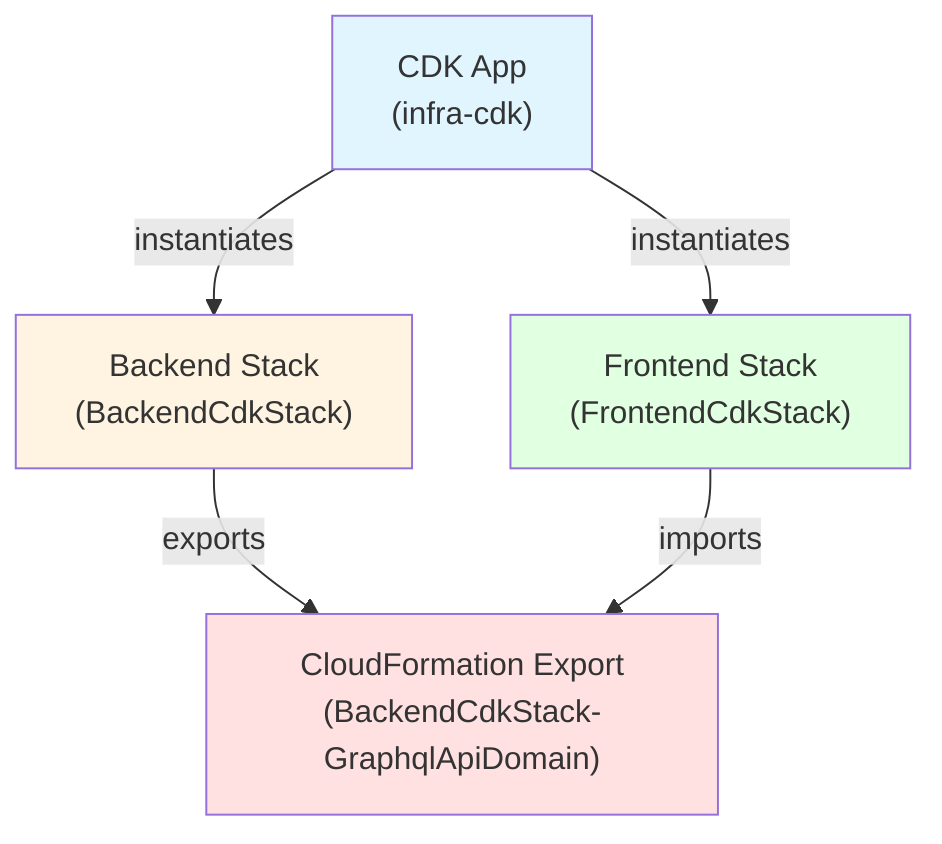

# Data Model: Merge CDK Packages

**Feature**: 024-merge-cdk-packages
**Date**: 2025-12-30

## Overview

This feature is an infrastructure consolidation task, not a data modeling task. However, this document captures the structural entities and their relationships in the infrastructure-as-code domain.

## Infrastructure Entities

### 1. Infra CDK App

**Description**: The unified AWS CDK application that orchestrates both backend and frontend stack deployments.

**Properties**:
- **Package Name**: `infra-cdk`
- **Entry Point**: `bin/app.ts`
- **Dependencies**: aws-cdk-lib@2.233.0, constructs, @dotenvx/dotenvx

**Relationships**:
- Contains exactly 2 stacks: BackendStack and FrontendStack
- Owns unified package.json with consolidated dependencies
- Manages single cdk-outputs.json for all stack outputs

**Lifecycle**:
- Instantiated via `new cdk.App()` in bin/app.ts
- Synthesizes CloudFormation templates via `cdk synth`
- Deploys stacks via `cdk deploy --all` or individual stack names

---

### 2. Backend Stack

**Description**: CloudFormation stack defining backend infrastructure (DynamoDB tables, Lambda functions, API Gateway).

**Properties**:
- **Stack Name**: `BackendCdkStack` (must remain unchanged to avoid resource recreation)
- **Class Name**: `BackendStack` (TypeScript class in lib/backend-stack.ts)
- **Source File**: `lib/backend-stack.ts`

**Infrastructure Resources**:
- 5 DynamoDB tables (Users, Accounts, Categories, Transactions, Migrations)
- 2 Lambda functions (GraphQL endpoint, Migration runner)
- 1 HTTP API Gateway
- 1 CloudWatch log group for API Gateway access logs

**Exports**:
- `BackendCdkStack-GraphqlApiDomain`: API Gateway domain name for CloudFront origin
- `BackendCdkStack-MigrationFunctionName`: Lambda function name for migration invocation

**Outputs**:
- `MigrationFunctionName`: Migration Lambda function name

**Dependencies**:
- Environment variables from .env.production (via dotenvx)
- Backend application code in ../backend/dist

**Validation Rules**:
- Stack name must be `BackendCdkStack` to preserve CloudFormation export names
- All DynamoDB tables have deletion protection enabled
- All DynamoDB tables use on-demand billing

---

### 3. Frontend Stack

**Description**: CloudFormation stack defining frontend infrastructure (S3 bucket, CloudFront distribution).

**Properties**:
- **Stack Name**: `FrontendCdkStack` (must remain unchanged to avoid resource recreation)
- **Class Name**: `FrontendStack` (TypeScript class in lib/frontend-stack.ts)
- **Source File**: `lib/frontend-stack.ts`

**Infrastructure Resources**:
- 1 S3 bucket for static website hosting
- 1 CloudFront distribution with two origins (S3 for assets, API Gateway for /graphql)

**Imports**:
- `BackendCdkStack-GraphqlApiDomain`: Imported via `cdk.Fn.importValue()` from BackendStack

**Outputs**:
- `S3BucketName`: S3 bucket name for frontend asset uploads
- `CloudFrontFullURL`: Full HTTPS URL for CloudFront distribution
- `CloudFrontDistributionId`: Distribution ID for cache invalidation

**Dependencies**:
- BackendStack export (deployment order: must deploy after BackendStack)

**Validation Rules**:
- Stack name must be `FrontendCdkStack` to preserve CloudFormation import references
- Must use `cdk.Fn.importValue()` to maintain CloudFormation-level dependency (not direct TypeScript reference)

---

## Entity Relationships

**Relationship Rules**:
1. **App → Stacks**: One CDK app instantiates exactly two stacks
2. **BackendStack → Export**: Backend stack exports GraphQL API domain
3. **FrontendStack → Import**: Frontend stack imports GraphQL API domain via CloudFormation Fn::ImportValue
4. **Deployment Order**: CloudFormation automatically enforces FrontendStack deploys after BackendStack due to import dependency

---

## State Transitions

### Stack Deployment States

**Backend Stack**:
1. **Not Deployed**: No CloudFormation stack exists
2. **Deploying**: CloudFormation stack creation/update in progress
3. **Deployed**: CloudFormation stack exists and is stable
4. **Failed**: CloudFormation stack creation/update failed

**Frontend Stack**:
1. **Not Deployed**: No CloudFormation stack exists
2. **Blocked**: Cannot deploy because BackendStack export doesn't exist
3. **Deploying**: CloudFormation stack creation/update in progress (requires BackendStack export)
4. **Deployed**: CloudFormation stack exists and is stable
5. **Failed**: CloudFormation stack creation/update failed

**Transition Rules**:
- FrontendStack can only transition to "Deploying" if BackendStack is in "Deployed" state
- `cdk deploy --all` automatically handles transition order
- `cdk deploy FrontendStack` fails with error if BackendStack export doesn't exist

---

## Data Migration

**Not Applicable**: This feature does not introduce new data entities or modify existing database schemas. It only restructures infrastructure-as-code package organization.

**Infrastructure Changes**:
- No CloudFormation stack recreation (stack names unchanged)
- No resource replacement (logical resource IDs unchanged)
- No data migration required

---

## Validation Strategy

**Pre-Deployment Validation**:
1. Verify stack names in code match existing CloudFormation stack names
2. Verify export name `BackendCdkStack-GraphqlApiDomain` unchanged
3. Verify import statement in FrontendStack unchanged
4. Run `cdk diff` to confirm no unexpected resource changes

**Post-Deployment Validation**:
1. Verify both stacks deploy successfully
2. Verify CloudFormation exports exist: `aws cloudformation list-exports`
3. Verify outputs written to infra-cdk/cdk-outputs.json
4. Verify application functionality (frontend accessible, backend GraphQL API responds)

---

## Open Questions

**Resolved**:
- ✅ How to maintain stack names? → Use exact same names in stack instantiation
- ✅ How to preserve export/import? → Keep export name generation logic unchanged
- ✅ How to handle deployment order? → CloudFormation import creates automatic dependency

**No outstanding questions**
