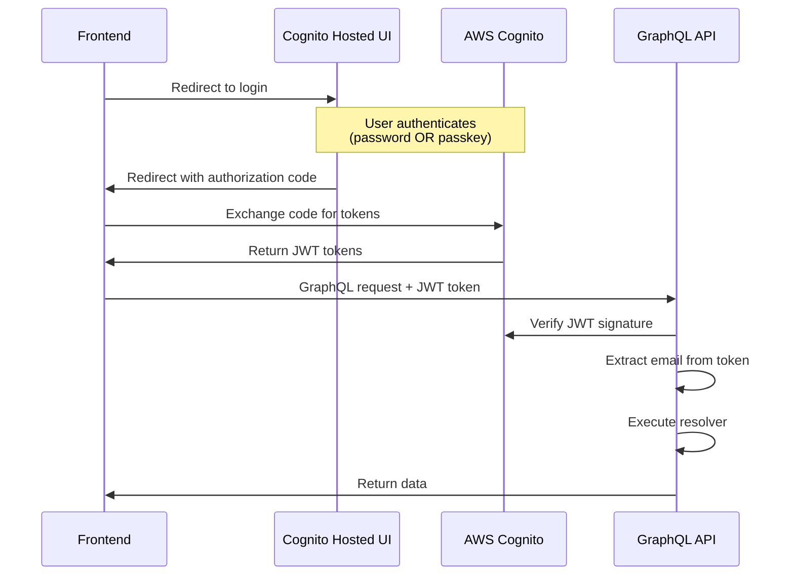

# API Contracts: Passkey Authentication Support

**Date**: 2026-02-15
**Status**: Complete

## Overview

This directory is intentionally empty. The passkey authentication feature requires **no API contract changes**.

## Rationale

### No GraphQL Schema Changes

The passkey feature is implemented entirely through infrastructure configuration (AWS Cognito User Pool settings). The GraphQL API remains unchanged because:

1. **Authentication is External**: User authentication occurs through Cognito Hosted UI before GraphQL requests are made
2. **Token Format Unchanged**: JWT tokens issued after passkey authentication are identical to those issued after password authentication
3. **Backend is Agnostic**: The backend verifies JWT tokens and extracts user email the same way regardless of authentication method
4. **No New Endpoints**: Passkey registration and management happen in Cognito's Hosted UI, not through the application API

### No REST API Changes

The application does not expose REST endpoints for authentication (delegated to AWS Cognito).

### No WebAuthn API Implementation

WebAuthn API calls are handled entirely by:
- **Client-side**: Browser's native WebAuthn API (triggered by Cognito Hosted UI)
- **Server-side**: AWS Cognito's native passkey support

The application backend never interacts with WebAuthn directly.

## Authentication Flow (Unchanged)

**Key Point**: The GraphQL API receives the same JWT tokens regardless of whether the user authenticated with a password or passkey. No API changes are needed.

## Implementation Constraints

From the feature specification:

- **IC-002**: Implementation MUST NOT require changes to backend or frontend application code
- **IC-003**: Passkey management interface MUST be provided by the identity provider's hosted UI

These constraints ensure that API contracts remain unchanged.

## Future Considerations

If future requirements include:
- Custom passkey management UI in the application
- Passkey metadata exposure via GraphQL
- Passkey-specific user preferences

Then API contracts would be added to this directory. However, the current implementation scope intentionally avoids these to minimize complexity and maintain infrastructure-only changes.

## Related Documentation

- [../spec.md](../spec.md): Feature specification and requirements
- [../data-model.md](../data-model.md): Data model (explains why passkey data stays in Cognito)
- [../research.md](../research.md): Research findings on Cognito passkey support
