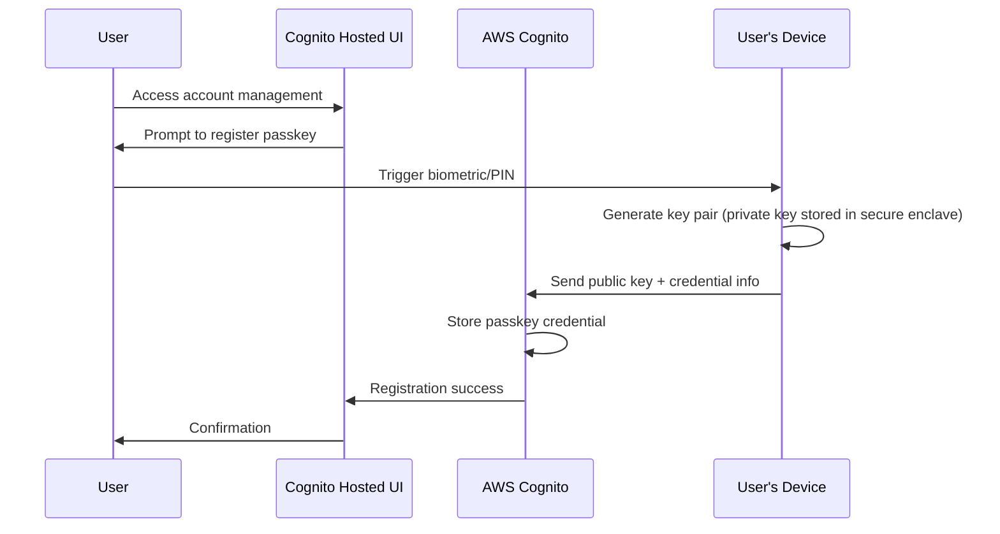
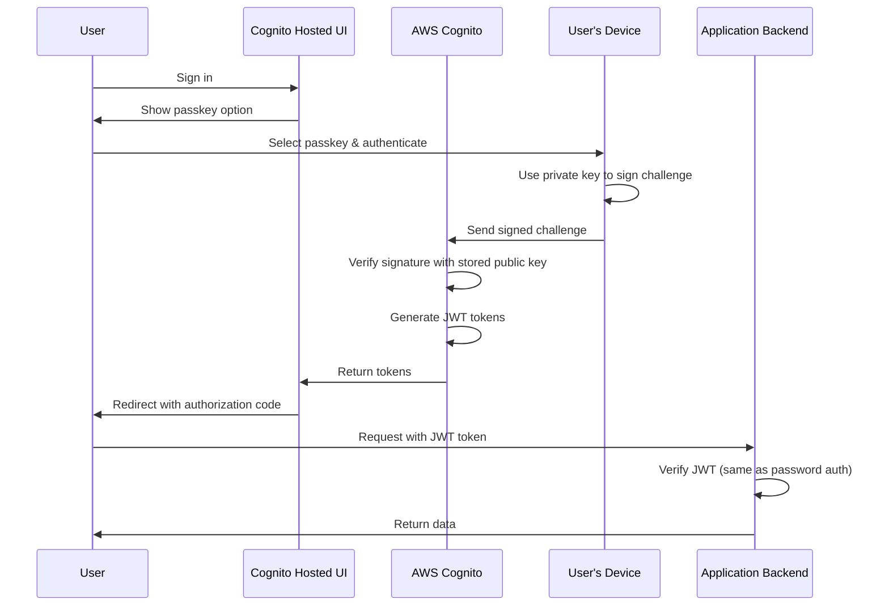

# Data Model: Passkey Authentication Support

**Date**: 2026-02-15
**Status**: Complete

## Overview

This feature introduces passkey authentication support through AWS Cognito configuration. Since passkeys are managed entirely by AWS Cognito, no new data models are required in the application's DynamoDB database.

## Entities

### Passkey Credential (Managed by AWS Cognito)

**Storage**: AWS Cognito User Pool (not in application database)

**Description**: Cryptographic credential tied to a specific device/authenticator, stored and managed by AWS Cognito. The application backend has no direct access to passkey credentials.

**Cognito-Managed Fields**:
- Public key information (FIDO2/WebAuthn compliant)
- Credential ID (unique identifier for the passkey)
- Relying Party ID (domain identifier)
- Creation timestamp
- Device/authenticator metadata
- User verification settings
- Counter (to prevent replay attacks)

**Access Pattern**:
- Users register and manage passkeys through Cognito Hosted UI
- Cognito handles credential storage, retrieval, and validation
- Backend receives standard JWT tokens regardless of authentication method (password or passkey)

### User Account (Existing Entity - No Changes)

**Storage**: DynamoDB `Users` table

**No schema changes required**.

**Relationship to Passkeys**:
- Cognito User Pool links passkey credentials to user accounts internally
- Application identifies users by email (from JWT token)
- Backend is agnostic to authentication method (password vs passkey)
- No new fields needed in DynamoDB user records

## Data Flows

### Passkey Registration Flow

**Note**: Application backend is not involved in passkey registration.

### Passkey Authentication Flow

**Note**: Backend authentication logic unchanged - verifies JWT tokens regardless of authentication method.

## Database Schema Changes

**No database schema changes required.**

**Rationale**:
- Passkey credentials stored entirely in AWS Cognito
- Application database (DynamoDB) unaware of passkeys
- JWT token claims remain unchanged
- User identification by email unchanged

## Data Migration

**No data migration required.**

**Deployment Impact**:
- Zero-downtime deployment
- Existing user accounts unchanged
- No user data transformation needed
- Passkey adoption is user-initiated

## Data Validation

**No application-level validation changes required.**

**Passkey Validation**: Handled entirely by AWS Cognito
- WebAuthn protocol validation
- Challenge-response verification
- Public key cryptography verification
- Replay attack prevention (counter validation)

**JWT Token Validation**: Remains unchanged
- Backend continues to verify JWT signature against Cognito public keys
- Email extraction from token claims unchanged
- User lookup by email unchanged

## Security Considerations

### Credential Storage
- Private keys never leave user's device (stored in secure enclave)
- Public keys stored in AWS Cognito (managed service)
- Application backend never handles passkey credentials directly

### Authentication Method Privacy
- Backend cannot distinguish password from passkey authentication
- Both methods produce identical JWT tokens
- User authentication method is private to Cognito

### Cross-Device Support
- Each device has its own passkey credential
- Multiple passkeys per user supported by Cognito
- No synchronization between devices (each is independent)

## Data Retention

**Passkey Credentials**: Managed by AWS Cognito
- Retained as long as user account exists
- Deleted when user account deleted
- User can delete individual passkeys via Hosted UI

**Application Data**: No changes
- Existing data retention policies unchanged
- User deletion process unchanged

## Alternatives Considered

### Alternative 1: Store Passkey Metadata in DynamoDB

**Approach**: Store passkey credential IDs and device names in application database for custom UI display.

**Rejected Because**:
- Violates IC-003: "Passkey management interface MUST be provided by the identity provider's hosted UI"
- Requires backend code changes (violates IC-002)
- Requires frontend code changes (violates IC-002)
- Adds data synchronization complexity
- Hosted UI already provides this functionality

### Alternative 2: Custom Passkey Management Table

**Approach**: Create separate DynamoDB table to track user passkey preferences and settings.

**Rejected Because**:
- No business requirements for custom passkey metadata
- Adds unnecessary complexity
- Cognito Hosted UI provides sufficient management interface
- Would require backend/frontend code changes (violates IC-002)

## Summary

**Zero data model changes required**. Passkey credentials are entirely managed by AWS Cognito. The application's DynamoDB schema remains unchanged, and the backend continues to authenticate users via JWT tokens without awareness of the authentication method used.
